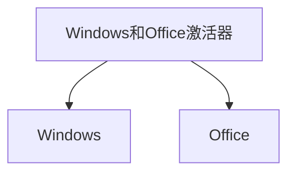

# :nose: 沉溺在知识的深渊里

## :stuck_out_tongue: 书籍理论
### :fearful: 算法
[hello-algo](https://www.hello-algo.com/chapter_preface/)
> 本项目旨在创建一本开源免费、新手友好的数据结构与算法入门教程。
- 全书采用动画图解，结构化地讲解数据结构与算法知识，内容清晰易懂、学习曲线平滑。
- 算法源代码皆可一键运行，支持 Java、C++、Python、Go、JS、TS、C#、Swift、Rust、Dart、Zig 等语言。
- 鼓励读者在章节讨论区互帮互助、共同进步，提问与评论通常可在两日内得到回复。

### :fearful: free-programming-books编程书籍集锦
[free-programming-books](https://github.com/EbookFoundation/free-programming-books/blob/main/books/free-programming-books-zh.md)

## :stuck_out_tongue: 生产力工具
### :fearful: hackingtool
[hackingtool](https://github.com/Z4nzu/hackingtool)

### :fearful: DevToys
[hackingtool](https://github.com/veler/DevToys)

### :fearful: 高斯飞溅实时辐射场渲染
[高斯飞溅实时辐射场渲染](https://github.com/LorisYounger/VPet)
### :fearful: Microsoft-Activation-Scripts
[Windows和Office激活器](https://github.com/massgravel/Microsoft-Activation-Scripts#download--how-to-use-it)

## :stuck_out_tongue: 他山之玉
### :fearful: c50projects50
> 50 个采用 HTML+CSS+JS 的前端小项目集合。项目包含网页源码和效果展示，标准入门级的前端开源项目。通过查看效果让新手感受前端的美妙，简单的源码降低了上手写代码门槛。

[50projects](https://github.com/bradtraversy/50projects50days)

### :fearful: appwrite
- 主要语言：TypeScript
- 项目分类：[中间件] [工具]
- 项目标签：[开发工具] [可视化工具] [协作工具] [协作平台] [微服务架构] [开发者平台]
- 推荐理由：一个端到端的开发者平台，基于Docker构建。它提供了容器化的微服务库，可应用于网页端、移动端和后端。Appwrite通过可视化界面简化了API编写过程，为开发者创造了高效的开发环境，同时保证了软件的安全性。
[appwrite](https://github.com/appwrite/appwrite#windows)

## :stuck_out_tongue: 人工智能
### :fearful: MetaGPT
[MetaGPT](https://github.com/geekan/MetaGPT)
### :fearful: Llama2-Chinese
欢迎来到Llama中文社区！我们是一个专注于Llama模型在中文方面的优化和上层建设的高级技术社区。 *基于大规模中文数据，从预训练开始对Llama2模型进行中文能力的持续迭代升级*。 我们热忱欢迎对大模型LLM充满热情的开发者和研究者加入我们的行列。
🚀 高级工程师团队支持：社区有一批专注为大家服务的NLP高级工程师，我们有着强大的技术支持和丰富的经验，为您提供专业的指导和帮助。

🎯 中文优化：我们致力于在Llama2模型的中文处理方面进行优化，探索适用于中文的最佳实践，以提升其性能和适应性。

💡 创新交流：我们拥有一支富有创造力和经验的社区成员团队，定期组织线上活动、技术研讨和经验分享，促进成员间的创新交流。

🌐 全球联结：我们欢迎来自世界各地的开发者加入社区，构建一个开放、多元化的学习和交流平台。

🤝 开放共享：我们鼓励社区成员开源分享代码和模型，推动合作共赢，共同促进中文NLP技术的发展。
[Llama2-Chinese](https://github.com/FlagAlpha/Llama2-Chinese)
### :fearful: facefusion
[facefusion](https://github.com/facefusion/facefusion)

### :fearful: lllyasviel
[lllyasviel](https://github.com/lllyasviel/Fooocus)

## :stuck_out_tongue: 没用的东西
### :fearful: 虚拟桌宠模拟器
[虚拟桌宠模拟器](https://github.com/LorisYounger/VPet)

