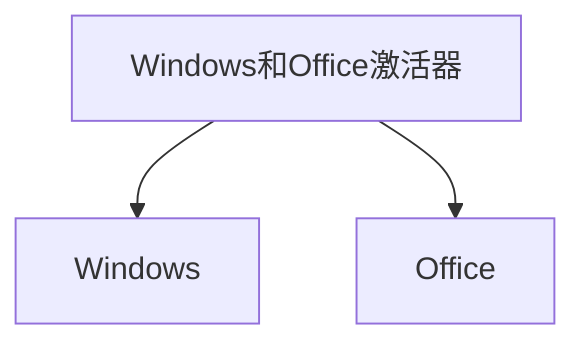

# :nose: 沉溺在知识的深渊里

## :stuck_out_tongue: 书籍理论
### :fearful: 算法
[hello-algo](https://www.hello-algo.com/chapter_preface/)
> 本项目旨在创建一本开源免费、新手友好的数据结构与算法入门教程。
- 全书采用动画图解，结构化地讲解数据结构与算法知识，内容清晰易懂、学习曲线平滑。
- 算法源代码皆可一键运行，支持 Java、C++、Python、Go、JS、TS、C#、Swift、Rust、Dart、Zig 等语言。
- 鼓励读者在章节讨论区互帮互助、共同进步，提问与评论通常可在两日内得到回复。

### :fearful: free-programming-books编程书籍集锦
[free-programming-books](https://github.com/EbookFoundation/free-programming-books/blob/main/books/free-programming-books-zh.md)

## :stuck_out_tongue: 生产力工具
### :fearful: hackingtool
[hackingtool](https://github.com/Z4nzu/hackingtool)

### :fearful: DevToys
[hackingtool](https://github.com/veler/DevToys)

### :fearful: 高斯飞溅实时辐射场渲染
[高斯飞溅实时辐射场渲染](https://github.com/LorisYounger/VPet)
### :fearful: Microsoft-Activation-Scripts
[Windows和Office激活器](https://github.com/massgravel/Microsoft-Activation-Scripts#download--how-to-use-it)

### :fearful: GitHub统计信息生成工具
[GitHub统计信息生成工具github-readme-stats](https://github.com/anuraghazra/github-readme-stats/blob/master/docs/readme_cn.md)

## :stuck_out_tongue: 他山之玉
### :fearful: c50projects50
> 50 个采用 HTML+CSS+JS 的前端小项目集合。项目包含网页源码和效果展示，标准入门级的前端开源项目。通过查看效果让新手感受前端的美妙，简单的源码降低了上手写代码门槛。

[50projects](https://github.com/bradtraversy/50projects50days)

### :fearful: appwrite
- 主要语言：TypeScript
- 项目分类：[中间件] [工具]
- 项目标签：[开发工具] [可视化工具] [协作工具] [协作平台] [微服务架构] [开发者平台]
- 推荐理由：一个端到端的开发者平台，基于Docker构建。它提供了容器化的微服务库，可应用于网页端、移动端和后端。Appwrite通过可视化界面简化了API编写过程，为开发者创造了高效的开发环境，同时保证了软件的安全性。

[appwrite](https://github.com/appwrite/appwrite#windows)

### :fearful: homepage定制应用程序仪表板
- 主要语言：JavaScript
- 项目分类：[工具]
- 项目标签：[协作工具]
- 推荐理由：一个全新的应用程序仪表板，具备现代化、全静态、快速、安全、全代理、高度可定制的特点。它集成了超过100个服务，并提供多种语言翻译。您可以通过YAML文件或Docker标签发现来轻松配置此仪表板。homepage的设计注重用户体验和可定制性，以满足各种应用程序监控和管理需求。

[定制应用程序仪表板](https://github.com/gethomepage/homepage)

### :fearful: 开源游戏引擎godot
- 主要语言：C++
- 项目分类：[游戏]
- 项目标签：[游戏引擎] [游戏助手]
- 推荐理由：一款功能丰富的开源游戏引擎。最初是一款 2D 引擎，后来拓展了强大的 3D 能力。尽管相对于成熟的商业引擎如 UE4 或 Unity 来说，Godot 较年轻，特别是在 3D 方面。但它具有简单的开发方式，适合初学游戏开发的人。社区活跃，文档详尽，示例丰富，非常适合初学者。底层代码完全开源，鼓励开发者参与贡献。总之，Godot 是学习游戏开发的理想选择。

[开源游戏引擎godot](https://github.com/godotengine/godot)

### :fearful: 可视化的Python框架:streamlit
- 主要语言：Python
- 项目分类：[前端] [工具] [应用软件]
- 项目标签：[可视化工具] [编程工具]
- 推荐理由：Streamlit是一个开源Python库，可以轻松创建和共享用于机器学习和数据科学的漂亮的自定义web应用程序。Streamlit在几分钟内将数据脚本转换为可共享的web应用程序。都是用纯Python编写的。不需要前端经验，你可以随时随地的更快地构建和共享数据应用程序。

[可视化的Python框架:streamlit](https://github.com/streamlit/streamlit)

### :fearful: 先进的前端拖放页面生成器:elementor
- 主要语言：JavaScript
- 项目分类：[设计] [前端]
- 项目标签：[前端设计] [响应式编程] [前端框架]
- 推荐理由：一款先进的前端拖放页面生成器，旨在以创纪录的速度创建高端、像素完美的网站。无论您是网站开发新手还是专业设计师，Elementor都提供了直观的工具和界面，使您能够轻松设计和构建美观的网站。它支持任何WordPress主题、任何页面和任何设计。Elementor是一个强大的工具，可帮助您将创意转化为出色的网页。

[先进的前端拖放页面生成器](https://github.com/elementor/elementor)

## :stuck_out_tongue: 人工智能
### :fearful: MetaGPT
[MetaGPT](https://github.com/geekan/MetaGPT)
### :fearful: Llama2-Chinese
欢迎来到Llama中文社区！我们是一个专注于Llama模型在中文方面的优化和上层建设的高级技术社区。 *基于大规模中文数据，从预训练开始对Llama2模型进行中文能力的持续迭代升级*。 我们热忱欢迎对大模型LLM充满热情的开发者和研究者加入我们的行列。
🚀 高级工程师团队支持：社区有一批专注为大家服务的NLP高级工程师，我们有着强大的技术支持和丰富的经验，为您提供专业的指导和帮助。

🎯 中文优化：我们致力于在Llama2模型的中文处理方面进行优化，探索适用于中文的最佳实践，以提升其性能和适应性。

💡 创新交流：我们拥有一支富有创造力和经验的社区成员团队，定期组织线上活动、技术研讨和经验分享，促进成员间的创新交流。

🌐 全球联结：我们欢迎来自世界各地的开发者加入社区，构建一个开放、多元化的学习和交流平台。

🤝 开放共享：我们鼓励社区成员开源分享代码和模型，推动合作共赢，共同促进中文NLP技术的发展。
[Llama2-Chinese](https://github.com/FlagAlpha/Llama2-Chinese)
### :fearful: facefusion
[facefusion](https://github.com/facefusion/facefusion)

### :fearful: lllyasviel
[lllyasviel](https://github.com/lllyasviel/Fooocus)

### :fearful: open-interpreter
- 主要语言：Python
- 项目分类：[工具] [AI]
- 项目标签：[人工智能] [LLM] [代码解释器] [自然语言处理]
- 推荐理由：一个允许在您的终端本地运行OpenAI的代码解释器的项目。它为开发者提供了一种便捷的方式来解释和执行OpenAI生成的代码，使其在本地环境中更易于调试和测试。这个工具对于开发基于OpenAI的应用程序和算法非常有用。

[open-interpreter](https://github.com/KillianLucas/open-interpreter)
### :fearful: DocsGPT
- 主要语言：Python
- 项目分类：[ChatGPT] [AI]
- 项目标签：[ChatGPT Web] [GPT模型]
- 推荐理由：一个基于GPT的文档查询工具，用于与文档进行实时对话。它允许用户通过自然语言进行文档查询，获得详细的解释和答案。DocsGPT通过强大的自然语言处理能力，将文档理解和查询变得更加直观和用户友好。

[DocsGPT](https://github.com/arc53/DocsGPT)

### :fearful: LLaVA
- 主要语言：Python
- 项目分类：[ChatGPT] [AI]
- 项目标签：[GPT4] [计算机视觉] [AI助手] [GPT模型] [自然语言处理]
- 推荐理由：一个面向多模式GPT-4级别能力构建的助手。它结合了自然语言处理和计算机视觉，为用户提供了强大的多模式交互和理解。LLaVA旨在更深入地理解和处理语言和视觉信息，从而实现更复杂的任务和对话。这个项目代表了下一代智能助手的发展方向，它能够更好地理解和应对用户需求。

[LLaVA](https://github.com/haotian-liu/LLaVA)

## :stuck_out_tongue: 没用的东西
### :fearful: 虚拟桌宠模拟器
[虚拟桌宠模拟器](https://github.com/LorisYounger/VPet)

## 编程语言
### python
#### 1
