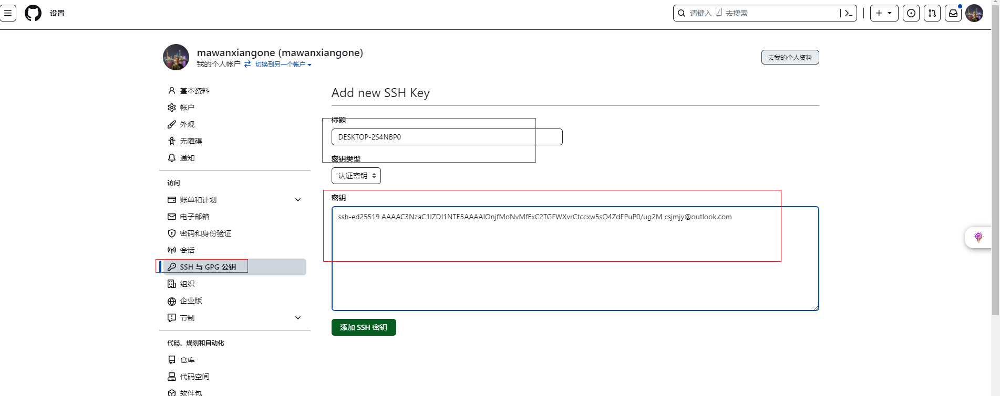

# 1. 🎈 interesting


## 1.1. git

### 1.1.1. 📵 新增SSH密钥到GitHub帐户



### 1.1.2. 📵 测试SSH连接

```bash
$ ssh -T git@github.com
# The authenticity of host 'github.com (20.205.243.166)' can't be established.
# ED25519 key fingerprint is SHA256:+DiY3wvvV6TuJJhbpZisF/zLDA0zPMSvHdkr4UvCOqU.
# This key is not known by any other names.
# Are you sure you want to continue connecting (yes/no/[fingerprint])? yes
# Warning: Permanently added 'github.com' (ED25519) to the list of known hosts.
# Hi mawanxiangone! You've successfully authenticated, but GitHub does not provide shell access.
```

### 1.1.3. 📵 检查现有SSH密钥

```bash
$ ls -al ~/.ssh
# total 38
# drwxr-xr-x 1 材料用途的工人 197121    0 10月 25 01:40 ./
# drwxr-xr-x 1 材料用途的工人 197121    0 10月 25 02:15 ../
# -rw-r--r-- 1 材料用途的工人 197121  464 10月 25 02:00 id_ed25519
# -rw-r--r-- 1 材料用途的工人 197121  100 10月 25 01:20 id_ed25519.pub
# -rw-r--r-- 1 材料用途的工人 197121 1509 10月 25 01:40 known_hosts
# -rw-r--r-- 1 材料用途的工人 197121  776 10月 25 01:40 known_hosts.old
```

### 1.1.4. 📵 git branch

```bash
# 查看本地分支列表
git branch

# 删除分支
git branch -d <分支>

# 强制删除分支(未合并的更改将会丢失)
git branch -D <分支>
```

### 1.1.5. 📵 git checkout

```bash
# 切换分支
git checkout main
```

### 1.1.6. 📵 git status

```bash

```

### 1.1.7. 📵git remote

```bash
# 修改通信为ssh方式
git remote set-url origin git@github.com:mawanxiangone/interesting.git
```

### 1.1.8. 📵git config

```bash
# 查看用户身份
git config user.name
git config user.email

# 更新用户身份
git config user.name ""
git config user.email ""

# 查看配置
git config --list
git config --global --get http.proxy
git config --global --get https.proxy
git config --global --get core.gitproxy

# 修改.git/config中url为ssh方式
url = git@github.com:mawanxiangone/interesting.git
```

### 1.1.9. 📵git remote

```bash
# 检查连接状态
```

## 1.2. 🔞 远程仓库使用

### 1.2.1. 📵 克隆现有仓库

```bash
$ git clone https://github.com/mawanxiangone/interesting.git
# Cloning into 'interesting'...
# remote: Enumerating objects: 179, done.
# remote: Counting objects: 100% (39/39), done.
# remote: Compressing objects: 100% (35/35), done.
# remote: Total 179 (delta 17), reused 3 (delta 3), pack-reused 140
# Receiving objects: 100% (179/179), 48.00 KiB | 434.00 KiB/s, done.
# Resolving deltas: 100% (53/53), done.

# 指定特定分支
git clone -b world https://github.com/mawanxiangone/interesting.git
```

### 1.2.2. 📵删除分支

```bash
# 切换到主分支
git checkout main

# 删除本地分支 world
git branch -d world  # 如果未合并,使用 git branch -D world

# 删除远程分支 world
git push origin --delete world

# 查看远程分支列表
git fetch origin
git branch -r
```

### 1.2.3. 📵删除文件

```bash
# 删除文件 example.txt
git rm example.txt

# 提交更改
git commit -m "删除文件 example.txt"

# 推送更改到 main 分支
git push origin main
```

### 1.2.4. 📵推送新文件夹到github

```bash
git rev-parse --show-toplevel
## 工作路径出错时,会导致一系列问题,如果有问题,请执行以下命令:删除路径文件的.git
Remove-Item -Recurse -Force F:\mawanxiao\starbucks\.git
Remove-Item -Recurse -Force F:\mawanxiao\.git

# 在github上创建一个仓库manstrory 不要勾选 README 不要勾选 .gitignore 不要勾选 License

# 在你的本地 Git 仓库根目录(F:\mawanxiao)执行:本地绑定这个远程仓库
git remote set-url origin git@github.com:mawanxiangone/manstrory.git


# 在正确位置重新初始化 Git

cd F:\mawanxiao
git init
# Reinitialized existing Git repository in F:/mawanxiao/.git/
git remote add origin git@github.com:mawanxiangone/manstrory.git

# 只添加 starbucks 文件夹
git add starbucks
git commit -m "upload starbucks folder"

# 推送到 GitHub
git branch -M main
git push -u origin main --force

# 查看本地 origin 指向哪里

git remote -v

# 图片问题:请把图片设置成相对路径,而不是F:\mawanxiao\interesting\花色密语.assets\,这样会导致github显示图片错误 
# 在typora上需要保持类似
# gitbub对文件名带有()显示不出来


# 简单粗暴推送
# 1. 进到项目目录
cd F:\mawanxiao\interesting

# 2. 添加所有变动(新增、修改、删除)
git add -A

# 3. 提交
git commit -m "update"

# 4. 推送到 GitHub
git push

# 拉取远端更新并合并(允许无关历史,保险)wq(Vim)
git pull origin main --allow-unrelated-histories

```

### 1.2.5. SSH agent 缓存密钥

```shell
ssh-agent $env:USERPROFILE\.ssh\id_ed25519
#
Set-Service ssh-agent -StartupType Automatic
Start-Service ssh-agent
ssh-add $env:USERPROFILE\.ssh\id_ed25519
```

## 1.3. 💀 有哪些命令行的软件堪称神器?

### 1.3.1. 🏡 Proselint

- 😃 [Proselint](http://proselint.com/write/) 它是一款全能的实时检查工具.它会找出行话、大话、不正确日期和时间格式、滥用的术语等等.它也很容易运行并忽略文本中的标记;

### 1.3.2. 🏡 tldr

- 😃 tldr:你能通过这个工具,快速查看查看各种命令的常用命令行例子

### 1.3.3. 🏡 nmon

- 😃 nmon:它能够帮你进行电脑的性能监控,包括 CPU,内存,磁盘 IO,网络 IO,并且界面很炫酷

### 1.3.4. 🏡 axel

- 😃 axel:多线程断点下载工具,非常好用

### 1.3.5. 🏡 mycli

- 😃 mycli:mysql客户端,支持语法高亮和命令补全,效果类似ipython,可以替代mysql命令

### 1.3.6. 🏡 jq

- 😃 jq: json文件处理以及格式化显示,支持高亮,可以替换python -m json.tool

### 1.3.7. 🏡 you-get

- 😃 [you-get](https://github.com/soimort/you-get/wiki/%E4%B8%AD%E6%96%87%E8%AF%B4%E6%98%8E): 非常强大的媒体下载工具,支持youtube、google+、优酷、芒果TV、腾讯视频、秒拍等视频下载.
  
## 1.4. 💀 艺术视觉

### 1.4.1. 🏡 weavesilk

- 😃 [weavesilk](http://weavesilk.com/): 光影自由绘画

  

### 1.4.2. 🏡 世界名画拼图

- 😃 [gallerix](https://gallerix.asia/): 世界名画拼图


### 1.4.3. 🏡 改图鸭

- 😃 [改图鸭](https://www.gaituya.com/aiimg/): 改图鸭:AI绘画

### 1.4.4. 🏡 topazlabs

- 😃 [类似Adobe](https://www.topazlabs.com/):


## 1.5. 💀 旋律悠扬

### 1.5.1. 🏡 tools.liumingye

- 😃 [tools.liumingye](https://tools.liumingye.cn/music/#/): 免费音乐


## 1.6. 💀 游戏次元

### 1.6.1. 🏡 poki

- 😃 [poki](https://poki.com/zh): 一个免费的在线游戏网站,里面有2万多个游戏可以在线玩,包含的游戏类型有动作小游戏、赛车、战棋游戏、女生小游戏、冒险、做饭等等,不管是男生还是女生都能找到喜欢的游戏.
  

### 1.6.2. 🏡 人生重开游戏

- 😃 [人生重开游戏](https://liferestart.syaro.io/public/index.html)

### 1.6.3. 🏡 在线喂养金鱼

- 😃 [在线喂养金鱼](https://feedgoldfish.top/)


## 1.7. 💀 方块文字

### 1.7.1. 🏡 纪妖

- 😃 [纪妖](https://www.cbaigui.com/):


### 1.7.2. 🏡 天涯神贴

- 😃 [天涯神贴](https://github.com/shengcaishizhan/kkndme_tianya/tree/master):

## 1.8. 💀 无用大瓠

### 1.8.1. 🏡 随机网站

- 😃 [随机网站](https://theuselessweb.com/)


### 1.8.2. 🏡 全球高清实况摄像头

- 😃 [全球高清实况摄像头](https://www.skylinewebcams.com/)
