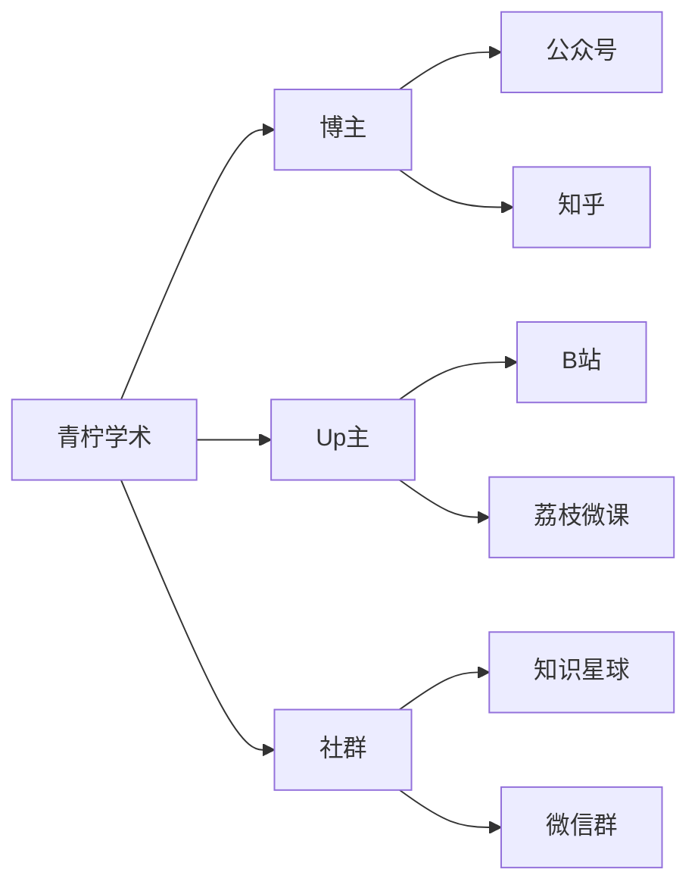
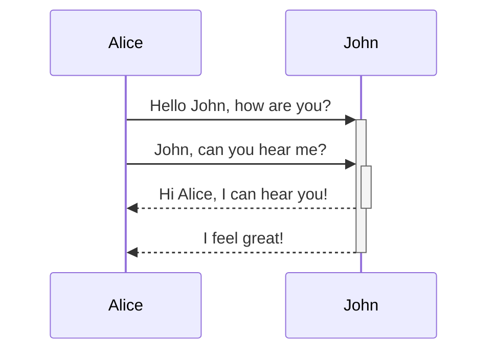
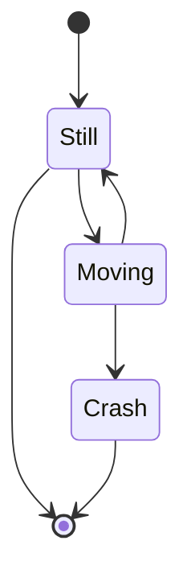
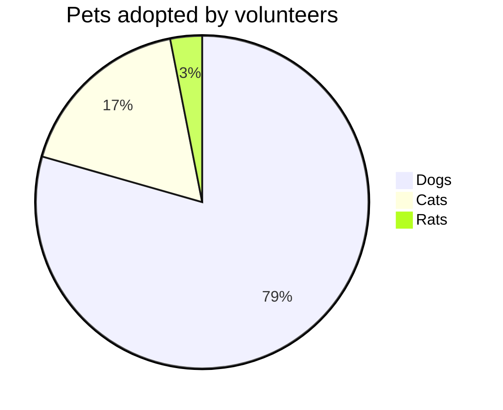

# 🕧markdown高级语法

## 🕒脑图

- [ ] graph TD 竖向思维导图



## 🕒时序图



## 🕒State Diagram



## 🕒Pie Diagram



# 🕧conda

## 🕒window添加环境变更

```bash
D:\Tool\conda\Library\lib
D:\Tool\conda\Scripts
```

## 🕒conda update

```shell
# 升级conda到最新版本
conda update conda
# 升级特定虚拟环境安装的包
conda update --update-all -n my3120
```

## 🕒conda env

```shell
# 查看创建的虚拟环境
conda env list
# 删除虚拟环境
conda.exe env remove -n <虚拟环境>
```

## 🕒conda info

```shell
# 当前激活的 Conda 虚拟环境
conda info -e

# 查看安装路径
conda info --envs
conda info --base

```

## 🕒conda list

```shell
# 查看虚拟环境详细信息
conda list -n <虚拟环境>

```

## 🕒conda create

```shell
# 创建虚拟环境
conda create --name mypy3110 python=3.11.0
conda create -p /path/to/desired/location/myenv

# 激活虚拟环境,需要初始化环境:conda init
conda.bat activate mypy3110

# cmd C:\Windows\System32执行
conda activate mypy3110

# 退出虚拟环境
conda deactivate


```

## 🕒conda remove

```shell
# 删除包
conda remove -n <虚拟环境> <包>

# 删除虚拟环境
conda remove --name your_env_name --all

```

## 🕒conda search

```shell
# 查看conda支持的python版本
conda search "^python$"
conda search "^python=3*"
# 查看conda最新版本
conda search -c anaconda conda
```

## 🕒conda init

```shell
# 初始化环境
conda init --all
```

## 🕒conda install

```shell
conda.exe install -n <虚拟环境> <包>

# 清华源找不到包时,试下如下
conda install sxtwl -n my3110 -c https://anaconda.org
# 如果conda 安装不了，直接虚拟环境下，pip吧
pip.exe install openpyxl -i https://mirrors.aliyun.com/pypi/simple/ --trusted-host mirrors.aliyun.com

# 查看虚拟环境安装的包
conda activate <>
conda list

# 虚拟环境运行代码
python.exe .\homcpeall_account.py "F:/accountall.log"
```

## 🕒.condarc

```shell


```

## 🕒conda config

```shell
# 列出当前配置
conda config --show
# 添加下载源
conda config --add channels https://mirrors.aliyun.com/anaconda/pkgs/main/
# 删除下载源
conda config --remove channels https://mirrors.aliyun.com/anaconda/pkgs/main/
# 设置代理
conda config --set proxy_servers.http http://your_proxy_server
conda config --set proxy_servers.https https://your_proxy_server
# 清除配置选项
conda config --remove-key proxy_servers.http

```
## 🕒conda run

```shell
# `myenv`的Conda环境,运行`my_script.py`:
conda run -n myenv python my_script.py

```

```bash
# 过滤特定字段,以及所在行的后几行
cat .\kimli.log  | Select-String -Pattern 'ps -e -o' -CaseSensitive -SimpleMatch  -Context 0,3
Get-Content 'C:\Users\a1993\Desktop\1236.log' | Select-String -Pattern 'ssh -p 333 boco4a|vswitch|\:\[ | eth'

# 查看笔记本wifi密码
netsh wlan show profiles
netsh wlan show profile name="WiFi名称" key=clear

# 查看笔记本系统详情
msinfo32

```

# 🕧node

## 🕒npm升级

```bash
# 清理缓存
npm cache clean -f

# 配置npm官网镜像地址
npm config set registry https://registry.npmjs.org/

# 执行升级操作
npm install -g

# 查看npm配置
npm config get registry
npm config get prefix


```

# 🕧powershell

## 🕒winget

### 🫁search

```powershell
winget search Microsoft.PowerShell
```

### 🫁install

```powershell
 winget install Miniconda3 --accept-package-agreements --accept-source-agreements --no-upgrade --uninstall-previous --force -l D:/Tool/conda --rainbow
```
### 🫁uninstall

```bash
winget uninstall --force --purge --accept-source-agreements Miniconda3
```

### 🫁list

```powershell

```

### 🫁show

```powershell

```

### 🫁upgrade

```powershell

```
## 🕒包管理

```bash
# Get-Help Get-AppxPackage

```

## 🕒tasklist

```bash

```

# 🚫 Git

## 🔞 Git配置SSH登录

> [GitHub文档操作指导](https://docs.github.com/zh/authentication/connecting-to-github-with-ssh/checking-for-existing-ssh-keys "GitHub")

### 📵 客户端生成SSH密钥

```bash
# 打开git bash
ssh-keygen -t ed25519 -C "csjmjy@outlook.com"
# $ ssh-keygen -t ed25519 -C "csjmjy@outlook.com"
# Generating public/private ed25519 key pair.
# Enter file in which to save the key (/c/Users/材料用途的工人/.ssh/id_ed25519):
# Enter passphrase (empty for no passphrase):
# Enter same passphrase again:
# Your identification has been saved in /c/Users/材料用途的工人/.ssh/id_ed25519
# Your public key has been saved in /c/Users/材料用途的工人/.ssh/id_ed25519.pub
# The key fingerprint is:
# SHA256:ih95nmfxKOEDY+wVBQXHeWUtUJih7StoNMxeEymysvg csjmjy@outlook.com
# The key's randomart image is:
# +--[ED25519 256]--+
# |        o=o.oB+. |
# |         .+++.. .|
# |      . ..+..  . |
# |       =.. o     |
# |    ... S.o .    |
# |   . +==o+.. .   |
# |  . oo+==..+.    |
# |   . ..=+.+..    |
# |    E . o=       |
# +----[SHA256]-----+
```

### 📵 将 SSH 密钥添加到 ssh-agent

```bash
# 在新的_管理员提升_终端窗口(PowerShell 或 CMD)中,确保 ssh-agent 正在运行
Get-Service -Name ssh-agent | Set-Service -StartupType Manual
Start-Service ssh-agent

# 在无提升权限的终端窗口中,将SSH私钥添加到ssh-agent.
ssh-add C:\Users\材料用途的工人\.ssh\id_ed25519
# Identity added: C:\Users\鏉愭枡鐢ㄩ€旂殑宸ヤ汉\.ssh\id_ed25519 (csjmjy@outlook.com)
```

### 📵 使用SSH密钥密码

```bash
# 添加或更改密码:Z!3WyrPTjV9zx31r
$ ssh-keygen -p -f ~/.ssh/id_ed25519
# Key has comment 'csjmjy@outlook.com'
# Enter new passphrase (empty for no passphrase):
# Enter same passphrase again:
# Your identification has been saved with the new passphrase.

# 在 Git for Windows 上自动启动 ssh-agent
# 可以在打开 bash 或 Git shell 时自动运行 ssh-agent. 复制以下行并将其粘贴到 Git shell 中的 ~/.profile 或 ~/.bashrc 文件中:
---------------------------------------------------------------------------------------------------
env=~/.ssh/agent.env

agent_load_env () { test -f "$env" && . "$env" >| /dev/null ; }

agent_start () {
    (umask 077; ssh-agent >| "$env")
    . "$env" >| /dev/null ; }

agent_load_env

# agent_run_state: 0=agent running w/ key; 1=agent w/o key; 2=agent not running
agent_run_state=$(ssh-add -l >| /dev/null 2>&1; echo $?)

if [ ! "$SSH_AUTH_SOCK" ] || [ $agent_run_state = 2 ]; then
    agent_start
    ssh-add
elif [ "$SSH_AUTH_SOCK" ] && [ $agent_run_state = 1 ]; then
    ssh-add
fi
---------------------------------------------------------------------------------------------------
```

### 📵 新增SSH密钥到GitHub帐户


### 📵 测试SSH连接

```bash
$ ssh -T git@github.com
# The authenticity of host 'github.com (20.205.243.166)' can't be established.
# ED25519 key fingerprint is SHA256:+DiY3wvvV6TuJJhbpZisF/zLDA0zPMSvHdkr4UvCOqU.
# This key is not known by any other names.
# Are you sure you want to continue connecting (yes/no/[fingerprint])? yes
# Warning: Permanently added 'github.com' (ED25519) to the list of known hosts.
# Hi mawanxiangone! You've successfully authenticated, but GitHub does not provide shell access.
```

### 📵 检查现有SSH密钥

```bash
$ ls -al ~/.ssh
# total 38
# drwxr-xr-x 1 材料用途的工人 197121    0 10月 25 01:40 ./
# drwxr-xr-x 1 材料用途的工人 197121    0 10月 25 02:15 ../
# -rw-r--r-- 1 材料用途的工人 197121  464 10月 25 02:00 id_ed25519
# -rw-r--r-- 1 材料用途的工人 197121  100 10月 25 01:20 id_ed25519.pub
# -rw-r--r-- 1 材料用途的工人 197121 1509 10月 25 01:40 known_hosts
# -rw-r--r-- 1 材料用途的工人 197121  776 10月 25 01:40 known_hosts.old
```

## 🔞 Git命令

### 📵 git branch

```bash
# 查看本地分支列表
git branch

# 删除分支
git branch -d <分支>

# 强制删除分支(未合并的更改将会丢失)
git branch -D <分支>
```

### 📵 git checkout

```bash
# 切换分支
git checkout main
```

### 📵 git status

```bash

```
### 📵git remote

```bash
```

### 📵git config

```bash
# 查看用户身份
git config user.name
git config user.email

# 更新用户身份
git config user.name “”
git config user.email “”

# 查看配置
git config --list 
git config --global --get http.proxy
git config --global --get https.proxy
git config --global --get core.gitproxy

# 修改.git/config中url为ssh方式
url = git@github.com:mawanxiangone/interesting.git
```

### 📵git remote

```bash
# 检查连接状态

```


## 🔞 远程仓库使用

### 📵 克隆现有仓库

```bash
$ git clone https://github.com/mawanxiangone/interesting.git
# Cloning into 'interesting'...
# remote: Enumerating objects: 179, done.
# remote: Counting objects: 100% (39/39), done.
# remote: Compressing objects: 100% (35/35), done.
# remote: Total 179 (delta 17), reused 3 (delta 3), pack-reused 140
# Receiving objects: 100% (179/179), 48.00 KiB | 434.00 KiB/s, done.
# Resolving deltas: 100% (53/53), done.

# 指定特定分支
git clone -b world https://github.com/mawanxiangone/interesting.git

```

### 📵合并分支

```bash
# 使用 SSH 克隆仓库
git clone git@github.com:mawanxiangone/interesting.git
cd interesting

# 切换到 main 分支
git checkout main

# 拉取最新的 main 分支更新
git pull origin main

# 查看远程分支列表
git fetch origin
git branch -r

# 创建并切换到本地 world 分支
git checkout -b world origin/world

# 切换回 main 分支并合并 world 分支
git checkout main
git merge world

# 处理可能的合并冲突 (如果有)
# 编辑有冲突的文件，然后使用 git add 添加解决后的文件
# git add <resolved_file>

# 提交合并 (如果有冲突需要手动提交)

# 推送更新到远程仓库
git push origin main
```

### 📵删除分支

```bash
# 切换到主分支
git checkout main

# 删除本地分支 world
git branch -d world  # 如果未合并，使用 git branch -D world

# 删除远程分支 world
git push origin --delete world
```

### 📵 创建分支

```bash
# 查看本地分支列表
git branch

# 拉取远程仓库的最新更改
git pull origin main

# 创建分支
git checkout -b world

# 新分支推送到 GitHub 上
git push -u origin world

# 切换分支
git checkout main
```

### 📵 创建文件

```bash

# 切换分支
git checkout world

# 创建一个文件夹
mkdir world

# 文件夹创建文件,新建对象都要以下几步
touch.exe world.md

# 新创建的文件夹添加到版本控制
git add world

# 提交更改
git commit -m "Add new folder"
git commit -m "Add new folder and file to repository"
# 粗暴的方式
git commit -am "你的提交信息"
# 更简单粗暴的方法
git add .
git commit -m "添加新文件夹及文件"
git push origin <你的分支名>

# 将本地的更改推送到GitHub上的分支
git push origin world
```

### 删除文件

```bash

```

### 📵 文件内容更新推送

```bash
# 拉取最新的远程更新
git pull origin main

# 本地的变动添加到Git的暂存区
git add text.md

# 提交文件的变动
git commit -m "Update text.md with new changes"

# 提交推送到远程GitHub仓库
git push origin world
```

## 🕒杂项

### 🫁文件哈希值计算

```bash
# 哈希计算,比如SHA256
certutil.exe -hashfile E:\Work\运营商工作\杭研工作\杭研资料\openEuler-20.03-LTS-SP3-aarch64-dvd.iso SHA256
```

### 🫁升级软件类

```bash
# git 升级
git update git --rainbow
```

## 🕒杂物

### 🫁centos9挂载文件夹

- vmware给centos9挂载共享的文件夹

```bash
4.0及更高版本的Linux内核	                                                              说明
/usr/bin/vmhgfs-fuse .host:/ /home/user1/shares -o subtype=vmhgfs-fuse,allow_other	   将所有共享装载到/home/user1/shares
/usr/bin/vmhgfs-fuse .host:/foo /tmp/foo -o subtype=vmhgfs-fuse,allow_other	           将名为foo的共享装载到/tmp/foo
/usr/bin/vmhgfs-fuse .host:/foo/bar /var/lib/bar -o subtype=vmhgfs-fuse,allow_other	   将共享foo中的子目录bar装载到/var/lib/bar
```
