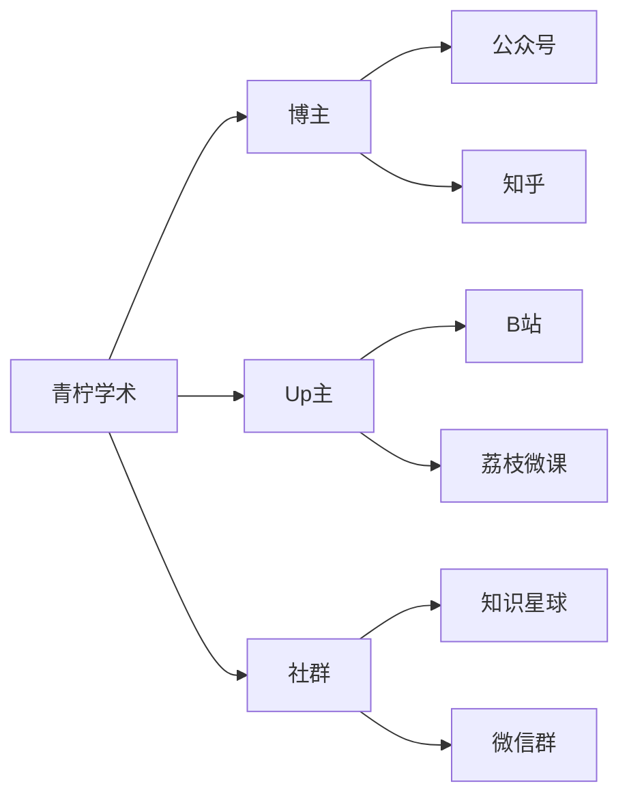
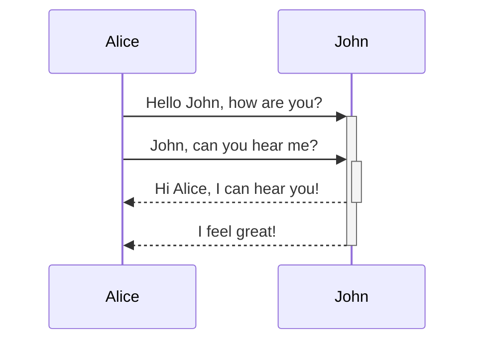
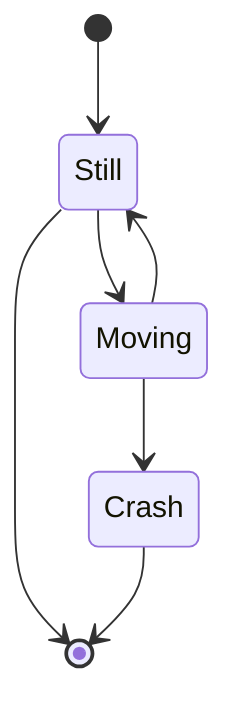
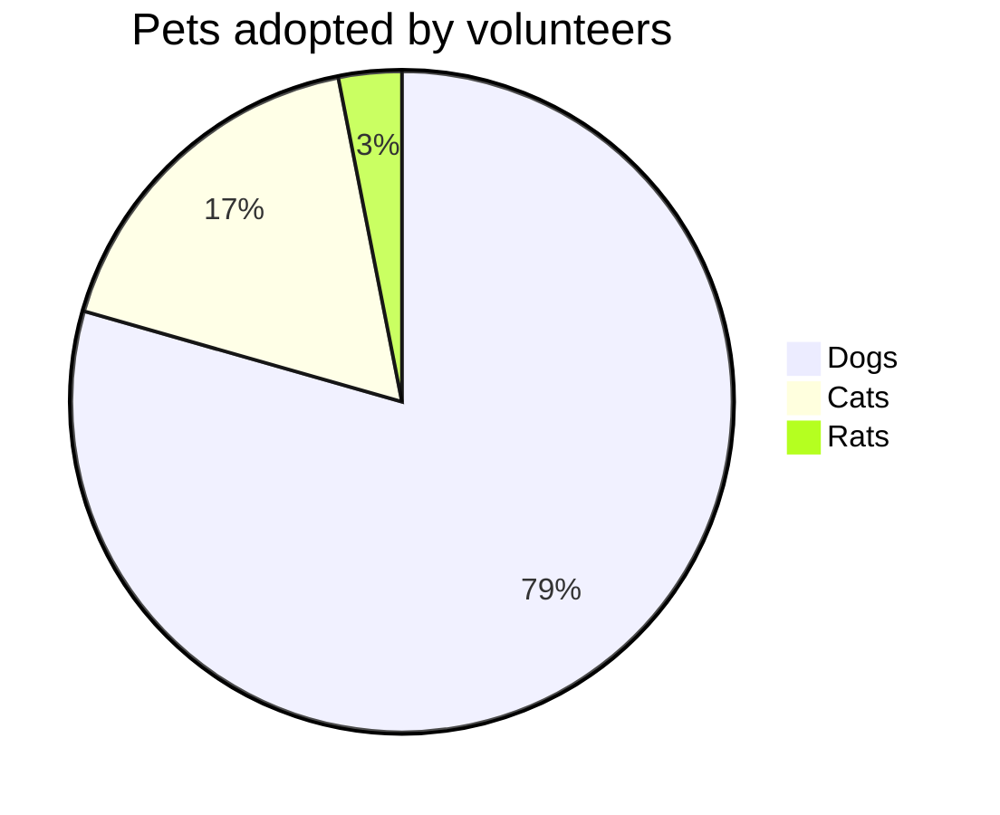

------

# 🕧markdown高级语法
## 🕒脑图

- [ ] graph TD 竖向思维导图



## 🕒时序图



## 🕒State Diagram



## 🕒Pie Diagram


# 🕧conda
## 🕒conda update

```shell
# 升级conda到最新版本
conda update conda
conda update update
```
## 🕒conda env

```shell
# 查看创建的虚拟环境
conda env list
# 删除虚拟环境
conda.exe env remove -n <虚拟环境>
```

## 🕒conda info

```shell
# 当前激活的 Conda 虚拟环境
conda info -e

```

## 🕒conda list

```shell
# 查看虚拟环境详细信息
conda list -n <虚拟环境>

```

## 🕒conda create

```shell
# 创建虚拟环境
conda create --name mypy3110 python=3.11.0
# 激活虚拟环境,需要初始化环境：conda init
conda.bat activate mypy3110
# 退出虚拟环境
conda deactivate


```

## 🕒conda remove

```shell
# 删除包
conda remove -n <虚拟环境> <包>

```
## 🕒conda search

```shell
# 查看conda支持的python版本
conda search "^python$"
conda search "^python=3*"
```
## 🕒conda init

```shell
# 初始化环境
conda init powershell
conda init bash
conda init 
```

## 🕒conda install

```shell
conda.exe install -n <虚拟环境> <包>

```

## 🕒.condarc

```shell


```
## 🕒conda config

```shell
# 列出当前配置
conda config --show
# 添加下载源
conda config --add channels https://mirrors.aliyun.com/anaconda/pkgs/main/
# 删除下载源
conda config --remove channels https://mirrors.aliyun.com/anaconda/pkgs/main/
# 设置代理
conda config --set proxy_servers.http http://your_proxy_server
conda config --set proxy_servers.https https://your_proxy_server
# 清除配置选项
conda config --remove-key proxy_servers.http

```
## 🕒conda run

```shell
# `myenv`的Conda环境，运行`my_script.py`:
conda run -n myenv python my_script.py

```

# 🕧powershell

```bash
# 过滤特定字段，以及所在行的后几行
cat .\kimli.log  | Select-String -Pattern 'ps -e -o' -CaseSensitive -SimpleMatch  -Context 0,3

```

## 🕒winget

### 🫁search

```powershell
winget search Microsoft.PowerShell
```

### 🫁install

```powershell

```

### 🫁list

```powershell

```

### 🫁show

```powershell

```

### 🫁upgrade

```powershell

```

## 🕒杂项

### 🫁文件哈希值计算

```bash
# 哈希计算，比如SHA256
certutil.exe -hashfile E:\Work\运营商工作\杭研工作\杭研资料\openEuler-20.03-LTS-SP3-aarch64-dvd.iso SHA256
```

### 🫁升级软件类

```bash
# git 升级
git update-git-for-windows
```
