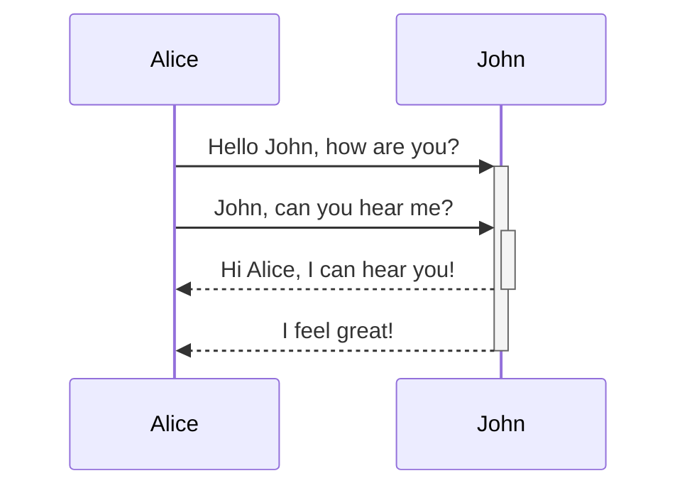
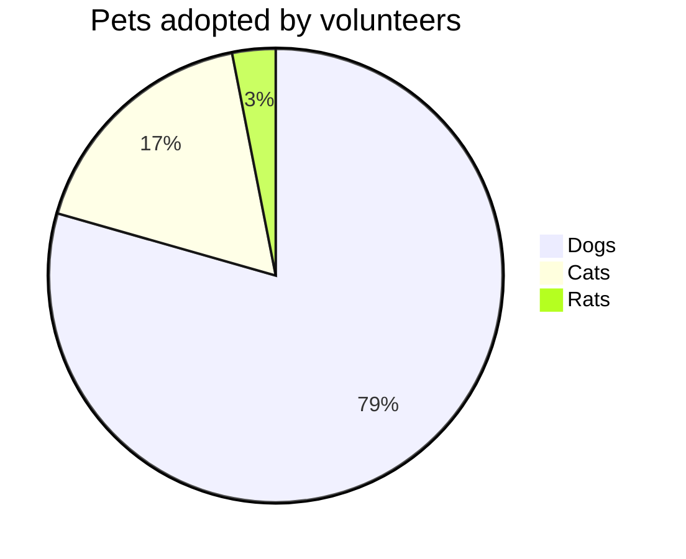
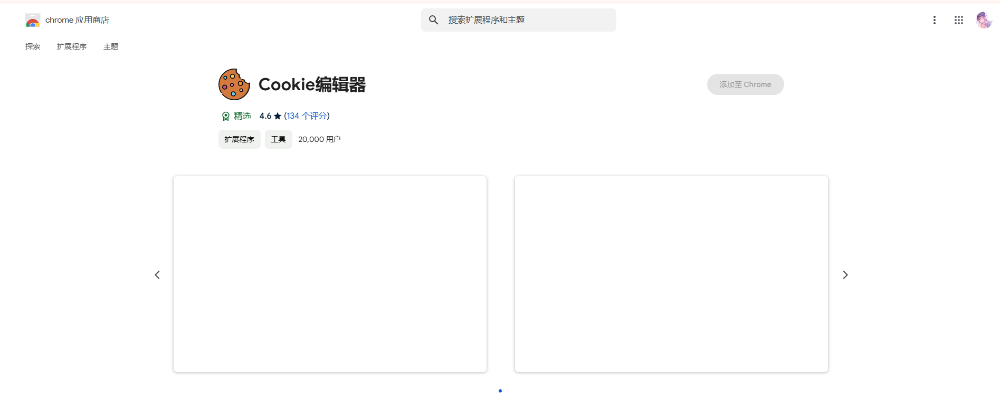
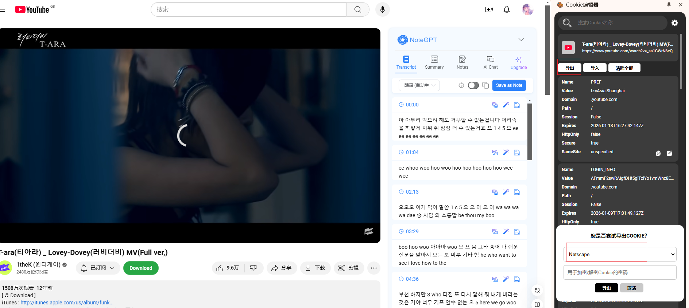

# 🕧markdown高级语法

## 🕒脑图

- [ ] graph TD 竖向思维导图


## 🕒时序图



## 🕒State Diagram


## 🕒Pie Diagram



# 🕧conda

## 🕒window添加环境变更

```bash
D:\Tool\conda\Library\lib
D:\Tool\conda\Scripts
```

## 🕒conda clean

```bash
# 删除未使用的软件包和缓存
```

## 🕒conda doctor

```bash
# 显示环境的健康报告
```

## 🕒conda update

```shell
# 升级conda到最新版本
conda update conda
# 升级特定虚拟环境安装的包
conda update --update-all -n my3120
```

## 🕒conda env

```shell
# 查看创建的虚拟环境
conda env list
# 删除虚拟环境
conda.exe env remove -n <虚拟环境>
```

## 🕒conda info

```shell
# 当前激活的 Conda 虚拟环境
conda info -e

# 查看安装路径
conda info --envs
conda info --base
```

## 🕒conda list

```shell
# 查看虚拟环境详细信息
conda list -n <虚拟环境>
```

## 🕒conda create

```shell
# 创建虚拟环境
conda create --name mypy3110 python=3.11.0
conda create -p /path/to/desired/location/myenv

# 激活虚拟环境,需要初始化环境:conda init
conda.bat activate mypy3110

# cmd C:\Windows\System32执行
conda activate mypy3110

# 退出虚拟环境
conda deactivate
```

## 🕒conda remove

```shell
# 删除包
conda remove -n <虚拟环境> <包>

# 删除虚拟环境
conda remove --name your_env_name --all
```

## 🕒conda rename

```bash
# 重命名现有环境
```

## 🕒conda search

```shell
# 查看conda支持的python版本
conda search "^python$"
conda search "^python=3*"
# 查看conda最新版本
conda search -c anaconda conda
```

## 🕒conda init

```shell
# 初始化环境
conda init --all
```

## 🕒conda install

```shell
conda.exe install -n <虚拟环境> <包>

# 清华源找不到包时,试下如下
conda install sxtwl -n my3110 -c https://anaconda.org
# 如果conda 安装不了，直接虚拟环境下，pip吧
pip.exe install openpyxl -i https://mirrors.aliyun.com/pypi/simple/ --trusted-host mirrors.aliyun.com

# 查看虚拟环境安装的包
conda activate <>
conda list

# 虚拟环境运行代码
python.exe .\homcpeall_account.py "F:/accountall.log"
```

## 🕒.condarc

```shell

```

## 🕒conda config

```shell
# custom_channels 自定义通道

# 列出当前配置
conda config --show
# 添加下载源
conda config --add channels https://mirrors.aliyun.com/anaconda/pkgs/main/
# 清华源
  - https://mirrors.tuna.tsinghua.edu.cn/anaconda/pkgs/main
  - https://mirrors.tuna.tsinghua.edu.cn/anaconda/pkgs/r
  - https://mirrors.tuna.tsinghua.edu.cn/anaconda/pkgs/msys2
# 删除下载源
conda config --remove channels https://mirrors.aliyun.com/anaconda/pkgs/main/
# 设置代理
conda config --set proxy_servers.http http://your_proxy_server
conda config --set proxy_servers.https https://your_proxy_server
# 清除配置选项
conda config --remove-key proxy_servers.http

# 当update conda 出现404错误时，可以把channels删除，试试看
conda config --remove-key channels defaults
```

## 🕒conda run

```shell
# `myenv`的Conda环境,运行`my_script.py`:
conda run -n myenv python my_script.py
```

```bash
# 过滤特定字段,以及所在行的后几行
cat .\kimli.log  | Select-String -Pattern 'ps -e -o' -CaseSensitive -SimpleMatch  -Context 0,3
Get-Content 'C:\Users\a1993\Desktop\1236.log' | Select-String -Pattern 'ssh -p 333 boco4a|vswitch|\:\[ | eth'

# 查看笔记本wifi密码
netsh wlan show profiles
netsh wlan show profile name="WiFi名称" key=clear

# 查看笔记本系统详情
msinfo32
```

# 🕧node

## 🕒npm升级

```bash
# 清理缓存
npm cache clean -f

# 配置npm官网镜像地址
npm config set registry https://registry.npmjs.org/

# 执行升级操作
npm install -g

# 查看npm配置
npm config get registry
npm config get prefix
```

# 🕧powershell

## 🕒winget

### 🫁search

```powershell
winget search Microsoft.PowerShell
```

### 🫁install

```powershell
 winget install Miniconda3 --accept-package-agreements --accept-source-agreements --no-upgrade --uninstall-previous --force -l D:/Tool/conda --rainbow
```

### 🫁uninstall

```bash
winget uninstall --force --purge --accept-source-agreements Miniconda3
```

### 🫁list

```powershell

```

### 🫁show

```powershell

```

### 🫁upgrade

```powershell

```

## 🕒包管理

```bash
# Get-Help Get-AppxPackage
```

## 🕒tasklist

```bash

```

# 🚫 Git

## 🔞 Git配置SSH登录

> [GitHub文档操作指导](https://docs.github.com/zh/authentication/connecting-to-github-with-ssh/checking-for-existing-ssh-keys "GitHub")

### 📵 客户端生成SSH密钥

```bash
# 打开git bash
ssh-keygen -t ed25519 -C "csjmjy@outlook.com"
# $ ssh-keygen -t ed25519 -C "csjmjy@outlook.com"
# Generating public/private ed25519 key pair.
# Enter file in which to save the key (/c/Users/材料用途的工人/.ssh/id_ed25519):
# Enter passphrase (empty for no passphrase):
# Enter same passphrase again:
# Your identification has been saved in /c/Users/材料用途的工人/.ssh/id_ed25519
# Your public key has been saved in /c/Users/材料用途的工人/.ssh/id_ed25519.pub
# The key fingerprint is:
# SHA256:ih95nmfxKOEDY+wVBQXHeWUtUJih7StoNMxeEymysvg csjmjy@outlook.com
# The key's randomart image is:
# +--[ED25519 256]--+
# |        o=o.oB+. |
# |         .+++.. .|
# |      . ..+..  . |
# |       =.. o     |
# |    ... S.o .    |
# |   . +==o+.. .   |
# |  . oo+==..+.    |
# |   . ..=+.+..    |
# |    E . o=       |
# +----[SHA256]-----+
```

### 📵 将 SSH 密钥添加到 ssh-agent

```bash
# 在新的_管理员提升_终端窗口(PowerShell 或 CMD)中,确保 ssh-agent 正在运行
Get-Service -Name ssh-agent | Set-Service -StartupType Manual
Start-Service ssh-agent

# 在无提升权限的终端窗口中,将SSH私钥添加到ssh-agent.
ssh-add C:\Users\材料用途的工人\.ssh\id_ed25519
# Identity added: C:\Users\鏉愭枡鐢ㄩ€旂殑宸ヤ汉\.ssh\id_ed25519 (csjmjy@outlook.com)
```

### 📵 使用SSH密钥密码

```bash
# 打开Git bash
# 添加或更改密码:Z!3WyrPTjV9zx31r
$ ssh-keygen -p -f ~/.ssh/id_ed25519
# Key has comment 'csjmjy@outlook.com'
# Enter new passphrase (empty for no passphrase):
# Enter same passphrase again:
# Your identification has been saved with the new passphrase.

# 在 Git for Windows 上自动启动 ssh-agent
# 可以在打开 bash 或 Git shell 时自动运行 ssh-agent. 复制以下行并将其粘贴到 Git shell 中的 ~/.profile 或 ~/.bashrc 文件中:
---------------------------------------------------------------------------------------------------
env=~/.ssh/agent.env

agent_load_env () { test -f "$env" && . "$env" >| /dev/null ; }

agent_start () {
    (umask 077; ssh-agent >| "$env")
    . "$env" >| /dev/null ; }

agent_load_env

# agent_run_state: 0=agent running w/ key; 1=agent w/o key; 2=agent not running
agent_run_state=$(ssh-add -l >| /dev/null 2>&1; echo $?)

if [ ! "$SSH_AUTH_SOCK" ] || [ $agent_run_state = 2 ]; then
    agent_start
    ssh-add
elif [ "$SSH_AUTH_SOCK" ] && [ $agent_run_state = 1 ]; then
    ssh-add
fi
---------------------------------------------------------------------------------------------------
```

### 📵 新增SSH密钥到GitHub帐户


### 📵 测试SSH连接

```bash
$ ssh -T git@github.com
# The authenticity of host 'github.com (20.205.243.166)' can't be established.
# ED25519 key fingerprint is SHA256:+DiY3wvvV6TuJJhbpZisF/zLDA0zPMSvHdkr4UvCOqU.
# This key is not known by any other names.
# Are you sure you want to continue connecting (yes/no/[fingerprint])? yes
# Warning: Permanently added 'github.com' (ED25519) to the list of known hosts.
# Hi mawanxiangone! You've successfully authenticated, but GitHub does not provide shell access.
```

### 📵 检查现有SSH密钥

```bash
$ ls -al ~/.ssh
# total 38
# drwxr-xr-x 1 材料用途的工人 197121    0 10月 25 01:40 ./
# drwxr-xr-x 1 材料用途的工人 197121    0 10月 25 02:15 ../
# -rw-r--r-- 1 材料用途的工人 197121  464 10月 25 02:00 id_ed25519
# -rw-r--r-- 1 材料用途的工人 197121  100 10月 25 01:20 id_ed25519.pub
# -rw-r--r-- 1 材料用途的工人 197121 1509 10月 25 01:40 known_hosts
# -rw-r--r-- 1 材料用途的工人 197121  776 10月 25 01:40 known_hosts.old
```

## 🔞 Git命令

### 📵 git branch

```bash
# 查看本地分支列表
git branch

# 删除分支
git branch -d <分支>

# 强制删除分支(未合并的更改将会丢失)
git branch -D <分支>
```

### 📵 git checkout

```bash
# 切换分支
git checkout main
```

### 📵 git status

```bash

```

### 📵git remote

```bash
# 修改通信为ssh方式 
git remote set-url origin git@github.com:mawanxiangone/interesting.git
```

### 📵git config

```bash
# 查看用户身份
git config user.name
git config user.email

# 更新用户身份
git config user.name “”
git config user.email “”

# 查看配置
git config --list 
git config --global --get http.proxy
git config --global --get https.proxy
git config --global --get core.gitproxy

# 修改.git/config中url为ssh方式
url = git@github.com:mawanxiangone/interesting.git
```

### 📵git remote

```bash
# 检查连接状态
```

## 🔞 远程仓库使用

### 📵 克隆现有仓库

```bash
$ git clone https://github.com/mawanxiangone/interesting.git
# Cloning into 'interesting'...
# remote: Enumerating objects: 179, done.
# remote: Counting objects: 100% (39/39), done.
# remote: Compressing objects: 100% (35/35), done.
# remote: Total 179 (delta 17), reused 3 (delta 3), pack-reused 140
# Receiving objects: 100% (179/179), 48.00 KiB | 434.00 KiB/s, done.
# Resolving deltas: 100% (53/53), done.

# 指定特定分支
git clone -b world https://github.com/mawanxiangone/interesting.git
```

### 📵合并分支

```bash
# 使用 SSH 克隆仓库
git clone git@github.com:mawanxiangone/interesting.git
cd interesting

# 切换到 main 分支
git checkout main

# 拉取最新的 main 分支更新
git pull origin main

# 查看远程分支列表
git fetch origin
git branch -r

# 创建并切换到本地 world 分支
git checkout -b world origin/world

# 切换回 main 分支并合并 world 分支
git checkout main
git merge world

# 处理可能的合并冲突 (如果有)
# 编辑有冲突的文件，然后使用 git add 添加解决后的文件
# git add <resolved_file>

# 提交合并 (如果有冲突需要手动提交)

# 推送更新到远程仓库
git push origin main
```

### 📵删除分支

```bash
# 切换到主分支
git checkout main

# 删除本地分支 world
git branch -d world  # 如果未合并，使用 git branch -D world

# 删除远程分支 world
git push origin --delete world
```

### 📵 创建分支

```bash
# 查看本地分支列表
git branch

# 拉取远程仓库的最新更改
git pull origin main

# 创建分支
git checkout -b world

# 新分支推送到 GitHub 上
git push -u origin world

# 切换分支
git checkout main
```

### 📵 创建文件

```bash
# 切换分支
git checkout world

# 创建一个文件夹
mkdir world

# 文件夹创建文件,新建对象都要以下几步
touch.exe world.md

# 新创建的文件夹添加到版本控制
git add world

# 提交更改
git commit -m "Add new folder"
git commit -m "Add new folder and file to repository"
# 粗暴的方式
git commit -am "你的提交信息"
# 更简单粗暴的方法
git add .
git commit -m "添加新文件夹及文件"
git push origin <你的分支名>

# 将本地的更改推送到GitHub上的分支
git push origin world
```

### 📵删除文件

```bash
# 删除文件 example.txt
git rm example.txt

# 提交更改
git commit -m "删除文件 example.txt"

# 推送更改到 main 分支
git push origin main
```

### 📵 文件内容更新推送

```bash
# 拉取最新的远程更新
git pull origin main

# 本地的变动添加到Git的暂存区
git add text.md

# 提交文件的变动
git commit -m "Update text.md with new changes"

# 提交推送到远程GitHub仓库
git push origin world 
```

# 🕒杂项

## 🫁文件哈希值计算

```bash
# 哈希计算,比如SHA256
certutil.exe -hashfile E:\Work\运营商工作\杭研工作\杭研资料\openEuler-20.03-LTS-SP3-aarch64-dvd.iso SHA256
```

## 🫁升级软件类

```bash
# git 升级
git update git --rainbow
```

# 🕒杂物

## 🫁centos9挂载文件夹

- vmware给centos9挂载共享的文件夹

```bash
4.0及更高版本的Linux内核                                                                  说明
/usr/bin/vmhgfs-fuse .host:/ /home/user1/shares -o subtype=vmhgfs-fuse,allow_other       将所有共享装载到/home/user1/shares
/usr/bin/vmhgfs-fuse .host:/foo /tmp/foo -o subtype=vmhgfs-fuse,allow_other               将名为foo的共享装载到/tmp/foo
/usr/bin/vmhgfs-fuse .host:/foo/bar /var/lib/bar -o subtype=vmhgfs-fuse,allow_other       将共享foo中的子目录bar装载到/var/lib/bar
```

# 🕧python工具使用

## 🕒yt-dlp

### 🫁参数

```bash
Options:
  通用选项:
    -h, --help                       打印帮助文档
    --version                        打印版本信息
    -U, --update                     更新到最新版(需要权限)
    -i, --ignore-errors              遇到下载错误时跳过
    --abort-on-error                 遇到下载错误时终止
    --dump-user-agent                显示当前使用的浏览器(User-agent)
    --list-extractors                列出所有的提取器(支持的网站)
    --extractor-descriptions         同上
    --force-generic-extractor        强制使用通用提取器下载
    --ignore-config                  不读取配置文件，仅读取/etc/youtube-dl.conf
    --config-location PATH           使用指定路径下的配置文件
    --flat-playlist                  列出列表视频但不下载
    --mark-watched                   标记看过此视频 (YouTube only)
    --no-mark-watched                不标记看过此视频 (YouTube only)
    --no-color                       打印到屏幕上的代码不带色

  网络选项:
    --proxy URL                      使用HTTP/HTTPS/SOCKS协议的代理.如：socks5://127.0.0.1:1080/.
    --socket-timeout SECONDS         放弃连接前等待时间
    --source-address IP              绑定的客户端IP地址
    -4, --force-ipv4                 所有连接通过IPv4
    -6, --force-ipv6                 所有连接通过IPv6

  地理限制:
    --geo-verification-proxy URL     使用此代理地址测试一些有地理限制的地址
    --geo-bypass                     绕过地理限制通过伪装X-Forwarded-For HTTP头部的客户端ip (实验)
    --no-geo-bypass                  不 绕过地理限制通过伪装X-Forwarded-For HTTP头部的客户端ip (实验)
    --geo-bypass-country CODE        强制绕过地理限制通过提供准确的ISO 3166-2标准的国别代码(实验) 

  视频选择:
    --playlist-start NUMBER          指定列表中开始下载的视频(默认为1)
    --playlist-end NUMBER            指定列表中结束的视频(默认为last)
    --playlist-items ITEM_SPEC       指定列表中要下载的视频项目编号.如："--playlist-items 1,2,5,8"或"--playlist-items 1-3,7,10-13"
    --match-title REGEX              下载标题匹配的视频(正则表达式或区分大小写的字符串)
    --reject-title REGEX             跳过下载标题匹配的视频(正则表达式或区分大小写的字符串)
    --max-downloads NUMBER           下载NUMBER个视频后停止
    --min-filesize SIZE              不下载小于SIZE的视频(e.g. 50k or 44.6m)
    --max-filesize SIZE              不下载大于SIZE的视频(e.g. 50k or 44.6m)
    --date DATE                      仅下载上传日期在指定日期的视频
    --datebefore DATE                仅下载上传日期在指定日期或之前的视频 (i.e. inclusive)
    --dateafter DATE                 仅下载上传日期在指定日期或之后的视频 (i.e. inclusive)
    --min-views COUNT                不下载观影数小于指定值的视频
    --max-views COUNT                不下载观影数大于指定值的视频

    --match-filter FILTER            通用视频过滤器. Specify any key (see help for -o for a list of available keys) to match if the key is present, !key to check if the key is not present, key > NUMBER (like "comment_count > 12", also works with >=, <, <=, !=, =) to compare against a number,key = 'LITERAL' (like "uploader = 'Mike Smith'", also works with !=) to match against a string literal and & to require multiple matches. Values which are not known are excluded unless you put a question mark (?) after the operator. For example, to only match videos that have been liked more than 100 times and disliked less than 50 times (or the dislike functionality is not available at the given service), but who also have a description, use --match-filter "like_count > 100 & dislike_count <? 50 & description" .

    --no-playlist                    当视频链接到一个视频和一个播放列表时，仅下载视频
    --yes-playlist                   当视频链接到一个视频和一个播放列表时，下载视频和播放列表
    --age-limit YEARS                下载合适上传年限的视频
    --download-archive FILE          仅下载档案文件中未列出的影片，已下载的记录ID
    --include-ads                    同时下载广告(实验)

  下载选项:
    -r, --limit-rate RATE            最大bps (e.g. 50K or 4.2M)
    -R, --retries RETRIES            重试次数 (默认10), or "infinite".
    --fragment-retries RETRIES       一个分段的最大重试次数(default is 10), or "infinite" (DASH, hlsnative and ISM)
    --skip-unavailable-fragments     跳过不可用分段(DASH, hlsnative and ISM)
    --abort-on-unavailable-fragment  放弃某个分段当不可获取时
    --keep-fragments                 下载完成后，将下载的片段保存在磁盘上; 片段默认被删除
    --buffer-size SIZE               设置缓冲区大小buffer (e.g. 1024 or 16K) (default is 1024)
    --no-resize-buffer               不自动调整缓冲区大小.默认情况下自动调整
    --playlist-reverse               以相反的顺序下载播放列表视频
    --playlist-random                以随机的顺序下载播放列表视频
    --xattr-set-filesize             Set file xattribute ytdl.filesize with expected file size (experimental)
    --hls-prefer-native              使用本机默认HLS下载器而不是ffmpeg
    --hls-prefer-ffmpeg              使用ffmpeg而不是本机HLS下载器
    --hls-use-mpegts                 使用TS流容器来存放HLS视频,一些高级播放器允许在下载的同时播放视频
    --external-downloader COMMAND    使用指定的第三方下载工具,当前支持：aria2c,avconv,axel,curl,ffmpeg,httpie,wget
    --external-downloader-args ARGS  给第三方下载工具指定参数，如：--external-downloader aria2c --external-downloader-args -j8

  文件系统选项:
    -a, --batch-file FILE            文件中包含需要下载的URL
    --id                             仅使用文件名中的视频ID
    -o, --output TEMPLATE            Output filename template, see the "OUTPUT TEMPLATE" for all the info
    --autonumber-start NUMBER        指定%(autonumber)s的起始值(默认为1)
    --restrict-filenames             将文件名限制为ASCII字符，并避免文件名中的“＆”和空格
    -w, --no-overwrites              不要覆盖文件
    -c, --continue                   强制恢复部分下载的文件。 默认情况下，youtube-dl仅在可能时将恢复下载。
    --no-continue                    不要恢复部分下载的文件(从头开始重新启动)
    --no-part                        不使用.part文件 - 直接写入输出文件
    --no-mtime                       不使用Last-modified header来设置文件最后修改时间
    --write-description              将视频描述写入.description文件
    --write-info-json                将视频元数据写入.info.json文件
    --write-annotations              将视频注释写入.annotations.xml文件
    --load-info-json FILE            包含视频信息的JSON文件(使用“--write-info-json”选项创建)
    --cookies FILE                   文件从中读取Cookie(经测试，export cookies插件可以使用，但firebug导出的cookies导致错误,chrome下请用cookies.txt)注意：不同平台windows、Linux、OSX之间需要转换CE LF才能使用！
    --cache-dir DIR                  文件存储位置。youtube-dl需要永久保存一些下载的信息。默认为$XDG_CACHE_HOME/youtube-dl或/.cache/youtube-dl。目前，只有YouTube播放器文件（对于具有模糊签名的视频）进行缓存，但可能会发生变化。
    --no-cache-dir                   不用缓存
    --rm-cache-dir                   删除所有缓存文件

  缩略图:
    --write-thumbnail                把缩略图写入硬盘
    --write-all-thumbnails           将所有缩略图写入磁盘
    --list-thumbnails                列出所有可用的缩略图格式

  详细/模拟选项:
    -q, --quiet                      激活退出模式
    --no-warnings                    忽略警告
    -s, --simulate                   不下载不存储任何文件到硬盘，模拟下载模式
    --skip-download                  不下载视频
    -g, --get-url                    模拟下载获取视频直连
    -e, --get-title                  模拟下载获取标题
    --get-id                         模拟下载获取id
    --get-thumbnail                  模拟下载获取缩略图URL
    --get-description                模拟下载获取视频描述
    --get-duration                   模拟下载获取视频长度
    --get-filename                   模拟下载获取输出视频文件名
    --get-format                     模拟下载获取输出视频格式
    -j, --dump-json                  模拟下载获取JSON information.
    -J, --dump-single-json           模拟下载获取每条命令行参数的JSON information.如果是个播放列表，就获取整个播放列表的JSON
    --print-json                     下载的同时获取视频信息的JSON
    --newline                        进度条在新行输出
    --no-progress                    不打印进度条
    --console-title                  在控制台标题栏显示进度
    -v, --verbose                    打印各种调试信息
    --dump-pages                     打印下载下来的使用base64编码的页面来调试问题（非常冗长）
    --write-pages                    将下载的中间页以文件的形式写入当前目录中以调试问题
    --print-traffic                  显示发送和读取HTTP流量
    -C, --call-home                  联系youtube-dl服务器进行调试
    --no-call-home                   不联系youtube-dl服务器进行调试

  解决方法:
    --encoding ENCODING              强制指定编码(实验)
    --no-check-certificate           禁止HTTPS证书验证
    --prefer-insecure                使用未加密的连接来检索有关视频的信息(目前仅支持YouTube)
    --user-agent UA                  指定user agent
    --referer URL                    指定自定义的referer,仅限视频来源于同一网站
    --add-header FIELD:VALUE         指定一个自定义值的HTTP头文件,使用分号分割,可以多次使用此选项
    --bidi-workaround                围绕缺少双向文本支持的终端工作。需要在PATH中有bidiv或fribidi可执行文件
    --sleep-interval SECONDS         在每次下载之前休眠的秒数，或者每次下载之前的随机睡眠的范围的下限(最小可能的睡眠秒数)与-max-sleep-interval一起使用。
    --max-sleep-interval SECONDS     每次下载前随机睡眠范围的上限(最大可能睡眠秒数)。只能与--min-sleep-interval一起使用。

  视频格式选项:
    -f, --format FORMAT              视频格式代码,查看"FORMAT SELECTION"获取所有信息
    --all-formats                    获取所有视频格式
    --prefer-free-formats            开源的视频格式优先，除非有特定的请求
    -F, --list-formats               列出请求视频的所有可用格式
    --youtube-skip-dash-manifest     不要下载关于YouTube视频的DASH清单和相关数据
    --merge-output-format FORMAT     如果需要合并(例如bestvideo + bestaudio)，则输出到给定的容器格式。mkv，mp4，ogg，webm，flv之一。如果不需要合并，则忽略

  字幕选项:
    --write-sub                      下载字幕文件
    --write-auto-sub                 下载自动生成的字幕文件 (YouTube only)
    --all-subs                       下载所有可用的字幕
    --list-subs                      列出所有字幕
    --sub-format FORMAT              字幕格式,接受格式偏好,如："srt" or "ass/srt/best"
    --sub-lang LANGS                 要下载的字幕的语言(可选)用逗号分隔,请使用--list-subs表示可用的语言标签

  验证选项:
    -u, --username USERNAME          使用ID登录
    -p, --password PASSWORD          账户密码,如果此选项未使用,youtube-dl将交互式地询问。
    -2, --twofactor TWOFACTOR        双因素认证码
    -n, --netrc                      使用.netrc认证数据
    --video-password PASSWORD        视频密码(vimeo, smotri, youku)

  Adobe Pass Options:
    --ap-mso MSO                     Adobe Pass多系统运营商(电视提供商)标识符,使用--ap-list-mso列出可用的MSO
    --ap-username USERNAME           MSO账号登录
    --ap-password PASSWORD           账户密码,如果此选项未使用,youtube-dl将交互式地询问。
    --ap-list-mso                    列出所有支持的MSO

  后处理选项:
    -x, --extract-audio              将视频文件转换为纯音频文件(需要ffmpeg或avconv和ffprobe或avprobe)
    --audio-format FORMAT            指定音频格式: "best", "aac", "flac", "mp3", "m4a", "opus", "vorbis", or "wav"; "best" by default;-x存在时无效
    --audio-quality QUALITY          指定ffmpeg/avconv音频质量,为VBR插入一个0(best)-9(worse)的值(默认5),或者指定比特率
    --recode-video FORMAT            必要时将视频转码为其他格式(当前支持: mp4|flv|ogg|webm|mkv|avi)
    --postprocessor-args ARGS        给后处理器提供这些参数
    -k, --keep-video                 视频文件在后处理后保存在磁盘上; 该视频默认被删除
    --no-post-overwrites             不要覆盖后处理文件; 默认情况下,后处理文件将被覆盖
    --embed-subs                     在视频中嵌入字幕(仅适用于mp4,webm和mkv视频）
    --embed-thumbnail                将缩略图嵌入音频作为封面艺术
    --add-metadata                   将元数据写入视频文件
    --metadata-from-title FORMAT     从视频标题中解析附加元数据，如歌曲标题/艺术家。格式语法和--output相似.也可以使用带有命名捕获组的正则表达式。解析的参数替换现有值。Example: --metadata-from-title "%(artist)s - %(title)s" matches a title like "Coldplay - Paradise". Example (regex): --metadata-from-title "(?P<artist>.+?) - (?P<title>.+)"
    --xattrs                         将元数据写入视频文件的xattrs(使用dublin core 和 xdg标准)
    --fixup POLICY                   自动更正文件的已知故障。never(不做警告), warn(只发出警告), detect_or_warn (默认;如果可以的话修复文件,否则警告)
    --prefer-avconv                  后处理时相较ffmpeg偏向于avconv
    --prefer-ffmpeg                  后处理优先使用ffmpeg
    --ffmpeg-location PATH           ffmpeg/avconv程序位置;PATH为二进制所在文件夹或者目录.
    --exec CMD                       在下载后对文件执行命令,类似于find -exec语法.示例：--exec'adb push {} /sdcard/Music/ && rm {}'
    --convert-subs FORMAT            转换字幕格式(当前支持: srt|ass|vtt)
```

### 🫁例子

```bash
# 通过代理查看下载的内容
yt-dlp -F --proxy socks5://127.0.0.1:11010 https://www.youtube.com/watch?v=dQw4w9WgXcQ
# 下载 
yt-dlp -f 251 --proxy socks5://127.0.0.1:11010 https://www.youtube.com/watch?v=_z1gkuCZFtc -o "F:/%(title)s.%(ext)s"
# 通过浏览器cookies下载
yt-dlp -f 251 --cookies github.txt --proxy socks5://127.0.0.1:10100 https://www.youtube.com/watch?v=X3z_WGOLl2A -o "F:/%(title)s.%(ext)s"^
```

### 🫁提取cookies

1. 下载插件



2. 导出cookies


