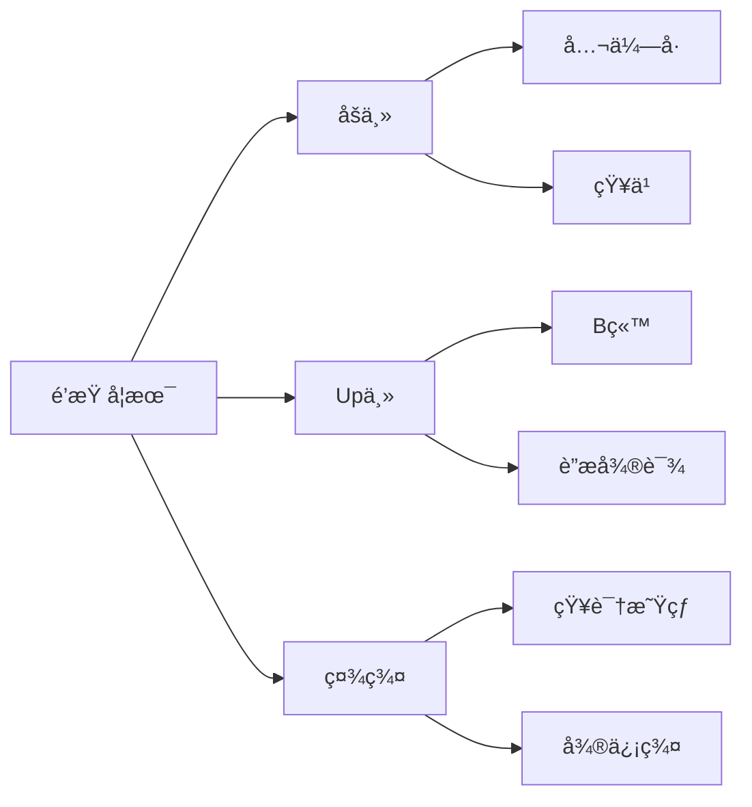
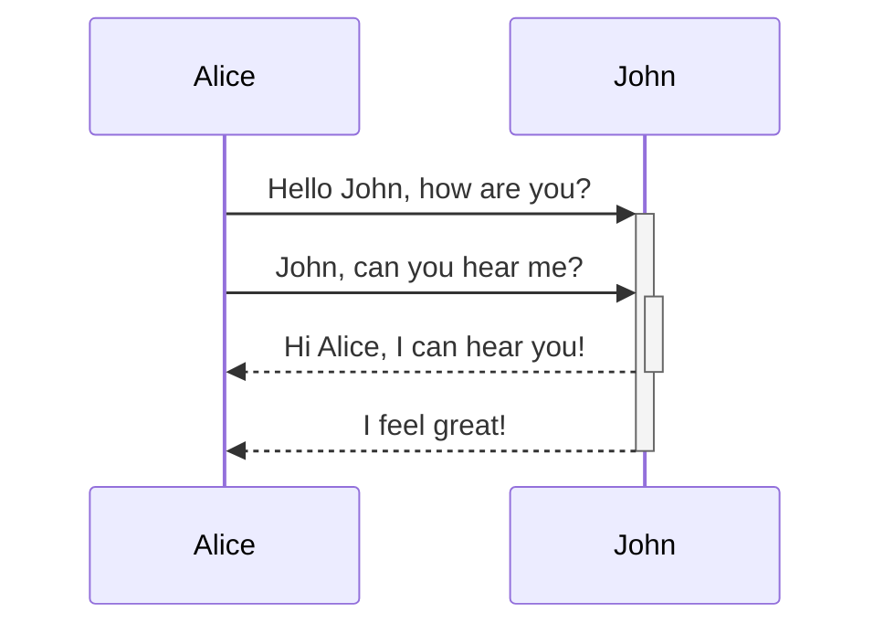
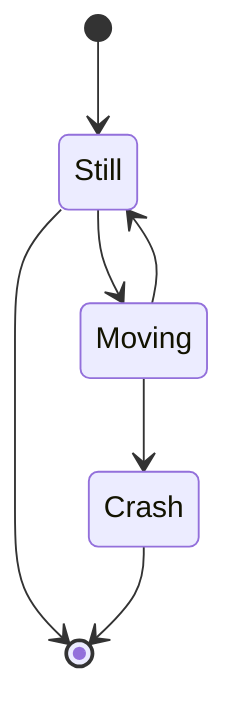
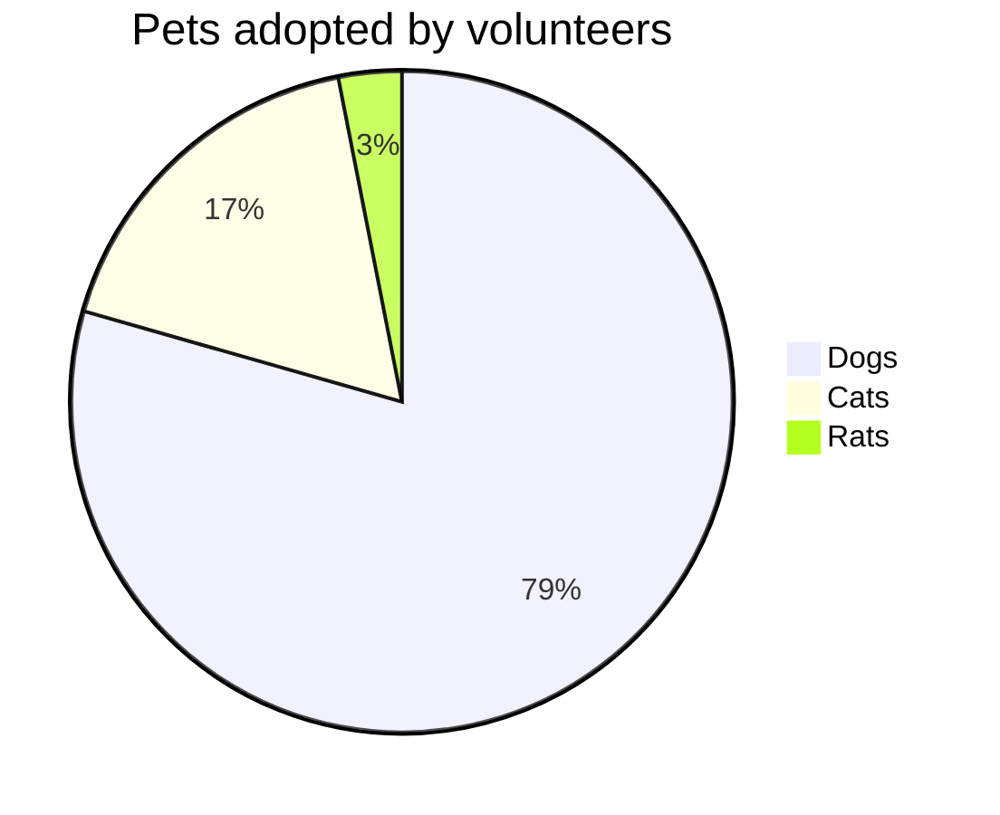

------

# 🕧markdown高级语法

## 🕒脑图

- [ ] graph TD ç«–å‘æ€ç»´å¯¼å›¾


```mermaid
graph LR
A[é’柠学术]-->B[åšä¸»]
A-->C[Up主]
A-->D[社群]
B-->E[公众å·]
B-->F[知ä¹]
C-->H[Bç«™]
C-->I[è”æ微课]
D-->J[知识星çƒ]
D-->K[微信群]
```

## 🕒时åºå›¾


```mermaid
sequenceDiagram
    Alice->>+John: Hello John, how are you?
    Alice->>+John: John, can you hear me?
    John-->>-Alice: Hi Alice, I can hear you!
    John-->>-Alice: I feel great!
```

## 🕒State Diagram


```mermaid
stateDiagram
[*] --> Still
Still --> [*]
Still --> Moving
Moving --> Still
Moving --> Crash
Crash --> [*]
```

## 🕒Pie Diagram


```mermaid
pie title Pets adopted by volunteers
    "Dogs" : 386
    "Cats" : 85
    "Rats" : 15
```

# 🕧conda

## 🕒window添加ç¯å¢ƒå˜æ›´

```bash
D:\Tool\conda\Library\lib
D:\Tool\conda\Scripts
```

## 🕒conda update

```shell
# å‡çº§conda到最新版本
conda update conda
```

## 🕒conda env

```shell
# 查看创建的虚拟ç¯å¢ƒ
conda env list
# 删除虚拟ç¯å¢ƒ
conda.exe env remove -n <虚拟ç¯å¢ƒ>
```

## 🕒conda info

```shell
# 当å‰æ¿€æ´»çš„ Conda 虚拟ç¯å¢ƒ
conda info -e

# 查看安装路径
conda info --envs
conda info --base

```

## 🕒conda list

```shell
# 查看虚拟ç¯å¢ƒè¯¦ç»†ä¿¡æ¯
conda list -n <虚拟ç¯å¢ƒ>

```

## 🕒conda create

```shell
# 创建虚拟ç¯å¢ƒ
conda create --name mypy3110 python=3.11.0
conda create -p /path/to/desired/location/myenv

# 激活虚拟ç¯å¢ƒ,需è¦åˆå§‹åŒ–ç¯å¢ƒ:conda init
conda.bat activate mypy3110

# cmd C:\Windows\System32执行
conda activate mypy3110

# 退出虚拟ç¯å¢ƒ
conda deactivate


```

## 🕒conda remove

```shell
# 删除包
conda remove -n <虚拟ç¯å¢ƒ> <包>

# 删除虚拟ç¯å¢ƒ
conda remove --name your_env_name --all

```

## 🕒conda search

```shell
# 查看conda支æŒçš„python版本
conda search "^python$"
conda search "^python=3*"
# 查看conda最新版本
conda search -c anaconda conda
```

## 🕒conda init

```shell
# åˆå§‹åŒ–ç¯å¢ƒ
conda init --all
```

## 🕒conda install

```shell
conda.exe install -n <虚拟ç¯å¢ƒ> <包>

# 清åæºæ‰¾ä¸åˆ°åŒ…æ—¶,试下如下
conda install sxtwl -n my3110 -c https://anaconda.org

```

## 🕒.condarc

```shell


```

## 🕒conda config

```shell
# 列出当å‰é…ç½®
conda config --show
# 添加下载æº
conda config --add channels https://mirrors.aliyun.com/anaconda/pkgs/main/
# 删除下载æº
conda config --remove channels https://mirrors.aliyun.com/anaconda/pkgs/main/
# 设置代ç†
conda config --set proxy_servers.http http://your_proxy_server
conda config --set proxy_servers.https https://your_proxy_server
# 清除é…置选项
conda config --remove-key proxy_servers.http

```
## 🕒conda run

```shell
# `myenv`çš„Condaç¯å¢ƒ,è¿è¡Œ`my_script.py`:
conda run -n myenv python my_script.py

```

# 🕧powershell

```bash
# 过滤特定字段,以åŠæ‰€åœ¨è¡Œçš„å几行
cat .\kimli.log  | Select-String -Pattern 'ps -e -o' -CaseSensitive -SimpleMatch  -Context 0,3

# 查看笔记本wifi密ç 
netsh wlan show profiles
netsh wlan show profile name="WiFiå称" key=clear

# 查看笔记本系统详情
msinfo32

```

## 🕒winget

### ğŸ«search

```powershell
winget search Microsoft.PowerShell
```

### ğŸ«install

```powershell
 winget install Miniconda3 --accept-package-agreements --accept-source-agreements --no-upgrade --uninstall-previous --force -l D:/Tool/conda --rainbow
```
### ğŸ«uninstall

```bash
winget uninstall --force --purge --accept-source-agreements Miniconda3
```

### ğŸ«list

```powershell

```

### ğŸ«show

```powershell

```

### ğŸ«upgrade

```powershell

```

## 🕒æ‚项

### ğŸ«æ–‡ä»¶å“ˆå¸Œå€¼è®¡ç®—

```bash
# 哈希计算,比如SHA256
certutil.exe -hashfile E:\Work\è¿è¥å•†å·¥ä½œ\æ­ç ”工作\æ­ç ”资料\openEuler-20.03-LTS-SP3-aarch64-dvd.iso SHA256
```

### ğŸ«å‡çº§è½¯ä»¶ç±»

```bash
# git å‡çº§
git update git --rainbow
```
