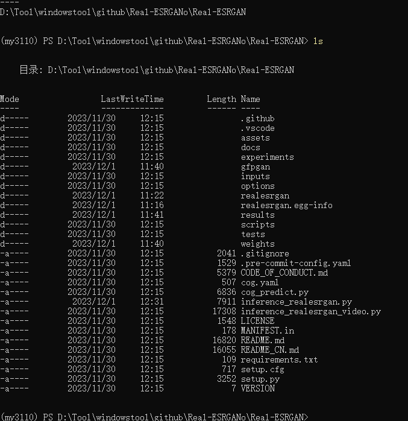
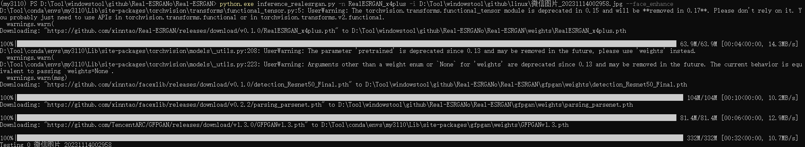
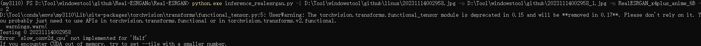
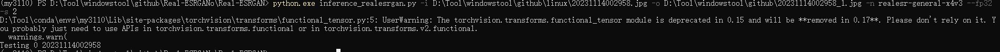
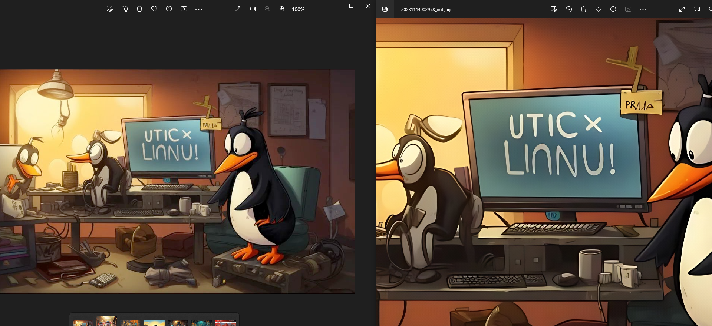

github项目地址 [Real-ESRGAN](tps://github.com/xinntao/Real-ESRGAN/blob/master/README_CN.md).

# 🧠Real-ESRGAN的使用

## 👁conda 创建虚拟环境

- 建议用conda的虚拟环境,python版本用3.11.0,我用3.12.0试过,3.12.0版本目前不匹配,会影响Real-ESRGAN安装

```bash

conda create --name my3110 python=3.11.0
conda activate my3110
```

## 👁本地构造Real-ESRGAN

```bash
# 下载项目到本地,前提已准备有git环境,可以从github拉取,如果没有git,直接github上下载下来也行
git clone https://github.com/xinntao/Real-ESRGAN.git
cd Real-ESRGAN
```



```bash
# 安装环境,建议用国内源
pip.exe install basicsr -i https://mirrors.aliyun.com/pypi/simple/ --trusted-host mirrors.aliyun.com

pip.exe install facexlib -i https://mirrors.aliyun.com/pypi/simple/ --trusted-host mirrors.aliyun.com

pip.exe install gfpgan -i https://mirrors.aliyun.com/pypi/simple/ --trusted-host mirrors.aliyun.com

pip.exe install -r requirements.txt -i https://mirrors.aliyun.com/pypi/simple/ --trusted-host mirrors.aliyun.com

python.exe .\setup.py develop
```

## 👁下载训练模型

```bash
# 第一次执行动作的主要目的让它自动下载模型,如下命令,-n 指定模型RealESRGAN_x4plus,RealESRGAN_x4plus本地不存在,则会自动下载这个模型
python.exe inference_realesrgan.py -n RealESRGAN_x4plus -i D:\Tool\windowstool\github\linux\微信图片_20231114002958.jpg --face_enhance
```



## 👁修复图片命令解释

```bash
usage: inference_realesrgan.py [-h] [-i INPUT] [-n MODEL_NAME] [-o OUTPUT] [-dn DENOISE_STRENGTH] [-s OUTSCALE] [--model_path MODEL_PATH] [--suffix SUFFIX] [-t TILE] [--tile_pad TILE_PAD] [--pre_pad PRE_PAD] [--face_enhance] [--fp32]
                               [--alpha_upsampler ALPHA_UPSAMPLER] [--ext EXT] [-g GPU_ID]

options:
  -h, --help            show this help message and exit
  -i INPUT, --input INPUT
                        Input image or folder
  -n MODEL_NAME, --model_name MODEL_NAME
                        Model names: RealESRGAN_x4plus | RealESRNet_x4plus | RealESRGAN_x4plus_anime_6B | RealESRGAN_x2plus | realesr-animevideov3 | realesr-general-x4v3
  -o OUTPUT, --output OUTPUT
                        Output folder
  -dn DENOISE_STRENGTH, --denoise_strength DENOISE_STRENGTH
                        Denoise strength. 0 for weak denoise (keep noise), 1 for strong denoise ability. Only used for the realesr-general-x4v3 model

# -dn指定了在进行图像超分辨率重建时,去除图像中噪声的程度.
## 当设置为 0 时,表示弱去噪(保留噪声).
## 当设置为 1 时,表示强去噪能力.
# 使用 realesr-general-x4v3 模型时有效.调整此参数可能会对重建后图像的视觉效果产生影响,因为较强的去噪可能会损失图像细节,而较弱的去噪可能会保留更多原始图像中的噪声.

  -s OUTSCALE, --outscale OUTSCALE
                        The final upsampling scale of the image

# -s/--outscale OUTSCALE 是用来指定图像最终的上采样比例的.在超分辨率重建过程中,它控制了最终生成图像的放大比例.
# 如果将此参数设置为 4,则最终生成的图像将是原始输入图像尺寸的 4 倍.
# 增加放大倍数也可能导致更长的处理时间和更多的计算资源需求

  --model_path MODEL_PATH
                        [Option] Model path. Usually, you do not need to specify it
  --suffix SUFFIX       Suffix of the restored image

# --suffix SUFFIX 参数用于指定恢复(重建)图像的后缀.在处理图像时,这个参数允许您为重建后的图像文件添加一个后缀标识.

  -t TILE, --tile TILE  Tile size, 0 for no tile during testing

# -t/--tile TILE: 切片大小,用于处理大尺寸图像,0 表示在测试过程中不切片.

  --tile_pad TILE_PAD   Tile padding

# --tile_pad TILE_PAD 参数用于设置图像切片(tiling)时的填充大小.
# 在进行图像处理时,如果图像尺寸较大,可能会将图像切成较小的块进行处理.--tile_pad 参数允许您指定在每个图像块周围添加的填充量.
# 这个参数决定了图像切片时的额外填充量,以确保图像块之间在处理过程中没有信息丢失或边界伪影.通过设置这个参数,您可以控制图像块之间的填充大小,以便更好地处理大型图像,并确保图像块之间的无缝连接.

  --pre_pad PRE_PAD     Pre padding size at each border

# --pre_pad PRE_PAD 参数用于设置图像在每个边界预填充(pre-padding)的大小.

  --face_enhance        Use GFPGAN to enhance face

# --face_enhance: 使用 GFPGAN 增强人脸

  --fp32                Use fp32 precision during inference. Default: fp16 (half precision).

# --fp32: 在推理过程中使用 fp32 精度,默认是 fp16(半精度)

  --alpha_upsampler ALPHA_UPSAMPLER
                        The upsampler for the alpha channels. Options: realesrgan | bicubic

# --alpha_upsampler ALPHA_UPSAMPLER 参数用于指定 alpha 通道(透明度通道)的上采样方法.

  --ext EXT             Image extension. Options: auto | jpg | png, auto means using the same extension as inputs
  -g GPU_ID, --gpu-id GPU_ID
                        gpu device to use (default=None) can be 0,1,2 for multi-gpu

# GPU_ID:指定要使用的 GPU 设备的 ID.可以是单个 GPU 设备的 ID(如 0、1、2),也可以是多个 GPU 设备的 ID,用逗号分隔(例如 0,1,2),以便在多 GPU 环境下进行处理.

```

## 👁修复图片测试

我的笔记本性能可能有问题,试了几个模板都提示CUDA问题:



乱测试选择如下成功:
- 应该加上 --fp32 就行了
- 路径最好是英文,中文名图片出错了
- 有的模型消耗资源,直接进行不下去,建议选择消耗资源小的模型

```bash
python.exe inference_realesrgan.py -i D:\Tool\windowstool\github\linux\20231114002958.jpg -o D:\Tool\windowstool\github\20231114002958_1.jpg -n realesr-general-x4v3 --fp32 -s 2
```



对比可以看出修复后的效果十分明显



## 👁修复视频命令解释

# GFPGAN的使用

## GFPGAN命令解释

```python
python inference_gfpgan.py -i inputs/whole_imgs -o results -v 1.3 -s 2 [options]...

# -h: 显示帮助信息。
# -i input: 输入图像或文件夹，默认是 inputs/whole_imgs。
# -o output: 输出文件夹，默认是 results。
# -v version: GFPGAN 模型版本，可选值为 1、1.2、1.3，默认是 1.3。
# -s upscale: 最终图像的上采样比例，默认是 2。
# -bg_upsampler: 背景上采样器，默认是 realesrgan。
# -bg_tile: 背景采样器的块大小，0 表示测试时不进行块处理，默认是 400。
# -suffix: 恢复人脸的后缀。
# -only_center_face: 仅恢复中心人脸。
# -aligned: 输入的是对齐的人脸。
# -ext: 图像扩展名，选项有 auto、jpg、png，auto 表示使用与输入相同的扩展名，默认是 auto。
# 
# -s upscale
# 
# 功能: 设置图像的最终上采样比例。例如，设置为 2 会将图像的分辨率提高到原来的两倍。
# 适用场景: 如果你希望修复后的图像具有更高的清晰度，适用于需要高分辨率输出的场合，比如打印或展示。
# 
# -bg_upsampler
# 
# 功能: 指定用于背景上采样的算法，默认为 realesrgan。可以选择其他上采样器（如 nearest、bicubic 等）。
# 适用场景: 当你处理包含背景的图像时，使用不同的上采样器可能会影响图像的整体效果。选择更适合背景细节的上采样器可以改善结果。
# realesrgan：当你需要高质量的背景图像，尤其是细节丰富的场景时，realesrgan 是一个很好的选择。适合处理大部分类型的图像，效果通常较好。
# bicubic：适用于较简单的场景，效果相对均匀，但在细节较复杂的图像中可能会产生模糊效果。通常在不需要高质量输出时使用。
# nearest：适合处理二值图像或不需要平滑效果的图像，比如图标或简单图形。通常在快速预览或处理时使用，但效果较差。
# lanczos：适合需要高保真度和清晰度的场景，通常用于艺术图像、文本或细节丰富的图像。

# -bg_tile
# 
# 功能: 设置背景上采样时的块大小。如果设置为 0，则在测试时不进行块处理，默认值为 400。
# 适用场景: 适用于大型图像或需要处理的图像尺寸较大时。设置适当的块大小可以减少内存消耗，提高处理速度。
# 
# -suffix
# 
# 功能: 设置恢复人脸图像的后缀名，便于区分处理过的图像。
# 适用场景: 当你处理多个图像并希望保存不同版本时，可以通过后缀名快速识别。例如，可以使用 _restored 来标记修复后的图像。
# 
# -only_center_face
# 
# 功能: 指定是否只恢复中心人脸。如果设置该选项，则仅处理图像中位于中心的人脸。
# 适用场景: 在多人合影中，如果你只希望提升中间人物的质量而不处理周围的人脸，此选项非常有用。
# 
# -aligned
# 
# 功能: 指定输入的人脸图像是否已经对齐。对齐的人脸通常指经过预处理，使人脸在图像中处于相同的姿态和尺度。
# 适用场景: 当你输入的图像是经过对齐处理的（例如，使用人脸检测和对齐算法），此选项可以提高处理效率和结果的准确性。
```

