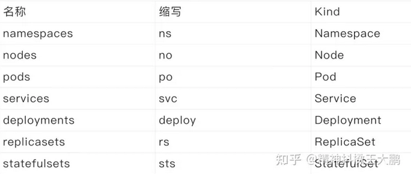
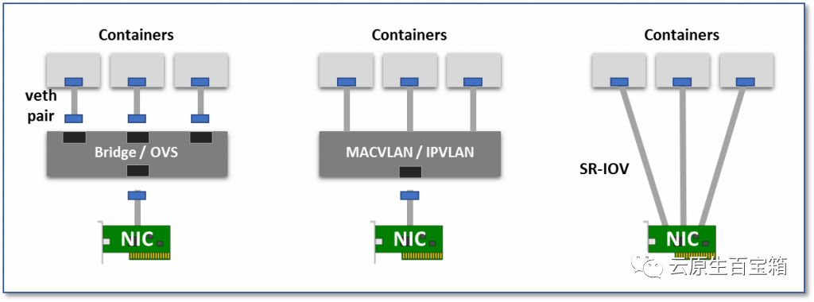

# 👀kubernetes定义

## 👺声明式配置



# 👀curl访问k8s

## 👺使用证书

## 👺使用token

test


## 👺使用kubectl proxy

# 👀kubectl

## 👺kubectl edit

* kubectl 工具来编辑位于 kube-system 命名空间中的 kube-proxy 的 ConfigMap

```
kubectl edit configmap -n kube-system kube-proxy
```

## 👺kubectl get

```
kubectl get configmap -n kube-system kube-proxy -o yaml
```

# 👀yaml

## 👺daemon.json设置

如果你的 docker-compose.yml 文件中指定的镜像仍然从本地节点地址拉取,而不是使用 insecure-registries 中指定的地址,你可以继续保持 image 字段只写镜像名,而不包含地址信息.

Docker 在解析镜像名称时会按照以下顺序进行查找:

1. 首先,它会检查本地节点上是否存在相应的镜像.如果存在,则直接使用本地镜像.
2. 如果本地节点上不存在镜像,则会按照 insecure-registries 字段中指定的地址列表顺序,依次尝试从这些地址拉取镜像.

> 因此,在你的情况下,如果 docker-compose.yml 文件中的 image 字段只写镜像名,Docker 会按照以下步骤进行查找:
>
> 首先,它会检查本地节点上是否存在该镜像,如果存在,则使用本地镜像.

> 如果本地节点上不存在该镜像,则会尝试从 insecure-registries 中的第一个地址(172.31.251.13)拉取镜像.

如果你希望优先从 172.31.63.230 拉取镜像,而不是从本地节点的 172.31.251.13,你可以调整 insecure-registries 字段的顺序,将 172.31.63.230 放在前面.例如:

## 👺yaml字段说明

* apiVersion 设置为 apps/v1,用于指定使用的 Kubernetes API 版本.
* kind 设置为 Deployment,用于指定资源类型为 Deployment.
* metadata 资源的元数据,包括名称.
* spec 定义了 Deployment 的规格,其中 selector 用于选择要控制的 Pod,template 定义了 Pod 的模板.
* containers 容器的规格,包括容器名称、镜像、环境变量、工作目录和命令.
* volumeMounts 要挂载到容器中的卷的名称和挂载路径.
* resources 容器的资源限制和请求.
* volumes 要使用的宿主机路径作为卷.

## 👺deployments

* 一个 Deployment 为 Pod 和 ReplicaSet 提供声明式的更新能力
* 你负责描述 Deployment 中的 目标状态,而 Deployment 控制器(Controller) 以受控速率更改实际状态, 使其变为期望状态.你可以定义 Deployment 以创建新的 ReplicaSet,或删除现有 Deployment, 并通过新的 Deployment 收养其资源.

> 以下是 Deployments 的典型用例:

* 创建 Deployment 以将 ReplicaSet 上线. ReplicaSet 在后台创建 Pods. 检查 ReplicaSet 的上线状态,查看其是否成功.
* 通过更新 Deployment 的 PodTemplateSpec,声明 Pod 的新状态 . 新的 ReplicaSet 会被创建,Deployment 以受控速率将 Pod 从旧 ReplicaSet 迁移到新 ReplicaSet. 每个新的 ReplicaSet 都会更新 Deployment 的修订版本.
* 如果 Deployment 的当前状态不稳定,回滚到较早的 Deployment 版本. 每次回滚都会更新 Deployment 的修订版本.
* 扩大 Deployment 规模以承担更多负载.
* 暂停 Deployment 以应用对 PodTemplateSpec 所作的多项修改, 然后恢复其执行以启动新的上线版本.
* 使用 Deployment 状态 来判定上线过程是否出现停滞.
* 清理较旧的不再需要的 ReplicaSet .

  ```
  kubectl get deployments
  # NAME 列出了集群中 Deployment 的名称.
  # READY 显示应用程序的可用的"副本"数.显示的模式是"就绪个数/期望个数".
  # UP-TO-DATE 显示为了达到期望状态已经更新的副本数.
  # AVAILABLE 显示应用可供用户使用的副本数.
  # AGE 显示应用程序运行的时间.
  kubectl get rs
  # NAME 列出名字空间中 ReplicaSet 的名称;
  # DESIRED 显示应用的期望副本个数,即在创建 Deployment 时所定义的值. 此为期望状态;
  # CURRENT 显示当前运行状态中的副本个数;
  # READY 显示应用中有多少副本可以为用户提供服务;
  # AGE 显示应用已经运行的时间长度.
  ```

## 👺yaml和yml的resources对比

```
# yml
limits 对象用于设置资源的上限,表示资源的最大可用量.在这里,memory 被限制为 20G,意味着应用程序或容器的内存使用不能超过此限制.

reservations 对象用于设置资源的保留量,表示资源的最低需求量.在这里,memory 被保留为 1G,意味着系统将确保至少有 1G 的内存可供应用程序或容器使用.

通过设置保留量,系统可以在资源紧张的情况下合理分配资源,并确保应用程序或容器的基本需求得到满足.保留量通常用于确保关键任务或重要应用的资源需求得到满足,以避免由于资源不足而导致的性能下降或故障.

请注意,具体的资源保留量策略和支持可能会根据所使用的容器管理平台或云提供商而有所不同.因此,确保根据目标平台的文档和要求来正确配置资源保留量.
```

```
# yaml
limits 对象用于设置资源的上限,表示资源的最大可用量.在这里,memory 被限制为 20G,意味着应用程序或容器的内存使用不能超过此限制.

requests 对象用于设置资源的请求量,表示应用程序或容器希望获得的资源量.在这里,memory 被请求为 1G,表示应用程序或容器希望至少获得 1G 的内存资源.

通过设置请求量,应用程序或容器向系统明确表达了其对资源的需求,使系统能够更好地进行资源分配和调度.系统可以根据请求量来决定如何在不同的节点或服务器上分配资源,以满足应用程序或容器的需求,并实现资源的合理利用.

请注意,资源请求量仅是建议值,系统可能会根据实际情况进行调整.具体的资源调度策略和支持可能会根据所使用的容器管理平台或云提供商而有所不同.因此,确保根据目标平台的文档和要求来正确配置资源请求量.
```
## 👺node选择器

**nodeSelector**
- ​nodeSelector ​是节点选择约束的最简单推荐形式.你可以将 ​nodeSelector ​字段添加到 Pod 的规约中设置你希望目标节点所具有的节点标签. Kubernetes 只会将 Pod 调度到拥有你所指定的每个标签的节点上.

**亲和性与反亲和性**
- ​nodeSelector ​提供了一种最简单的方法来将 Pod 约束到具有特定标签的节点上. 亲和性和反亲和性扩展了你可以定义的约束类型.使用亲和性与反亲和性的一些好处有:

亲和性、反亲和性语言的表达能力更强.​nodeSelector ​只能选择拥有所有指定标签的节点. 亲和性、反亲和性为你提供对选择逻辑的更强控制能力.

你可以标明某规则是"软需求"或者"偏好",这样调度器在无法找到匹配节点时仍然调度该 Pod.

你可以使用节点上(或其他拓扑域中)运行的其他 Pod 的标签来实施调度约束, 而不是只能使用节点本身的标签.这个能力让你能够定义规则允许哪些 Pod 可以被放置在一起.

**节点亲和性**
节点亲和性概念上类似于 ​nodeSelector​, 它使你可以根据节点上的标签来约束 Pod 可以调度到哪些节点上. 节点亲和性有两种:

​requiredDuringSchedulingIgnoredDuringExecution​: 调度器只有在规则被满足的时候才能执行调度.此功能类似于 ​nodeSelector​, 但其语法表达能力更强.

​preferredDuringSchedulingIgnoredDuringExecution​: 调度器会尝试寻找满足对应规则的节点.如果找不到匹配的节点,调度器仍然会调度该 Pod.


> Note:
在上述类型中,​IgnoredDuringExecution ​意味着如果节点标签在 Kubernetes 调度 Pod 时发生了变更,Pod 仍将继续运行.


# 👀简单脚本

## 👺kubectl-simple

```
for i in `cat /home/k8syaml/ip-map-hostname.txt`;do kubectl get pods --all-namespaces -o wide --field-selector spec.nodeName=$i;done
```

# 👀网络

## 👺calico

### 💴BGP模式

> 将节点做为虚拟路由器通过BGP路由协议来实现集群内容器之间的网络访问

### 💴IPIP模式

> 在原有IP报文中封装一个新的IP报文,新的IP报文中将源地址IP和目的地址IP都修改为对端宿主机IP

### 💴cross-subnet

> Calico-ipip模式和calico-bgp模式都有对应的局限性,对于一些主机跨子网而又无法使网络设备使用BGP的场景可以使用cross-subnet模式,实现同子网机器使用calico-BGP模式,跨子网机器使用calico-ipip模式

### 💴查看calio状态

* 获取calico节点的状态

```
kubectl get nodes -o wide
```

* 获取 Calico 的组件状态

```
kubectl get pods -n kube-system -l k8s-app=calico-node -o wide
```

* 获取集群中的网络策略

```
kubectl get networkpolicies --all-namespaces
```

* 获取Calico DaemonSet 的详细信息

```
kubectl get daemonset calico-node -n kube-system -o yaml
```

## 👺docker network

* scope是网络的作用范围,包括 `local` 表示本地网络,`global` 表示全局网络等.
* bridge:Docker 默认的桥接网络,用于连接多个容器,使它们可以相互通信.
* host:是主机网络,容器使用主机的网络
* none: 空网络,容器不使用任何网络
* overlay:覆盖网络等.

### 💴如何查看docker的网络信息

```
        "NetworkSettings": {
            "Bridge": "",
            "SandboxID": "0a097f4456efd6467f0d967398e690975fb9f3a173879791f6f0ba1c819b8854",
            "HairpinMode": false,
            "LinkLocalIPv6Address": "",
            "LinkLocalIPv6PrefixLen": 0,
            "Ports": {},
            "SandboxKey": "/var/run/docker/netns/0a097f4456ef",
            "SecondaryIPAddresses": null,
            "SecondaryIPv6Addresses": null,
            "EndpointID": "",
            "Gateway": "",
            "GlobalIPv6Address": "",
            "GlobalIPv6PrefixLen": 0,
            "IPAddress": "",
            "IPPrefixLen": 0,
            "IPv6Gateway": "",
            "MacAddress": "",
            "Networks": {
                "harbor_harbor": {
                    "IPAMConfig": null,
                    "Links": null,
                    "Aliases": [
                        "jobservice",
                        "9a642b320c77"
                    ],
                    "NetworkID": "6d610a9786b1864d1d40cd2c8f063a0c5268bd4fcb8b85163b9d1016c2682fa0",
                    "EndpointID": "50d4b160740a0f682c8d23375e4210b3e4d3a72a5c82465858a1c5f96e812cfe",
                    "Gateway": "172.18.0.1",
                    "IPAddress": "172.18.0.3",
                    "IPPrefixLen": 16,
                    "IPv6Gateway": "",
                    "GlobalIPv6Address": "",
                    "GlobalIPv6PrefixLen": 0,
                    "MacAddress": "02:42:ac:12:00:03",
                    "DriverOpts": null
```

* 如上全部信息,可以如下过滤:docker inspect -f '{{.NetworkSettings.SandboxKey}}' <容器名称或ID>

```
docker inspect -f '{{json .NetworkSettings.Networks}}' <容器名称或ID>
docker inspect -f '{{json .NetworkSettings.Networks.harbor_harbor.IPAddress}}' 9a642b320c77
```

* 查看容器的网络命名空间

```
[root@harbor ~]# docker inspect -f '{{.NetworkSettings.SandboxKey}}' 9a642b320c77
/var/run/docker/netns/0a097f4456ef
```

### 💴查看docker和主机网卡对应关系

* container通过ethtool或者iflink文件查看映射

```
harbor [ /harbor ]$ cat /sys/class/net/eth0/iflink 
248
```

* 宿主机查看veth

```
248: vethac7bbb7@if247: <BROADCAST,MULTICAST,UP,LOWER_UP> mtu 1500 qdisc noqueue master br-6d610a9786b1 state UP group default 
    link/ether 22:2a:f3:8a:fc:a2 brd ff:ff:ff:ff:ff:ff link-netnsid 5
    inet6 fe80::202a:f3ff:fe8a:fca2/64 scope link 
       valid_lft forever preferred_lft forever
```

### 💴查看主机到docker的NAT

* iptables

```
iptables -t nat -nvL --line
```

* docker inspect

```
docker inspect --format '{{json .NetworkSettings.Ports}}' e771c2f64126
```

### 💴网卡ipvs和tun

* kube-ipvs0 是 Kubernetes 中的 IPVS(IP Virtual Server)接口.IPVS 是一种负载均衡技术,用于分发流量到 Kubernetes 集群中的服务.kube-ipvs0 接口用于 IPVS 负载均衡器的配置和管理.
* tunl0 是一个隧道接口,用于在 Kubernetes 集群中建立虚拟网络隧道.该接口通常与容器网络插件(如 Flannel、Calico 等)一起使用,以便在不同节点之间建立虚拟网络隧道,实现容器之间的通信.
* 确认tun的外层封装报文

```
# inet行对应的就是外层封装报文
ip address show tunl0
[root@k8s-master1 ~]# ip addr show tunl0 
5: tunl0@NONE: <NOARP,UP,LOWER_UP> mtu 1480 qdisc noqueue state UNKNOWN group default qlen 1000
    link/ipip 0.0.0.0 brd 0.0.0.0
    inet 10.244.159.128/32 scope global tunl0
       valid_lft forever preferred_lft forever
```

### 💴网络none模式

* ip show 查看主机网卡信息

```
ip link show
8: cali2183d2823d4@if4: <BROADCAST,MULTICAST,UP,LOWER_UP> mtu 1480 qdisc noqueue state UP mode DEFAULT group default 
    link/ether ee:ee:ee:ee:ee:ee brd ff:ff:ff:ff:ff:ff link-netnsid 0
9: cali74e66085ff3@if4: <BROADCAST,MULTICAST,UP,LOWER_UP> mtu 1480 qdisc noqueue state UP mode DEFAULT group default 
    link/ether ee:ee:ee:ee:ee:ee brd ff:ff:ff:ff:ff:ff link-netnsid 1
10: cali1adf1e63244@if4: <BROADCAST,MULTICAST,UP,LOWER_UP> mtu 1480 qdisc noqueue state UP mode DEFAULT group default 
    link/ether ee:ee:ee:ee:ee:ee brd ff:ff:ff:ff:ff:ff link-netnsid 2
```

* docker network查看none网络,可以看出三个docker是none网络,对应ip link show网卡

```
[root@k8s-master1 ~]# docker network ls 
NETWORK ID     NAME      DRIVER    SCOPE
760a6271f39b   bridge    bridge    local
268312bbd032   host      host      local
3dd770c3c6d6   none      null      local
[root@k8s-master1 ~]# docker network inspect 3dd770c3c6d6 
[
    {
        "Name": "none",
        "Id": "3dd770c3c6d627752832286a029d68c4efb2015cfad257693650bad35a7a8e9a",
        "Created": "2023-08-14T15:24:03.960468011+08:00",
        "Scope": "local",
        "Driver": "null",
        "EnableIPv6": false,
        "IPAM": {
            "Driver": "default",
            "Options": null,
            "Config": []
        },
        "Internal": false,
        "Attachable": false,
        "Ingress": false,
        "ConfigFrom": {
            "Network": ""
        },
        "ConfigOnly": false,
        "Containers": {
            "48c3a106b5c8f6040ede055c0e3a81dc03689ebdceb4993008c6a19b10f531c8": {
                "Name": "k8s_POD_calico-kube-controllers-6c68d67746-74hzt_kube-system_d6f229ac-5d36-4b4a-9bb4-20bfa46e6d29_0",
                "EndpointID": "0b290929abd65339be97094babc2c7ed9844570b438097365a434d94868fb48e",
                "MacAddress": "",
                "IPv4Address": "",
                "IPv6Address": ""
            },
            "552cbf0460651c8d818236bcbc1cb5eda8c5a5dd49b5fc270b4dc6ec217129c9": {
                "Name": "k8s_POD_coredns-66bff467f8-d5pcb_kube-system_78d19860-5213-4e71-8f42-3bfd9981ff1f_0",
                "EndpointID": "1d7e5de1850e1d000bbbee77996a5cd3be54c470214ce92f9f951bef1f354a19",
                "MacAddress": "",
                "IPv4Address": "",
                "IPv6Address": ""
            },
            "f9fc3b3053c546af68b25d349f3153e0783de89422ff19d23cfd943eabd0ade5": {
                "Name": "k8s_POD_coredns-66bff467f8-qblgt_kube-system_b184f4eb-4bc6-46af-a15c-88765ac65b65_0",
                "EndpointID": "bfe632e549f1ba000479b5d32c1ec0e7278ed7ad36ba9ffc20d910aa5b3fbfa8",
                "MacAddress": "",
                "IPv4Address": "",
                "IPv6Address": ""
            }
        },
        "Options": {},
        "Labels": {}
    }
]
```

## 👺IPVLAN & MACVLAN

IPVLAN 和 MACVLAN 是一种网卡虚拟化技术,两者之间的区别为, IPVLAN 允许一个物理网卡拥有多个 IP 地址,并且所有的虚拟接口用同一个 MAC 地址;而 MACVLAN 则是相反的,其允许同一个网卡拥有多个 MAC 地址,而虚拟出的网卡可以没有 IP 地址.

因为是网卡虚拟化技术,而不是网络虚拟化技术,本质上来说属于 Overlay network,这种方式在虚拟化环境中与 Overlay network 相比最大的特点就是可以将 Pod 的网络拉平到 Node 网络同级,从而提供更高的性能、低延迟的网络接口.本质上来说其网络模型属于下图中第二个.



• 虚拟网桥:创建一个虚拟网卡对(veth pair),一头在容器内,一头在宿主机的 root namespaces 内.这样一来容器内发出的数据包可以通过网桥直接进入宿主机网络栈,而发往容器的数据包也可以经过网桥进入容器.

• 多路复用:使用一个中间网络设备,暴露多个虚拟网卡接口,容器网卡都可以介入这个中间设备,并通过 MAC/IP 地址来区分 packet 应该发往哪个容器设备.

• 硬件交换,为每个 Pod 分配一个虚拟网卡,这样一来,Pod 与 Pod 之间的连接关系就会变得非常清晰,因为近乎物理机之间的通信基础.如今大多数网卡都支持 SR-IOV 功能,该功能将单一的物理网卡虚拟成多个 VF 接口,每个 VF 接口都有单独的虚拟 PCIe 通道,这些虚拟的 PCIe 通道共用物理网卡的 PCIe 通道.

# 👀docker

## 👺数据管理

### 💴数据卷

`数据卷` 是一个可供一个或多个容器使用的特殊目录,它绕过 UnionFS,可以提供很多有用的特性:

* `数据卷` 可以在容器之间共享和重用
* 对 `数据卷` 的修改会立马生效
* 对 `数据卷` 的更新,不会影响镜像
* `数据卷` 默认会一直存在,即使容器被删除

> 注意:`数据卷` 的使用,类似于 Linux 下对目录或文件进行 mount,镜像中的被指定为挂载点的目录中的文件会复制到数据卷中(仅数据卷为空时会复制).

```shell
docker volume []
```

* 在用 `docker run` 命令的时候,使用 `--mount` 标记来将 `数据卷` 挂载到容器里.在一次 `docker run` 中可以挂载多个 `数据卷`.

### 💴挂载主机目录

```
# 使用 --mount 标记可以指定挂载一个本地主机的目录到容器中去.
```

# 🌐kubernetes-cli

## 💩Kubernetes 工作负载资源

### 🚶deployments

```shell
# 更新 Deployment 
## 仅当 Deployment Pod 模板(即 ​.spec.template​)发生改变时,例如模板的标签或容器镜像被更新, 才会触发 Deployment 上线.其他更新(如对 Deployment 执行扩缩容的操作)不会触发上线动作.
# 查看 Deployment 上线状态
kubectl rollout status deployment/nginx-deployment
# 查看 Deployment 创建的 ReplicaSet
kubectl get rs
# kubectl set image不会更新yaml文件
kubectl set image deployment.v1.apps/nginx-deployment nginx=nginx:1.16.1

# 回滚 Deployment
## 新的不断重启,
# 检查 Deployment 修订历史
kubectl rollout history deployment/nginx-deployment
# 看修订历史的详细信息
kubectl rollout history deployment/nginx-deployment --revision=2
# 回滚到以前版本,详情参考kubectl rollout命令
kubectl rollout undo deployment/nginx-deployment
```

## 💩日志

### 🚶journalctl

```shell
journalctl -u docker.service
journalctl -u kubelet.service
```

## 💩CLI

### 🚶kubectl annotate

```bash
# 它更新资源上的注释.

```

### 🚶kubectl api-versions 

### 🚶kubectl attach

```bash
# 这会将东西附加到正在运行的容器
```

### 🚶kubectl autoscale

```bash
# 用于自动扩展定义的 Pod,例如 部署、副本集、复制控制器.
```


### 🚶kubectl get

```shell
kubectl get pods --all-namespaces -o wide --field-selector spec.nodeName=harbor 
kubectl get pods --namespace default --field-selector spec.nodeName=harbor
kubectl get pods -A
kubectl get pods -l hostname=hz-yd-cgw-edge-acc-01
# 查看某种状态的pod
kubectl get pods --all-namespaces --field-selector=status.phase=Pending
#
kubectl get nodes -owide
# 查看命名空间
kubectl get namespace
# 查看
kubectl get service
kubectl get deployment -l hostname=hz-yd-cgw-edge-acc-01

kubectl get nodes --show-labels
# 打印其现时配置
kubectl get -f
```

### 🚶kubectl describe

```shell
kubectl describe node harbor
kubectl describe pod <> -n <>
```

### 🚶kubectl create

```shell
# 创建一个名为my-dep的deployment,运行busybox镜像.
kubectl create deployment my-dep --image=busybox
```

### 🚶kubectl config

### 🚶kubectl cp

```bash
# 在容器之间复制文件和目录
```

### 🚶kubectl delete

```shell
# 一种重启方式,适用于单个pod
 kubectl delete pod <pod> -n <namespace>

 kubectl delete pods --field-selector spec.nodeName=<node-name>

 # 会同步删除创建的pod
 kubectl delete -f <yaml> 

 # 删除pod,并且不会重建副本
 kubectl delete deployment <deployment-name> 

 # 删除deployment,保留pod
 kubectl delete deployment my-deployment --cascade=false
```

### 🚶kubectl drain

```bash
# 用于排空节点以进行维护. 它准备节点进行维护. 这会将节点标记为不可用,因此不应为其分配将要创建的新容器.

```

### 🚶kubectl apply

```shell
# 禁止验证
kubectl apply -f /home/k8syaml/mhztest/httpserice.yaml --validate=false
# 指定目录路径,而不用添加多个单独的文件
kubectl apply -f /home/k8syaml/mhztest/
# 多个资源组合在同一个文件中(在 YAML 中以 ​---​ 分隔) 来简化对它们的管理
# kubectl apply -f 可以跟多个yaml
kubectl apply -f /home/k8syaml/mhztest/httpserice.yaml -f /home/k8syaml/mhztest/httpd.yaml
```

### 🚶kubectl logs

```
kubectl logs
```

### 🚶kubectl exec

```
kubectl exec -it httpd-v1-deploy-harbor-86444b956-cpdf4 -n default -- /bin/bash
```

### 🚶kubectl edit

```bash
# 用于结束服务器上的资源. 这允许直接编辑可以通过命令行工具接收的资源
```

### 🚶kubectl expose

```bash
# 用于将 Kubernetes 对象(例如 pod、复制控制器和服务)公开为新的 Kubernetes 服务. 这可以通过正在运行的容器或 yaml 文件公开它.
```

### 🚶kubectl diff

```shell
# 应用对配置文件所作更改
kubectl diff -f https://k8s.io/examples/application/update_deployment.yaml
kubectl apply -f https://k8s.io/examples/application/update_deployment.yaml
# 使用 ​kubectl get​ 打印现时配置
kubectl get -f https://k8s.io/examples/application/update_deployment.yaml -o yaml
```

### 🚶kubectl scale

```bash
# 扩展 Kubernetes 部署、ReplicaSet、复制控制器或作业的大小
```

### 🚶kubectl set

```bash
```

### 🚶kubectl rollout 

```bash
# 用于触发一个滚动更新,重启部署中的所有Pod
kubectl rollout restart deployment/<deployment-name>

# 查看deployment状态
kubectl rollout status deployment/vswitch1-deploy-hz-yd-cgw-edge-acc-01
```

### 🚶kubectl rolling-update

```bash
# 在复制控制器上执行滚动更新. 通过一次更新 POD 将指定的复制控制器替换为新的复制控制器.
```

### 🚶kubectl replace

```bash
# 能够通过文件名或 stdin.替换资源
```

### 🚶kubectl lable

```shell
# 具体来说,假设你有一个 Deployment,其标签选择器是基于 app=example.此 Deployment 管理的所有 Pod 都有一个标签 app=example.现在,如果你使用 kubectl label 为这些 Pod 添加一个额外的标签 app1=1,这不会影响原有的 app=example 标签或它与 Deployment 的选择器之间的匹配关系.因此,Deployment 不会重新创建这些 Pod.
# kubectl label [resource-type] [resource-name] key1=value1 key2=value2
kubectl label pods my-pod env=production
# 修改已有标签
kubectl label pods my-pod env=staging --overwrite
# 删除标签
kubectl label pods my-pod env-
```

### 🚶crictl

```bash

```

### 🚶kubectl cluster-info

```bash
# 转储有关集群的相关信息以进行调试和诊断
kubectl cluster-info dump
```

### 🚶kubectl port-forward

```bash
# 用于将一个或多个本地端口转发到 pod
```

### 🚶kubectl top

```bash

```

# 🌐docker-cli

## 💩容器FQA

### 🚶docker dockerfile

```bash
# Dockerfile 是一个用来构建镜像的文本文件,文本内容包含了一条条构建镜像所需的指令和说明.

```

### 🚶docker info

```shell

```

### 🚶docker version

```dockerfile
# 查看
```

### 🚶docker system

```shell
# 查看镜像、容器、数据卷所占用的空间
docker system df
```

## 💩本地镜像管理

### 🚶docker save

```dockerfile
docker save -o my_ubuntu_v3.tar runoob/ubuntu:v3
# 将镜像 runoob/ubuntu:v3 生成 my_ubuntu_v3.tar 文档
```

### 🚶docker load

```dockerfile
# 导入使用 docker save 命令导出的镜像.
docker load [OPTIONS]
docker load < busybox.tar.gz
docker load --input fedora.tar
for i in $(find /home/v3.3.10 -type f); do docker load < $i; done
```

### 🚶docker images

```dockerfile

root@runoob:~# docker images  ubuntu
REPOSITORY          TAG                 IMAGE ID            CREATED             SIZE
ubuntu              14.04               90d5884b1ee0        9 weeks ago         188 MB
ubuntu              15.10               4e3b13c8a266        3 months ago        136.3 MB
```

### 🚶docker import

```dockerfile
# 从归档文件中创建镜像
# docker import [OPTIONS] file|URL|- [REPOSITORY[:TAG]]
runoob@runoob:~$ docker import  my_ubuntu_v3.tar runoob/ubuntu:v4  
sha256:63ce4a6d6bc3fabb95dbd6c561404a309b7bdfc4e21c1d59fe9fe4299cbfea39
runoob@runoob:~$ docker images runoob/ubuntu:v4
REPOSITORY          TAG                 IMAGE ID            CREATED             SIZE
runoob/ubuntu       v4                  63ce4a6d6bc3        20 seconds ago      142.1 MB
```

### 🚶docker history

```dockerfile
root@runoob:~# docker history runoob/ubuntu:v3
IMAGE             CREATED           CREATED BY                                      SIZE      COMMENT
4e3b13c8a266      3 months ago      /bin/sh -c #(nop) CMD ["/bin/bash"]             0 B                 
<missing>         3 months ago      /bin/sh -c sed -i 's/^#\s*\(deb.*universe\)$/   1.863 kB            
<missing>         3 months ago      /bin/sh -c set -xe   && echo '#!/bin/sh' > /u   701 B               
<missing>         3 months ago      /bin/sh -c #(nop) ADD file:43cb048516c6b80f22   136.3 MB
```

### 🚶docker tag

```dockerfile
# 将镜像ubuntu:15.10标记为 runoob/ubuntu:v3 镜像
root@runoob:~# docker tag ubuntu:15.10 runoob/ubuntu:v3
root@runoob:~# docker images   runoob/ubuntu:v3
REPOSITORY          TAG                 IMAGE ID            CREATED             SIZE
runoob/ubuntu       v3                  4e3b13c8a266        3 months ago        136.3 MB
```

### 🚶docker stop

```dockerfile
# 停止docker 运行,停止之后,才能运行docker rm 删除容器

docker ps -qa --format "{{.ID}}" | xargs docker stop
```

### 🚶docker rm

```dockerfile
# 删除容器,对于docker-compose down而言,则是停止并删除docker

docker ps -qa --format "{{.ID}}" | xargs docker rm
```

### 🚶docker port

```bash
查看docker端口映射

```
### 🚶docker rmi

```dockerfile
# 删除镜像
```

## 💩容器操作

### 🚶docker run

```bash
# 运行容器,和docker-compose up作用一样
docker run -d -p 5000:5000 app/webapp python appinstall.py
docker run -d -p 127.0.0.1:5000:5000/tcp app/webapp python appinstall.py
docker run -t -i ubuntu:15.10 /bin/bash

# --name标识来命名容器
docker run -d -P --name runoob training/webapp python app.py

```

### 🚶docker pull

```bash
# 获取镜像
docker pull ubuntu
```


### 🚶docker inspect

```shell
docker inspect --format='{{.Image}}:{{.HostConfig}}'
```

### 🚶 docker ps

```shell
# docker区分大小写
docker ps -f status=running --format "table "{{.ID}}"\t"{{.Image}}"\t"{{.Command}}"\t"{{.Status}}"\t{{.Names}}"
docker ps -f status=running --format "table "{{.ID}}"\t"{{.Image}}"\t{{.Status}}"
docker ps -f status=running --format "table "{{.ID}}"\t"{{.Image}}"\t"{{.Status}}"\t"{{.Ports}}"\t{{.Names}}"
```

### 🚶docker stats

```shell
docker stats : 显示容器资源的使用情况,包括:CPU、内存、网络 I/O 等
docker stats --format "table {{.Container}}\t{{.CPUPerc}}\t{{.MemUsage}}\t{{.MemPerc}}\t{{.NetIO}}\t{{.BlockIO}}\t{{.PIDs}}"
# {{.Container}}:容器名称或ID.
# {{.Name}}:容器名称.
# {{.ID}}:容器ID.
# {{.CPUPerc}}:CPU使用百分比.
# {{.MemUsage}}:内存使用情况.
# {{.MemPerc}}:内存使用百分比.
# {{.NetIO}}:网络IO.
# {{.BlockIO}}:块IO.
# {{.PIDs}}:进程ID数.
```

### 🚶docker container

```shell
# 输出特定字段内容
docker container inspect --format '{{json .NetworkSettings}}' 9a642b320c77
```

### 🚶docker export

```shell
# 导出镜像

```

### 🚶docker import

```shell
# 导入
```

## 💩容器网络

### 🚶docker network

```shell
# 创建一个新的 Docker 网络
docker network create -d bridge bgr-net

# 运行容器并连接到新建的bgr-net
docker run -itd --name test1 --network bgr-net ubuntu /bin/bash
docker run -itd --name test2 --network bgr-net ubuntu /bin/bash


```

## 💩docker-compose

### 🚶docker-compose down

```shell
# 停止删除,这和docker的命令有差异:docker stop是停止,然后docker rm删除.docker-compose down则是停止并删除
docker-compose -f <filedir> down 
# 停止但不删除
docker-compose -f <filedir> down --stop
# 
```

### 🚶docker-compose up

```shell
docker-compose -f <filedir> up -d
```

# this

## this

### this