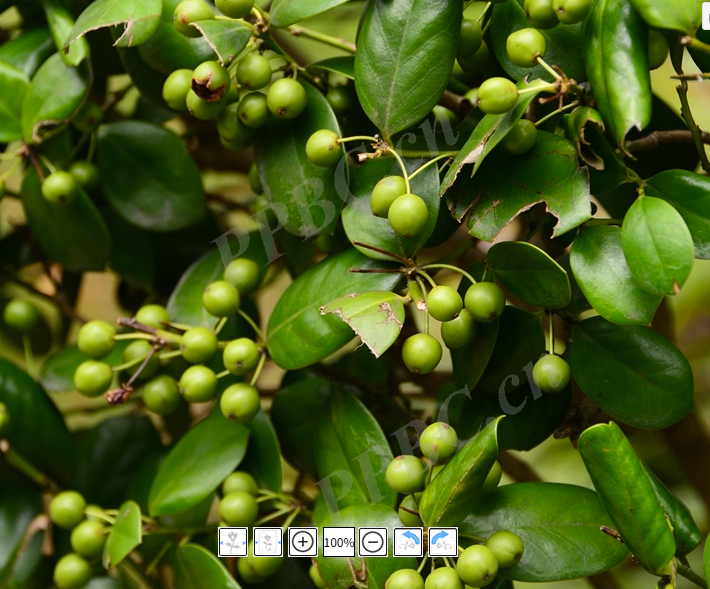

# 植物名词

## 颜色

花瓣细胞中含有花青素和有色体(又叫杂色体)的缘故.

含有花青素的花瓣可显现红、蓝、紫各色.花青素这种物质的颜色,随着细胞液的酸碱性不同而发生变化.细胞液为酸性时它呈红色;细胞液为碱性时它呈蓝色;细胞液为中性时它便表现为紫色.这可通过试验来证明:如果你摘下一朵红色的牵牛花,泡在肥皂水里(碱性溶液),花色立刻由红变蓝;如果把这朵蓝色的花再放入稀盐酸溶液中(酸性溶液),花色又由蓝变红了,这实际就是花青素的变色反应.由于各种植物体内的有机酸和生物碱含量都不一样,因此它们细胞液中的酸碱度也就不同,花青素便在其中"变戏法",从而使花朵呈现万紫千红的颜色.

还有一些花的颜色不是在红、蓝、紫之间变化,而是在黄色、橙黄色或橙红色之间变化,那是由于花瓣细胞中含有有色体的缘故.有色体含有两种色素,即胡萝卜素和叶黄素.由于不同植物花中这两种色素所含的比例不同,因而花朵呈现黄色、橙黄色或橙红色.

有的花瓣细胞中既含有花青素,又含有有色体,因而花朵可呈现绚丽多彩的颜色;也有的花瓣细胞中花青素和有色体都不存在,则呈现白色.

花色的浓淡与花青素和有色体的多少有关,而花青素和有色体的多少又与环境条件有关.如气温的高低、光线的强弱和日照的长短等都会对花色有影响,情况比较复杂.一般说来,一种植物的花,自开花至凋谢,其花色保持相对的稳定.但也有一些植物,随着花朵开放时间的延续,其花瓣细胞中的细胞液酸碱度、盐类和酚类物质发生变化,从而使花朵的颜色也发生变化,这类花卉被称为变色花卉.

在变色花卉的花期中,由于每朵花开放时间有先后,所以同一植株上就会出现多种花色,看上去满株五彩缤纷,具有独特的观赏价值.如茄科的鸳鸯莱莉,花色初开时为淡紫色,逐渐变成淡雪青色,后变成白色.虎耳草科的绣球花,初开时为白色,似绿叶丛中的团团雪球,后转为青碧色,最后变成淡红色.又如忍冬科的金银忍冬,花色初开时洁白如玉,经2～3天后变成金黄,前开后继,彼黄此白,宛如金银并列.

## 全缘

植物叶片边缘完整无缺刻或锯齿的形态特征,与锯齿缘、波状缘等相对

## 腺点

腺点是指植物器官表面散布的小型分泌结构,通常呈现为黑色或红色斑点,内含挥发油、树脂或其他次生代谢物.在紫金牛属植物中,腺点常见于叶片、花萼、花瓣甚至果实表面,尤其在山血丹等种类中尤为密集.这些腺点可通过显微镜观察或透光查看,是该属重要的分类特征之一,也可能参与防御植食性动物或吸引传粉者.

## 中脉

中脉(midvein 或 midrib)是叶片中央最粗大的主脉,由叶柄延伸进入叶片形成的维管束结构,负责输送水分、矿物质和有机养分,并提供机械支撑.在蕨类植物中,中脉通常显著隆起,尤其在叶背更为突出.侧脉从中脉分出,进一步分支形成网状或开放式脉序.琼越线蕨的中脉在叶的两面均隆起,是其形态识别特征之一,同时也是孢子囊群着生的基础_其孢子囊群从内侧(近中脉)向外侧(达叶缘)延伸.

## 侧脉

侧脉是植物叶片中从主脉(中脉)分出的次级叶脉,属于叶脉系统的一部分,负责输送水分、养分和支持叶片结构.在沙枣的形态描述中,"侧脉不明显"意味着其叶片上的分支叶脉较细弱或不易观察,这是某些植物分类鉴定的重要特征之一.侧脉的分布模式(如羽状、网状)也是植物分类学中的重要依据.

## 聚伞花序

聚伞花序是一种有限花序( determinate inflorescence),其特点是主轴顶端先开花,随后侧枝依次发育并开花,整体呈伞状或圆锥状排列.花序最外层的花先开,中心花最后开放,与无限花序相反.聚伞花序常见于茜草科、石竹科、毛茛科等植物中,如铁线莲、报春花等.根据分支方式可进一步分为单歧聚伞、二歧聚伞和多歧聚伞等形式.

## 苞片

苞片(bract)是植物花序或单朵花基部的一种变态叶,通常位于花梗或花序轴的节上,形态和颜色多样,可能呈绿色、红色、黄色或其他鲜艳色彩.苞片的主要功能包括保护幼嫩花蕾、吸引传粉者以及参与光合作用.在蝎尾蕉等热带植物中,苞片往往极为显著且色彩斑斓,起到类似花瓣的作用,吸引蜂鸟等传粉动物前来取食花蜜,从而促进授粉过程.某些植物如一品红的红色"花瓣"实为特化的苞片.

## 花梗

花梗是指连接花朵与枝条的小柄,支撑花朵并输送养分.大多数桃花品种缺乏明显花梗,花朵几乎直接着生于枝条上;但部分品种仍保留较清晰的花梗.这一特征可用于与其他蔷薇科植物(如有明显花梗的樱花)相区别.

## 花萼

花萼是花的最外轮结构,由若干萼片组成,通常绿色,但在某些植物中可显著增大并呈现鲜艳颜色以吸引传粉者.在朱萼梅中,花萼起初为白色,在花后不仅不脱落,反而继续生长,并随着果实成熟转变为鲜红色,起到类似花瓣的视觉吸引作用.这种现象称为"宿存花萼"或"艳色花萼",在园艺上具有重要观赏价值.花萼的主要功能是保护未开放的花蕾,但在朱萼梅等植物中,其后期功能已演化为辅助繁殖传播.

## 花冠管

花冠管(corolla tube)是指合瓣花中花瓣下部联合形成的管状结构,常见于木犀科、唇形科、茜草科等植物.在丁香花中,花冠管细长,顶端分裂为四片裂瓣,内部藏有雄蕊和雌蕊.花冠管的存在有助于保护生殖器官,并引导传粉者接触花蜜,从而促进授粉.其长度和形态是植物分类的重要依据之一

## 雄蕊

雄蕊(stamen)是花的雄性生殖器官,由花丝和花药组成.在牡丹中,雄蕊长约1–1.7厘米,花丝呈紫红色或粉红色,上部为白色,顶端着生长圆形的花药,长约4毫米.花药成熟后开裂释放花粉,参与授粉过程.牡丹雄蕊数量较多,围绕雌蕊排列,既是繁殖结构,也增强花朵的视觉美感.

## 雌蕊

雌蕊(pistil)是花的雌性生殖器官,由柱头、花柱和子房构成,负责接受花粉并完成受精过程.在鹅掌楸中,雌蕊位于花中央,多个离生心皮螺旋排列于花托上,未来发育为聚合翅果.其柱头能分泌黏液以捕获花粉,并通过花柱引导花粉管进入胚珠完成双受精

# 植物

## 细风轮菜

叶片:表面有细微绒毛,质感粗糙

花序:轮伞花序

## 无刺枸骨

叶片:深绿色,表面光滑油亮,质感厚实,叶边缘无刺,

## 金叶女贞

叶片:明亮金黄色或黄绿色,呈椭圆形卵状椭圆形,对生,叶面光滑,质地薄,基部楔形

绿篱,灌木球

千千石楠树,万万女贞林

## 红叶石楠

叶片:红绿相间,顶端新叶鲜艳红色或红褐色,中下部老叶深绿色,椭圆形或倒卵形,叶边缘细锯齿,表面光滑且革质感,叶片互生.

绿篱,球状灌木

## 金边黄杨

叶片:倒卵形或椭圆形,革质,表面光滑油亮,叶边缘金黄色,叶中心翠绿色.

## 冬青卫矛(大叶黄杨)

常绿灌木或小乔木,高达5米;小枝近四棱形.叶片革质,表面有光泽,倒卵形或狭椭圆形,长3―6厘米,宽2―3厘米,顶端尖或钝,基部楔形,边缘有细锯齿;叶柄长约6―12毫米.花绿白色,4数,5―12朵排列成密集的聚伞花序,腋生.蒴果近球形,有4浅沟,直径约1厘米;种子棕
色,假种皮桔红色.花期6―7月,果熟期9―10月.

## 蜘蛛兰

水鬼蕉

叶片:宽大带状,

## 大花惠兰

## 七叶树

叶片:掌状复叶

树干:树皮深褐色或灰褐色,表面粗糙且有明显纵向裂纹

## 荚蒾

叶片:叶片宽大,卵形或宽卵形,叶脉纹理清晰深陷,叶边缘粗锯齿,表面明显褶皱感

花序:复伞房花序

## 冷水花

叶片:叶片呈卵形或卵状披针形,叶边缘锯齿,富有光泽,表面网状,呈现凹凸不平皱褶感

## 君子兰

## 麦冬

叶片:叶片细长,线形,颜色墨绿,富有光泽,四季常青,又名沿阶草,阶前草

## 窃衣

叶片:叶子呈二至三回羽状分裂,叶边缘粗锯齿

## 桂花(木樨)

叶片:叶片革质,椭圆形、长椭圆形或椭圆状披针形,长7-14.5厘米,宽2.6-4.5厘米,先端渐尖,基部渐狭呈楔形或宽楔形,全缘或通常上半部具细锯齿,两面无毛,腺点在两面连成小水泡状突起,中脉在上面凹入,下面凸起,侧脉6-8对,多达10对,在上面凹入,下面凸起;叶柄长0.8-1.2厘米,最长可达15厘米,无毛.

## 乌饭草

叶片:椭圆形或倒卵形,互生排列,叶面光滑油亮,质感较厚,鲜嫩翠绿色

## 玉兰

燥湿消痰,下气除满,湿滞伤中,脘痞吐泻,食积气滞,腹胀便秘

## 常春藤

叶片:革质,表面油亮翠绿,三角状卵形,边缘全缘

## 苎麻

叶片:宽卵形或近圆形,顶端尖锐,边缘明显锯齿,叶脉纹路清晰深陷,网状结构,质感粗糙,叶片对生

## 荨麻

叶片:边缘明显粗锯齿,齿尖端尖锐,叶面纹理清晰,布满细密网状叶脉,表面有细小刺毛

## 楼梯草

叶片:羽状复叶,小叶对生,边缘明显锯齿状

清热解毒,消肿止痛,治疗跌打损伤,风湿疼痛.

## 大头橐吾

叶片:掌状叶片,叶片宽大,边缘锯齿,

## 粉团蔷薇

叶片:边缘锯齿,表面光泽

花卉:粉红色,聚伞花序

## 加拿大一枝黄花

叶片:披针形或线状披针形

## 阴地蒿

叶片:羽状深裂,裂片边缘锯齿,

## 小蓬草

叶片:羽状分裂,边缘锯齿,

茎杆:直立多分枝,

## 红盖鳞毛蕨

叶片长圆状披针形,长约40-60厘米,宽约15-25厘米,二回羽状;羽片10-15对,对生或近对生;裂片也明显地斜向小羽片顶端并在前方具1-2尖齿.叶轴疏被狭披针形、暗棕色的小鳞片,或鳞片脱落后近光滑,羽轴和小羽片中脉密被棕色泡状鳞片.羽轴和小羽片中脉上面具浅沟,侧脉上面不显,下面可见,羽状.

## 金边六月雪

叶对生,常聚生于小枝上部,卵形至卵状椭圆形,全缘,长7-15毫米,宽3-5毫米,叶缘金黄色,花近无梗,白色或略带红晕,1朵至数朵簇生于枝顶或叶腋,花冠漏斗状,长约0.7厘米,

## 红王子锦带花

单叶对生,呈椭圆形,先端渐尖,叶缘有锯齿,红枝及叶脉具柔毛;花冠漏斗状钟形,花冠筒中部以下变细,聚伞花序,生于小枝顶端或叶腋;

## 天鹅绒紫薇

叶片质地厚实,新叶嫩红、老叶墨绿,圆锥形花序,花色玫红,四季三色

## 萱草

## 文殊兰

## 金边玉簪

根状茎粗大,白色,并生有许多须根,株高50厘米~70厘米,叶基生,大型,叶片卵形至心形,有长柄,有多数平行叶脉.

顶生总状花序,花梗自叶丛中抽出,高出叶面,有花10朵~15朵,花洁白色或紫色,漏斗状,有浓香

## 金叶榆

金叶榆叶片金黄色,光照不足会转绿,越是阳光晒到的地方,叶片越金黄.幼枝金黄色色泽艳丽;叶脉清晰,质感好;叶卵圆形,叶缘具锯齿,叶尖渐尖,互生于枝条上.

## 海桐

叶多数聚生枝顶,狭倒卵形,长5一12厘米,宽1―4厘米,全缘,顶端钝圆或内凹,基部楔形,边缘常外卷,有柄.聚伞花序顶生;花白色或带黄绿色,芳香,花柄长0．8―1．5厘米;萼片、花瓣、雄蕊各5;子房上位,密生短柔毛.蒴果近球形,有棱角,长达1．5厘米,成熟时3瓣裂,果瓣木质;种子鲜红色.花期5月,果熟期10月.

## 喙核桃

落叶乔木,高约10~15米;髓部实心.单数羽状复叶,小叶通常7~9,近革质,全缘,上端小叶较大,长椭圆形至长椭圆状披针形,下端小叶较小,通常卵形.

## 狐尾天门冬

多年生常绿半蔓性草本植物,植株丛生,各分枝近于直立生长2,高30厘米至60厘米,稍有弯曲,但不下垂;非真叶,而是叶状枝,真正的叶退化成细小的鳞片状或柄状,淡褐色,着生于叶状枝的基部,3片至4片呈辐射状生长;叶状枝纤细而密集周生于各分枝上2,呈三角形水平展开羽毛状;叶状枝每片有6-13枚小枝,小枝长3-6 毫米,常年绿色,2年生以上苗其枝条可达 40-50cm 2;根部稍肉质略怕积水.小花白色,具清香;浆果小球状,初为绿色,成熟后呈鲜红色,表皮有光泽,内有黑色种子.

## 细味美女樱(羽叶马鞭草)

茎基部稍木质化,甸甸生长,节部生根.株高20-30厘米,枝条细长四棱,微生毛.叶对生,二回羽状深裂,裂片线性,两面疏生短硬毛,端尖,全缘,叶有短柄.穗状花序顶生,开花呈碎状花序顶生短缩呈伞房状,多数小花密集排列其上,花冠筒状,花色丰富,有白、粉红、玫瑰红、大红、   紫、蓝等色,花期4-10月.花期持续110天左右,果实为蒴果、黑色,于8月底成熟.

## 松果菊

菊科松果菊属,多年生草本植物,株高60-150cm,全株具粗毛,茎直立;基生叶卵形或三角形,茎生叶卵状披针形,叶柄基部稍抱茎;头状花序单生于枝顶,或数多聚生,花径达10cm,舌状花紫红色,管状花橙黄色;

## 龙舌兰

植株具有不明显的茎;其叶基生,形成肉质的莲座状排列,叶尖带有暗褐色的硬刺,叶缘散布有刺状小齿.花茎粗壮,可高达6米或以上,顶端生有大型圆锥花序,开多花.蒴果呈长圆形,约5厘米长.花期集中在5月至6月.

## 金边虎尾兰

有横走根状茎;叶基生,直立,长条状披针形,有白绿色和深绿色相间的横带斑纹且具宽的金黄色边缘;向下部渐狭成长短不等的、有槽的柄;花亭基部有淡褐色的膜质鞘;花淡绿色,排成总状花序

## 艳阳伞法师

## 芦荟

## 薄化妆

其茎部弯曲,顶端形成莲座状结构,叶片呈淡绿色窄匙形,长可达3厘米,冬季或强光下转为红粉色

## 白色鼠尾草

厚的长形披针形叶子从植物的基部伸出,有叶柄,长4-8厘米.它们的小叶基部非常狭窄,边缘为圆形,小叶被浓密的毛茸茸覆盖,使它们呈白色调.

长12-22毫米,左右对称的花具明显的花柱和雄蕊,从花裂片突出.花簇或花序是由几朵淡淡的白色花和淡紫色的小斑点组成.

## 凤尾蕨

植株高50-70厘米.根状茎短而直立或斜升,粗约1厘米,先端被黑褐色鳞片.叶簇生,二型或近二型;柄长30-45厘米(不育叶的柄较短),基部粗约2毫米,禾秆色,有时带棕色,偶为栗色,表面平滑;叶片卵圆形,长25-30厘米,宽15-20厘米,一回羽状;不育叶的羽片(2)3-5对,10-18(24)厘米,宽1-1.5(2)厘米,先端渐尖,基部阔楔形,叶缘有软骨质的边并有锯齿,锯齿往往粗而尖,也有时具细锯齿;能育叶的羽片3-5(8)对,对生或向上渐为互生,斜向上,基部一对有短柄并为二叉,偶有三叉或单一,向上的无柄,线形(或第二对也往往二叉),长12-25厘米,宽5-12毫米,先端渐尖并有锐锯齿,基部阔楔形,顶生三叉羽片的基部不下延或下延.主脉下面强度隆起,禾秆色,光滑;侧脉两面均明显,稀疏,斜展,单一或从基部分叉.叶干后纸质,绿色或灰绿色,无毛;叶轴禾秆色,表面平滑.

## 乳脉千年芋

地下有块茎. 叶箭戟形,叶基凹入,叶端尖,其特征是中叶面的羽状脉呈乳白色,状极优美脱俗. 

## 蓝羊茅

有柔软的针状叶子,株高可达40厘米,蓬径约为株高的2倍,形成圆垫.蓝羊茅的叶子直立平滑,叶片强内卷几成针状或毛发状,大多呈蓝色,具银白霜.圆锥花序,

## 南非叶

## 彩叶芋

# 乔木

## 交让木

## 金钱松

## 黄山松

## 貂皮樟

## 天目木姜子

## 柳杉

## 银杏

## 云杉

## 小叶白辛树

## 连香树

## 亮中桦

## 山柿

## 凹叶厚朴

## 朝鲜落叶松

## 灯台树

## 小叶青冈

## 青钱柳

## 光叶毛果枳椇

## 橉木

## 临安槭

## 水榆花楸

## 四照花

## 胡北山楂

## 灰叶稠李

## 雉栗

## 沉香树

叶片:长椭圆形至披针形,边缘全缘,顶端渐尖,偶数羽状复叶,叶面光滑,革质,光泽

## 构树

## 阴香

叶互生或近对生;叶柄近无毛;叶片革质,卵圆形,长圆形或披针形,长5．5～10．5cm,宽2～5cm,先端短渐尖,基部宽楔形,全缘,上面绿色,光亮,下面粉绿色,两面无毛,离基三出脉,中脉和侧脉在叶上面明显,下面凸起,网脉两面微凸起.

## 木荷

树可高达30米,树皮灰褐色,块状纵裂.单叶互生,革质或薄革质,长椭圆形,长6～15厘米,宽2.5～5.0厘米,先端渐尖或短尖,侧脉在两面明显,叶缘有钝锯齿.

## 大花六道木

大花六道木小枝有柔毛,红褐色,叶对生或3~4枚轮生,卵形至卵状披针形,圆锥聚伞花序,数朵着生于叶腋或花枝顶端,漏斗形,花白色,粉红色,瘦果黄褐色.

# 动物

## 白鹇

## 雕鸮

## 云豹

## 猪獾

## 脆蛇蜥

## 安吉小鲵

## 花面狸

## 黑麂

## 仙八色鸫

## 白颈长尾雉

## 中华鬣羚

## 中华穿山甲

