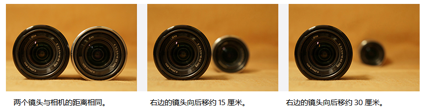

# 😀花色密语

## 😍日本

### 🤮庄司みゆき

庄司美雪

### 🤮木田彩水

## 😍摄影

### 🤮摄影选型

#### 🤗Alpha 6400

- 半画幅

#### 🤗A7C2

#### 🤗ZV-E10L

### 🤮基本知识

#### 🤗焦距

焦距是镜头中心与影像传感器（焦平面）之间的距离，每个镜头的焦距有所不同。  

焦距对决定可拍摄的画面范围（视角）而言非常重要。 如以下相片所示，焦距越短，可拍摄的范围越大；焦距越长，较远距离的物体拍的越大。

一般而言，约 35 毫米焦距的镜头被认为「标准镜头」，因为它们的视角与人的视野接近。比该焦距更短的镜头为「广角镜头」，

焦距更长的镜头为「远摄镜头」。然而，这些并无严格标准。请根据您想拍摄的主体或者影像使用不同的镜头。

**变焦镜头及定焦镜头**

镜头分为两种：可变焦距的「变焦镜头」以及固定焦距的「定焦镜头」。部分变焦镜头具备多功能性，从广角到远射镜头均可使用。

除了可用于日常拍摄外，这种镜头在外出游玩希望尽量减少行李时，尤其方便。

相反，如使用不具备变焦功能的定焦镜头，您就需要自行移动来解决构图的问题。*但定焦镜头大多较快且光圈较宽，透过用散焦背景令表现力方面存在优势。并具备在光线微弱的环境下使用高快门速度的能力，可减少影像模糊。另外，其优越的表达性能让您可享受变焦镜头无法实现的超凡画质*

*下图就是使用的定焦镜头拍摄。通过将光圈设为小光圈值，背景达到极为显著的散焦效果*
微距镜头使你可靠近主题拍摄特写，同样是定焦镜头。虽然近来不少变焦镜头具备对焦距离颇短的微距能力，其表现始终无法媲美专门的微距镜头。

这张照片使用微距镜头捕捉向日葵的细节。使用微距镜头，您就能够大幅靠近拍摄的主体。

#### 🤗光圈(光圈值)及A 模式

光圈是用来调整镜头进光量的部件。如下图所示，它位于镜头内，并通过改变圆孔大小调整穿过镜头的光量。

受光圈大小影响的镜头进光量以光圈值计算。光圈值有固定的标准值，例如F2、F2.8、F4、F5.6 和 
F8。光圈值越大，表示光圈越关闭，越少光线可以穿过镜头。光圈值越小，表示光圈开放，越多光线可以穿过镜头。例如，当光圈从F8转为F5.6，光量会变为双倍。因此，即使快门速度变为双倍，只要其他条件维持不变，仍可让相同的光量进入相机。

光圈也会影响合焦位置范围或相片的散焦量。  
以下显示散焦量与光圈相关的比较。您可看见随着光圈值越小，前景和背景变得更散焦。

一般而言，光圈值越小，相机进光量就越多，而您也可欣赏到更明显的散焦效果。每个镜头均有其最小光圈值，这被称为镜头的「最大光圈」。要查阅镜头的最大光量，请参考镜头规格，或如下图所示的印在镜头上的参数。  
光圈值小的镜头一般称为「快镜头」。

**A模式（光圈优先模式）**

A 模式（光圈优先模式）可让您按照喜好设定光圈值。相机会按照此条件自动设定快门速度和IOS感光度。以拍摄曝光充足的照片。  
如您希望令前景和背景散焦并只对主体，或希望对焦与前景至背景的大范围以清晰呈现完整的风景时，就可以使用此模式。

光圈值越大，让光线进入相机的圆孔就越小。快门速度会相应减慢，可能导致影像因相机晃动而模糊。如发生此情况，请重新尝试使用较小光圈拍摄。

#### 🤗灯光及其效果

即使拍摄同一主题，相片的感觉也可以大幅改变。这是因为角度和光线强度会影响曝光和暗影呈现的效果。让我们看看光线角度和主题位置的组合如何造成差别。

光线角度粗略可分为以下三种。

**1.顺光**

顺光从正面（相机一面）照亮主体。  
由于主题直接暴露于光线下，颜色和形状均可清晰呈现。这种灯光适用于拍摄风景，可呈现鲜艳清晰的蓝天白云。

**2.侧光**

侧光从侧面照亮主题。  
这种灯光倾向在主体上投射清晰的暗影，创造出光暗之间的强烈对比。这最适合在主题上加上暗影以营造深度。

**3.逆光**

逆光从后背照亮主题。  
逆光拍摄会使食物的照片看起来更美味吸引。或使肖像呈现柔和的感觉。另一方面，由于强烈的光线进入镜头，主体会偏暗。在这种情况下，可按喜好使用*曝光补偿*来调整主题的亮度。

明白灯光对于主体呈现效果的影响后，便可拍摄出更接近您意念的照片。  
例如，当您在阳光普照的室内拍摄时，使用从窗户进入的光线会有显著的效果。如果您背着窗户站立，可以顺光拍摄。如果您将相机朝向窗户，可以逆光拍摄。若要拍摄食物或室內花卉，建议使用逆光。

#### 🤗散焦的因素

自由呈现散焦的能力是准备大型感测器的可换镜头数码相机独有的功能。透过将主体的背景和前景散焦，主体将显得更突出。

要控制散焦量，「光圈（光圈值）」、「焦距」、「对焦距离」和「与背景的距离」这四大因素十分重要。您可有效组合这些因素，以按照喜好营造散焦效果。

1. 光圈值：设得越小会令散焦越明显。
2. 焦距：设得越长会令散焦越明显。
3. 对焦距离：设得越短会令散焦越明显。
4. 与背景的距离：设得越长会令散焦越明显。

**1.光圈（光圈值）**

光圈状态由称为光圈值的数字显示。光圈值越小，散焦量会变得越大。光圈值越大，散焦量会变得越小。

这些相片拍摄于同一位置，只变更了光圈值设定。使用 F2.8 时，焦点在红色的玻璃珠上，其前景及背景均为散焦。使用 F16 时，焦点不单在红色的玻璃珠上，其他前后的珠子也无散焦并清晰呈现。

**2.焦距**

散焦量也受焦距影响。散焦量在焦距较长时会变得较大，在焦距较短时变少。如使用变焦镜头，您可使用远摄端拍摄以增加散焦量。

以上相片以同一变焦镜头拍摄，分別使用 35 毫米（广角端）和 250 毫米（远摄端）。摄影师移动镜头，令前景的花朵在两张相片上均以同一大小呈现。就如此例子，如有足够移动空间，您可稍微从主体移开并使用远摄端拍摄，以令背景明显散焦。

**3.对焦距离（相机与主体之间的距离）**

除「光圈」和「焦距」等相机设定，相机与主体之间的距离也会改变散焦量。随着您将相机移近主体，背景散焦逐渐增加。但您与主体的接近程度设有限制。以下相片在拍摄期间只改变了对焦距离。与在主体
150 厘米外拍摄的相片 [1] 相比，在 50 厘米外拍摄的相片 [2] 中，除了合焦范围区，较大部份的影像呈现出散焦效果。

**4.主体与背景之间的拍摄距离**

除相机与主体之间的距离，主体与背景之间的距离也会影响散焦量。背景与主体越远，散焦就会越明显。在以下相片中，右边的镜头向后移至不同位置以比较散焦量。

焦点固定在左边的镜头上。您可看到随着背景与焦点（主体位置）的距离拉远，散焦效果变得更明显。如可以移动背景物件，例如拍摄桌上的细小物品时，您可移动主体和背景物件以调整散焦量。

通过此方式，四大因素会决定散焦量，但并非任何时候都必须使用所有因素以营造散焦。根据您的拍摄条件，调整每个因素以有效取得散焦效果。

#### 🤗最近对焦距离

每个镜头均有离主体最近的可拍摄距离。此距离称为最近对焦距离。如过份靠近主体超越了此距离，您将无法对主体适当进行对焦。

最近对焦距离视镜头而有所不同，如为变焦镜头，也视焦距而有所不同。要检查镜头的最近对焦距离，请参考镜头的规格，或如下图所示印于镜头上的距离。

此距离在镜头的正面以米及尺的单位标识。以上镜头 SELP1650 的最近对焦距离视焦距而定，由 0.25 米（25 厘米）至 0.3 米（30 厘米）不等。如过份靠近主体超越了这距离，您将无法对主体适当进行对焦，而快门也无法释放。

如您想尽量靠近主体，例如在拍摄花卉的特写时，首先毫无保留地靠近主体，然后逐步拉远距离以寻找能对焦主体的距离。

#### 🤗曝光及曝光补偿

曝光是拍摄相片时进入相机的光量。光量取决于[光圈](https://www.sony.com/zh-cn/electronics/support/articles/00243684?showheaderfooter=false)和[快门速度](https://www.sony.com/zh-cn/electronics/support/articles/00243685?showheaderfooter=false)。再加上 [ISO 感光度](https://www.sony.com/zh-cn/electronics/support/articles/00243687?showheaderfooter=false)，就能决定相片的亮度。

在自动拍摄模式和 P/A/S 模式下，自动曝光 (AE) 功能会启动，让相机自行判断最佳曝光，从而设定光圈、快门速度和ISO感光度。使用此 AE 功能，您就能拍摄出由相机自动测定，具备适当亮度的相片。

视情况而定，相机测定的适当亮度可能与您预期的有所不同。以下使用AE功能拍摄的相片中，曝光根据明亮的白云和黑暗的建筑物之间的亮度而定。但如果您希望强调高耸的白云，影像较暗更适合。相反，如果您希望建筑物呈现的更清晰，影像较亮则更合适。

                       曝光补偿 +0.7                                      曝光补偿 0                                             曝光补偿 -0.7

在这种情况下，建议使用 曝光补偿。

曝光补偿用于调整由于相机测定的适当曝光，以近一步贴近您所想的亮度。如上述例子，相片的适当亮度视场景或个人喜好而有所不同。如您希望相片更亮，向 + 方调整，而希望相片更暗的話，則向 - 方调整。  
使用数码相机，您可即时检查出拍摄结果。重复进行曝光补偿以实现您所需的亮度。
