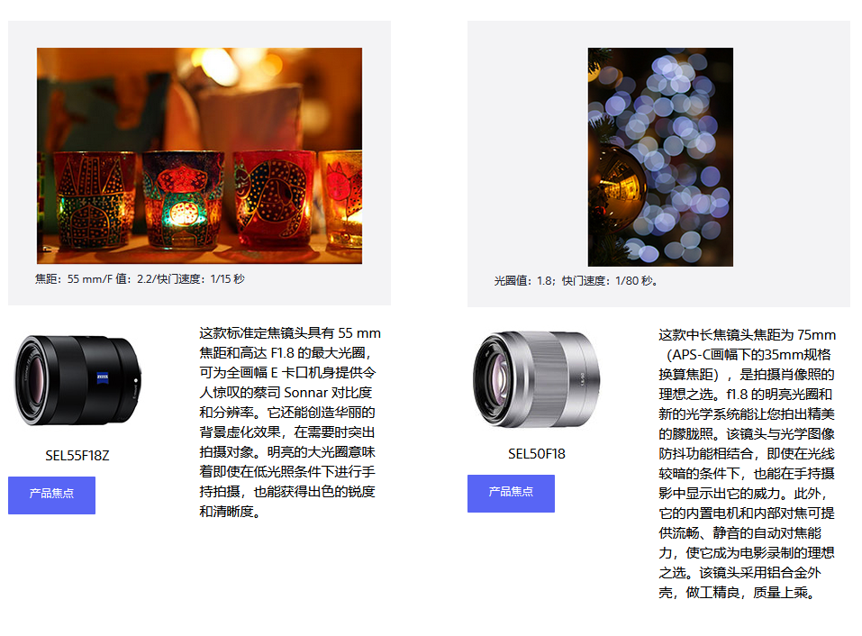

# 😀花色密语

## 😍摄影

### 🤮基本知识

1. [索尼相机使用帮助](https://service.sony.com.cn/i-manual/ilce-6500/zh-CN/contents/TP0001118416.html)
2. [Sony α (Alpha) 相机入门知识](https://www.sony.com/zh-cn/electronics/support/articles/00157815)

焦距是镜头中心与影像传感器（焦平面）之间的距离，每个镜头的焦距有所不同。  

焦距对决定可拍摄的画面范围（视角）而言非常重要。 如以下相片所示，焦距越短，可拍摄的范围越大；焦距越长，较远距离的物体拍的越大。


一般而言，约 35 毫米焦距的镜头被认为「标准镜头」，因为它们的视角与人的视野接近。比该焦距更短的镜头为「广角镜头」，

焦距更长的镜头为「远摄镜头」。然而，这些并无严格标准。请根据您想拍摄的主体或者影像使用不同的镜头。


**变焦镜头及定焦镜头**

镜头分为两种：可变焦距的「变焦镜头」以及固定焦距的「定焦镜头」。部分变焦镜头具备多功能性，从广角到远射镜头均可使用。

除了可用于日常拍摄外，这种镜头在外出游玩希望尽量减少行李时，尤其方便。


相反，如使用不具备变焦功能的定焦镜头，您就需要自行移动来解决构图的问题。*但定焦镜头大多较快且光圈较宽，透过用散焦背景令表现力方面存在优势。并具备在光线微弱的环境下使用高快门速度的能力，可减少影像模糊。另外，其优越的表达性能让您可享受变焦镜头无法实现的超凡画质*

*下图就是使用的定焦镜头拍摄。通过将光圈设为小光圈值，背景达到极为显著的散焦效果*
微距镜头使你可靠近主题拍摄特写，同样是定焦镜头。虽然近来不少变焦镜头具备对焦距离颇短的微距能力，其表现始终无法媲美专门的微距镜头。

这张照片使用微距镜头捕捉向日葵的细节。使用微距镜头，您就能够大幅靠近拍摄的主体。


#### 🦷光圈(光圈值)及A 模式

光圈是用来调整镜头进光量的部件。如下图所示，它位于镜头内，并通过改变圆孔大小调整穿过镜头的光量。


受光圈大小影响的镜头进光量以光圈值计算。光圈值有固定的标准值，例如F2、F2.8、F4、F5.6 和 
F8。光圈值越大，表示光圈越关闭，越少光线可以穿过镜头。光圈值越小，表示光圈开放，越多光线可以穿过镜头。例如，当光圈从F8转为F5.6，光量会变为双倍。因此，即使快门速度变为双倍，只要其他条件维持不变，仍可让相同的光量进入相机。

光圈也会影响合焦位置范围或相片的散焦量。  
以下显示散焦量与光圈相关的比较。您可看见随着光圈值越小，前景和背景变得更散焦。


一般而言，光圈值越小，相机进光量就越多，而您也可欣赏到更明显的散焦效果。每个镜头均有其最小光圈值，这被称为镜头的「最大光圈」。要查阅镜头的最大光量，请参考镜头规格，或如下图所示的印在镜头上的参数。
光圈值小的镜头一般称为「快镜头」。


**A模式（光圈优先模式）**

A 模式（光圈优先模式）可让您按照喜好设定光圈值。相机会按照此条件自动设定快门速度和IOS感光度。以拍摄曝光充足的照片。
如您希望令前景和背景散焦并只对主体，或希望对焦与前景至背景的大范围以清晰呈现完整的风景时，就可以使用此模式。


**光圈值越大，让光线进入相机的圆孔就越小。快门速度会相应减慢，可能导致影像因相机晃动而模糊。如发生此情况，请重新尝试使用较小光圈拍摄。**

#### 🦷灯光及其效果

即使拍摄同一主题，相片的感觉也可以大幅改变。这是因为角度和光线强度会影响曝光和暗影呈现的效果。让我们看看光线角度和主题位置的组合如何造成差别。

光线角度粗略可分为以下三种。


**1.顺光**

顺光从正面（相机一面）照亮主体。  
由于主题直接暴露于光线下，颜色和形状均可清晰呈现。这种灯光适用于拍摄风景，可呈现鲜艳清晰的蓝天白云。


**2.侧光**

侧光从侧面照亮主题。  
这种灯光倾向在主体上投射清晰的暗影，创造出光暗之间的强烈对比。这最适合在主题上加上暗影以营造深度。


**3.逆光**

逆光从后背照亮主题。  
逆光拍摄会使食物的照片看起来更美味吸引。或使肖像呈现柔和的感觉。另一方面，由于强烈的光线进入镜头，主体会偏暗。在这种情况下，可按喜好使用*曝光补偿*来调整主题的亮度。


明白灯光对于主体呈现效果的影响后，便可拍摄出更接近您意念的照片。  
例如，当您在阳光普照的室内拍摄时，使用从窗户进入的光线会有显著的效果。如果您背着窗户站立，可以顺光拍摄。如果您将相机朝向窗户，可以逆光拍摄。若要拍摄食物或室內花卉，建议使用逆光。

#### 🦷散焦的因素

自由呈现散焦的能力是准备大型感测器的可换镜头数码相机独有的功能。透过将主体的背景和前景散焦，主体将显得更突出。

要控制散焦量，「光圈（光圈值）」、「焦距」、「对焦距离」和「与背景的距离」这四大因素十分重要。您可有效组合这些因素，以按照喜好营造散焦效果。

1. 光圈值：设得越小会令散焦越明显。
2. 焦距：设得越长会令散焦越明显。
3. 对焦距离：设得越短会令散焦越明显。
4. 与背景的距离：设得越长会令散焦越明显。


**1.光圈（光圈值）**

光圈状态由称为光圈值的数字显示。光圈值越小，散焦量会变得越大。光圈值越大，散焦量会变得越小。


这些相片拍摄于同一位置，只变更了光圈值设定。使用 F2.8 时，焦点在红色的玻璃珠上，其前景及背景均为散焦。使用 F16 时，焦点不单在红色的玻璃珠上，其他前后的珠子也无散焦并清晰呈现。

**2.焦距**

散焦量也受焦距影响。散焦量在焦距较长时会变得较大，在焦距较短时变少。如使用变焦镜头，您可使用远摄端拍摄以增加散焦量。


以上相片以同一变焦镜头拍摄，分別使用 35 毫米（广角端）和 250 毫米（远摄端）。摄影师移动镜头，令前景的花朵在两张相片上均以同一大小呈现。就如此例子，如有足够移动空间，您可稍微从主体移开并使用远摄端拍摄，以令背景明显散焦。

**3.对焦距离（相机与主体之间的距离）**

除「光圈」和「焦距」等相机设定，相机与主体之间的距离也会改变散焦量。随着您将相机移近主体，背景散焦逐渐增加。但您与主体的接近程度设有限制。以下相片在拍摄期间只改变了对焦距离。与在主体
150 厘米外拍摄的相片 [1] 相比，在 50 厘米外拍摄的相片 [2] 中，除了合焦范围区，较大部份的影像呈现出散焦效果。


**4.主体与背景之间的拍摄距离**

除相机与主体之间的距离，主体与背景之间的距离也会影响散焦量。背景与主体越远，散焦就会越明显。在以下相片中，右边的镜头向后移至不同位置以比较散焦量。


焦点固定在左边的镜头上。您可看到随着背景与焦点（主体位置）的距离拉远，散焦效果变得更明显。如可以移动背景物件，例如拍摄桌上的细小物品时，您可移动主体和背景物件以调整散焦量。

通过此方式，四大因素会决定散焦量，但并非任何时候都必须使用所有因素以营造散焦。根据您的拍摄条件，调整每个因素以有效取得散焦效果。

#### 🦷最近对焦距离

每个镜头均有离主体最近的可拍摄距离。此距离称为最近对焦距离。如过份靠近主体超越了此距离，您将无法对主体适当进行对焦。


最近对焦距离视镜头而有所不同，如为变焦镜头，也视焦距而有所不同。要检查镜头的最近对焦距离，请参考镜头的规格，或如下图所示印于镜头上的距离。


此距离在镜头的正面以米及尺的单位标识。以上镜头SELP1650 的最近对焦距离视焦距而定，由 0.25 米（25 厘米）至 0.3 米（30 厘米）不等。如过份靠近主体超越了这距离，您将无法对主体适当进行对焦，而快门也无法释放。

如您想尽量靠近主体，例如在拍摄花卉的特写时，首先毫无保留地靠近主体，然后逐步拉远距离以寻找能对焦主体的距离。

#### 🦷曝光及曝光补偿

曝光是拍摄相片时进入相机的光量。光量取决于[光圈](https://www.sony.com/zh-cn/electronics/support/articles/00243684?showheaderfooter=false)和[快门速度](https://www.sony.com/zh-cn/electronics/support/articles/00243685?showheaderfooter=false)。再加上 [ISO 感光度](https://www.sony.com/zh-cn/electronics/support/articles/00243687?showheaderfooter=false)，就能决定相片的亮度。


在自动拍摄模式和 P/A/S 模式下，自动曝光 (AE) 功能会启动，让相机自行判断最佳曝光，从而设定光圈、快门速度和ISO感光度。使用此AE功能，您就能拍摄出由相机自动测定，具备适当亮度的相片。

视情况而定，相机测定的适当亮度可能与您预期的有所不同。以下使用AE功能拍摄的相片中，曝光根据明亮的白云和黑暗的建筑物之间的亮度而定。但如果您希望强调高耸的白云，影像较暗更适合。相反，如果您希望建筑物呈现的更清晰，影像较亮则更合适。


                       曝光补偿 +0.7                                      曝光补偿 0                                             曝光补偿 -0.7

在这种情况下，建议使用 曝光补偿。

曝光补偿用于调整由于相机测定的适当曝光，以近一步贴近您所想的亮度。如上述例子，相片的适当亮度视场景或个人喜好而有所不同。如您希望相片更亮，向 + 方调整，而希望相片更暗的話，則向 - 方调整。  
使用数码相机，您可即时检查出拍摄结果。重复进行曝光补偿以实现您所需的亮度。

#### 🦷创意风格

尝试使用创意风格，更尽情享受相机为您带来的乐趣，让拍摄出的相片更有氛围感。只需学习使用创意风格，即可大大提升您的摄影表现力。

##### 💂‍♀️什么是创意风格？

创意风格是提供相机内预设的影像风格的功能，让您拍出不同风格的照片。可用的风格共6至13种，视相机型号而定，当中包括 [风景] 及 [日落]，并可在 P/A/S/M 模式下使用。
使用相机，您就能控制相机各种参数，例如色调及颜色深度、亮度、对比度及清晰度，为同一主体塑造不同形象。
创意风格让您在以上各项参数保持最佳平衡，轻易拍摄出心中所想的相片。
只需选择您想表达的主题或场景所适用的风格，就能大大扩展您摄影表现的灵活性。另外，此特別功能更可让您根据所选风格加上个人艺术思想。


​                                                                                   [1] 创意风格：[鲜艳]                           [2] 创意风格：[日落]

以 [鲜艳] 风格拍摄的相片 [1] 艳丽清晰，可见较艳丽的颜色和较明显的效果。以 [日落] 风格拍摄的相片 [2] 中，日落红霞以更吸引的方式呈现。  
因此，创意风格是其中一项有助摄影师拍摄出所想影像的应用功能。当您无法拍摄出心中所想的气氛時，不妨试试创意风格中的各种风格。如您找到喜爱的风格，将它作为相机的标准风格使用或许是个不错的主意，可让相机呈现出其独特之处。

##### 💂‍♀️这与场景选择有什么不同？

创意风格是一项根据喜好而调整影像最终效果的功能，而场景选择则是个自动拍摄模式，可自动选定适用于所选场景的最佳参数。例如光圈值和快门速度，并会自动选定处理影像的方式。由于场景选择是自动拍摄模式之一，您不能变更创意风格的设定。

创意风格和场景选择的不同之处如下。

##### 💂‍♀️场景选择（拍摄模式）

相机会自动控制大部分设定，包括光圈和快门速度。由于设定根据所选场景而定，只需将所有工作交给相机，就能轻易拍摄出精美相片。

##### 💂‍♀️创意风格功能

此功能让您根据场景或您的想法控制相片的最终效果。这可在 P/A/S/M 模式下使用，并完全独立于光圈、快门速度及白平衡的控制。您可选择适用于您审美思想以及场景的影像风格。另外，您也可根据喜好调整影响相片最终效果的参数。

##### 💂‍♀️创意风格的范例及比较

以下显示创意风格提供的影像风格以及其特色。相机内预设的风格因相机型号而有所不同，以下所提供的为6种最基本的风格。

- [标准] 这是 α 的标准影像风格。色调、颜色深度（饱和度）及对比度等设定调整至适用于各种不同的主体及场景。这可用于快拍和迅速随意拍摄各种主体。

                     

- [鲜艳] 使用较高的饱和度及对比度设定，让您拍摄的相片与 [标准] 风格相比之下更艳丽清晰且效果更明显。 此风格不但有助让彩色的主体和场景更突出，即使影像在过度曝光摄影下显得颜色过淡，或主体在阴天的环境下显得太暗，亦可令色彩更鲜艳。

                  

-   [肖像] 此风格可重现女性和孩子的自然肤色。另外，为将皮肤质感更柔滑重现，此风格使用适用于肖像的对比度及清晰度设定。

                  

- [风景] 此风格以更突出的色调捕捉蓝天绿树的画面。而使用较高清晰度设定，无论近距离还是远距离的景色，均能清晰呈现。由于对比度和饱和度都较高，可让整个影像有清晰利落的感觉。这不但适用于蓝天、大海和高山等自然景观的相片，也适用于以蓝天为背景的主体。

                    

- [日落] 此风格可将日落日出等偏红的场景更突出地重现。由于红色色调维持于白平衡控制水平之内，色调和气氛依然极度自然。此风格也使用较高的清晰度设定，以更清晰呈现远距离景色。另外，如您使用此风格拍摄日落照射下的人像，更可欣赏到与 [肖像] 风格截然不同的气氛。

                    

- [黑白] 使用此风格，您就能体会单色的迷人之处，通过排除色彩效果，令主体格外引人注目。适用于单色的对比度及其他设定，营造出光暗间动人且丰富的层次。建议在希望令场景具有写实感觉时使用此风格，例如新闻图片。 
- 

##### 💂‍♀️微调

在创意风格中，您可微调预设风格。「清晰度」、「对比度」和「饱和度」这三个参数可以 ± 3 个步骤变更。使用此功能作最后调整以完成您的拍摄。

       

        [1]                                                        [2]

相片 [1] 以创意风格的 [风景] 风格拍摄。基于此原理，相片 [2] 的「对比度」和「饱和度」向 + 方调整。虽然这张相片最后变得更鲜艳，而效果明显，亦应注意不要过度调整，因这可能导致不自然的最终效果。

#### 🦷创意外观

使用创意外观拍摄照片或视频，并应用图像处理技术来创造你喜欢的情绪或氛围，从而更好地利用相机。 此功能可以极大地扩展您的创造性表达范围。

##### 💂‍♀️什么是创意外观?

您可通过选择“外观”来选择影像的效果。此外，您还可微调每种“外观”的对比度、高光、阴影、褪色、锐度、锐度范围和清晰度。

通过改变色调、饱和度、对比度、清晰度、亮度和其他图像元素，你可以给同一个对象营造不同的外观。要创建您预想的外观，您可以使用这些元素的理想平衡设置图像处理。

创意外观提供10种独特的预设外观。 您可以通过改变模式来享受更丰富的表达自由，例如 **FL** 或 **VV** 创建一个适合场景的外观或你想象的画面。 您还可以自定义此高级图像处理的预设模式，以创建自己的原始外观。  
创意外观可用于照片和电影，这对于那些希望在拍摄后立即在社交媒体上发布一致外观的人来说是一个不错的选择。

##### 💂‍♀️创意外观风格

创意外观风格和特点如下，这里描述了四种模式的示例。 拍摄时，检查摄像机屏幕或取景器上的实时取景显示，为拍摄对象、场景或为主体选择合适的模式。


享受单一色调摄影的世界,选择**SE** 模式营造棕褐色调或 **BW** 模式营造黑白单色调拍摄影像。

##### 💂‍♀️自定义外观

您可以根据所选模式微调对比度、高光、阴影、阴影、饱和度、锐度、锐度度范围和清晰度。创建首选外观后，可以将其保存为自定义外观，并在以后需要时轻松应用。 “自定义外观”还允许您保存同一模式的略微不同的版本，以便您可以为不同的场景使用不同版本的喜爱模式.

##### 💂‍♀️它与图片配置文件的区别是什么?

使用图片配置文件,您可以调整或更改确定灰度（明暗色调）、颜色和其他图像特征的参数。该菜单主要用于电影录制，包括用于调整伽马曲线、颜色、细节和一系列其他参数的高级设置。  
推荐给参与电影或视频制作的用户，他们将在拍摄后期在计算机上进行灰阶过程中进行细微调整，以准备最终图像。  
[什么是灰阶?](https://www.sony.com/zh-cn/electronics/support/articles/00146211)

在具有图片配置文件的相机上, 默认情况下，可以使用多个预设，包括S-LOG。有关图片配置文件和S-Log的详细信息，请访问以下页面。  
[创作者帮助指南（此链接为英文说明）](https://helpguide.sony.net/di/pp/v1/en/index.html)  
[使用S-Log拍摄后期调色](https://support.d-imaging.sony.co.jp/support/ilc/movie/l/grading/index.php)

创意外观和图片配置都是用来调整图像颜色和纹理的。这些差异可以总结如下内容：

##### 💂‍♀️创意外观

- 易于设置，便于利用在视频和静态图像
- 享受直观的图像处理，无需任何特殊知识。初学者的最佳选择。

##### 💂‍♀️图片配置文件

- 主要用于电影录制，但也可用于静止图像。
- 需要了解伽马曲线、颜色模式和其他参数。 使用此功能拍摄后，需要进行最终编辑，例如灰阶处理。
- 能够与配备S-Log的专业摄像机拍摄的图像的外观和感觉紧密匹配，并能创造出电影中的感觉。

#### 🦷白平衡

白平衡能抵消拍摄环境中灯光色彩的影响，以使白色的物体在相片中呈现白色。  
不同的灯光有不同的颜色及特性。例如，钨丝灯的颜色偏黄，阴天的阳光则呈现偏蓝色。肉眼可基于「白色的物体看起来应该是白色」的概念，自动抵消以上影响。不过，相机会按照其捕捉的色彩原样重现在相片上。因此，视周围环境灯光而定，白色在相片上看起来可能比肉眼看到的实际影像更黄或更蓝。

在相片 [1] 中，白色的碟子因受到钨丝灯的影响而显得较黄。另一方面，相片 [2] 则因为阳光的影响而偏蓝。  
调整相机「白色度」的标准以修正灯光色彩所导致的「偏色」是白平衡的原始功能。除重现白色的功能外，数码相机的白平衡功能也逐渐被用作滤光镜来调整色调。  


                                [1]                                                                              [2]

##### 💂‍♀️自动白平衡 (AWB)

相机配备「自动白平衡 (AWB)」的功能，根据已识别的场景自动调整白平衡。由于相机的白平衡功能预设为AWB，相机会在各种场景自动调整相片的色彩以显得较为自然。进行快拍时，或在混合灯光环境下拍摄时不确定适合使用哪种白平衡设定，建议使用 AWB。

##### 💂‍♀️变更白平衡设定

除 AWB 以外，相机预设了适合多种不同场景的白平衡设定。如 AWB无法呈现您预期的色彩，又或您想根据自己的喜好调整色调，请自行选择理想的白平衡设定。


如上图所示，相机已预设包括 AWB 在內的 10 种白平衡设定。以下相片显示不同白平衡设定的不同色彩。


                   AWB                                             日光                                                   阴影                                阴天

在阴天下拍攝的貓。设定了 [AWB] 和 [阴天] 时，色彩自然重现，接近实际色彩。相比之下，相片在 [日光] 下显得较蓝，在 [阴影] 下显得较黄。


                                                                          [AWB]                                   [荧光灯：暖白 (-1)]                                      [荧光灯：冷白 (0)]


                                                                             [荧光灯：白天白光 (+1)]                                         [荧光灯：日光 (+2)]

我们现在可比较一下以上的夜景相片。这张[AWB] 的实际色彩重现较佳，但整张影像略带绿色。变更为 [荧光灯] 后，所有偏绿色都消失了。在  [荧光灯] 设定中，您可看见随着设定从 - 变为 +，色彩也变得较暖。根据您的喜好或想展示的影像效果选择设定。

##### 💂‍♀️微调

每个白平衡设定均可作微调 (*)。微调预设的白平衡设定，您可为相片加入您的个人风格。

(*) 可作微调的白平衡设定及操作屏幕视型号有所不同。


右边的相片在 [AWB] 设定中加入了蓝色拍摄。
运用微调功能后，呈现了预设白平衡设定所不能实现的色彩。


                                                                                                白平衡：[AWB]                                       微调后

##### 💂‍♀️利用白平衡以提高摄影表现力

白平衡原本的功能是调整「白色度」，但此调整并非完整答案。根据你想要表达的主题或你的个人喜好，你可能希望你的形象更温暖或更凉爽。白平衡可以用来处理这种表达式。让我们通过尝试不同颜色的白色平衡来享受不同的色彩渲染。


#### 🦷快门速度及 S 模式

快门速度是影像传感器前面的快门开启的时间长度。快门开启时，传感器可接触光线，从而创造影像。


[1] 快门开启。                                                 [2] 快门关闭

以上图片显示 E-mount 相机的快门部件。快门[1] 中为开启，且传感器可通过光线。快门速度越慢，就越多光线可到达影像传感器。例如，快门速度由1/60 秒转为 1/30 秒，光量将变为两倍。  
除光圈可调整通过镜头的光量外，快门速度也是其中一项决定曝光的因素。  
在自动拍摄模式P和A模式下，相机会自动调整快门速度。在S模式下，您可根据喜好设定快门速度。

##### 💂‍♀️快门速度在照片上的效果

您可改变快门速度以控制影像的表现力。以下照片显示快门速度不同而产生变化。


​                                                              [1] 1/1250 秒                                          [2] 1/20 秒                                          [3] 1/4 秒

这些瀑布照片是在变更快门速度时拍摄。  
相片 [1] 以 1/1250 秒拍摄，这是三者之中最快的快门速度。由于快门开启时间短暂，捕捉了流水似乎静止的一瞬间。  
相片 [3] 以 1/4 秒拍摄，是最慢的快门速度。长时间开启快门导致流水显得如丝绸一般。  
通过此方式，您就能够变更快门速度使移动的主体以不同的方式呈现。您可在S模式和M模式下根据个人喜好设定快门速度，但可选的速度范围则因型号而有所不同。

如您希望捕捉移动的主体，例如在拍摄运动时，建议使用最快快门速度，以防止由主体快速移动所导致的影像模糊。


快门速度：1/4000 秒

通过以1/4000 秒拍摄，以上相片捕捉了主体正在尝试接球的一刻。相反，如您希望拍摄流水或者光的轨迹，建议使用较慢的快门速度。


快门速度：5 秒

通过设定快门速度为5秒，以上相片捕捉了烟花的轨迹。但快门速度越慢，影像就越容易变得模糊。在光线微弱的环境下拍摄，例如烟花和夜景，快门会倾向自动减慢。因此必须使用三脚架保持相机稳定。  
如该场景无法使用三脚架，您可提高ISO感光度以使用较快的快门速度。但请注意，较高的IOS感光度容易造成影像上出现杂色。另外，如要手持相机拍摄夜景，场景选择的「夜间手持模式」能达到颇佳的效果。


快门速度：0.5 秒

由于以上相片以缓慢的快门速度拍摄，影像由于相机晃动而变得模糊。如要拍摄移动的主体，除小心相机晃动外，您也应该防止主体移动所导致的影像模糊。如主体相机正在移动，影像会变得模糊导致照片不清晰。

##### 💂‍♀️S-模式（快门优先模式）

S 模式（快门优先模式）可让您按照喜好设定快门速度。相机会照此条件自动设定光圈（光圈值）和 ISO 感光度，以拍摄曝光充足的照片。  
如您希望拍摄移动的主体，或捕捉流水与光线的轨迹，就可使用此模式。

#### 🦷ISO 感光度

对于数码相机而言，ISO 感光度是一项显示光线通过镜头后于相机内增强多少的指标。  
进入相机的光量取决于光圈和快门速度。此光量会增强以创造出曝光充足的影像。ISO
 感光度以数字代表光线增强的水平。例如，ISO200 的感光度是 ISO100 的两倍。这代表即使光线只有一半，设定为 ISO200 
也可令您拍摄出与 ISO 100 同等的亮度。  
实际上，在大多模式下，ISO 感光度会自动由相机根据拍摄条件而定。然而，在 P/A/S/M 模式下，您也可按需要进行手动设置。  
感光度越高，即使在光线微弱的环境也可使用更快的快门速度，以减少在光线微弱时因相机晃动，或运动拍摄时主体移动而造成的影像模糊。但由于光线以电子形式增强，以高 ISO 感光度拍摄容易造成相片较多噪点（颗粒）或清晰度欠佳。


​                                                                                              [1] ISO: 3200                                       [2] ISO: 800

以上夜景相片以手持相机拍摄，相片 [1] 使用 ISO3200，相片 [2] 则使用 ISO 800。  
通过设定为高感光度，避免出现影像模糊，但左侧相片就出现了较强的颗粒感。

#### 🦷自动对焦(AF)模式和手动对焦(MF)模式的区别是什么？

自动对焦(AF)是相机自动对焦于物体的一种功能，通常大多数相机都有这个功能。不同的相机 AF 方法不同，具体取决于您的相机型号。根据您想拍摄的场景和主题的不同采用不同的对焦方法。

##### 💂‍♀️自动对焦方法

本节解释了 α 系列的自动对焦方法。  
两种主要的 AF 方法是 AF-S 和 AF-C,在半按快门时，它们有不同的对焦操作。

```visual-basic
自动对焦方法

本节解释了 α 系列的自动对焦方法。
两种主要的 AF 方法是 AF-S 和 AF-C,在半按快门时，它们有不同的对焦操作。
AF-S (单次AF)

当半按快门时开始自动对焦操作，一旦被摄体聚焦，焦点就会被锁定。
这适用于拍摄静止物体，如风景或快照。
AF-C (连续AF)

当按下快门按钮并保持半按状态时，自动对焦操作继续进行,并不断调整焦点。
这适用于拍摄运动物体，如运动或铁路摄影。
AF-A (自动AF)

半按快门时，相机会自动识别主题是否运动，并据此切换 AF-S 和 AF-C 两种 AF 模式。
使用这种模式可以同时拍摄不同的物体，或者避免手动切换 AF 模式。
```

##### 💂‍♀️直接手动对焦(DMF)

您可以在执行自动对焦后手动进行微调，使您能够比从一开始就使用手动对焦更快地对焦主题。这在拍摄宏大主题等情况下很方便.

##### 💂‍♀️手动对焦(MF)

手动对焦(MF)可以让拍摄者手动进行调节而非相机自动调节。  
虽然自动对焦（AF）拍摄在数码相机中更为常用，但在自动对焦困难时，如在微距拍摄中，MF是有必要的  
在MF模式下，您可以通过转动镜头上的对焦环来调整焦点位置。有关如何切换到MF模式或详细操作，请参阅相机的用户指南或说明书。


以上是 SEL24105G 镜头, **A** 部分是对焦环. 当像机设置为MF模式时，您可以通过转动此调焦环手动调整焦点。


镜头: SAL50M28 / 焦距: 50 mm / F值: 4.0

上面的照片是用SAL5028微距镜头拍摄的。焦点在左前侧的水滴上，前景和背景离焦很大。如本例所示，当您需要将焦点精确调整到一个小区域时，建议使用MF。当相机无法通过自动对焦找到所需的对焦位置时，MF也很有用。

##### 💂‍♀️对焦放大和MF帮助

对焦放大和MF帮助来检查拍摄对象是否对焦。这些功能的可用性及其详细功能因相机型号而异。有些型号只有其中一个功能，但该功能可用于放大您想要聚焦的主题部分，以手动微调焦点。  
请查阅对应型号的帮助指南和说明书，了解其可用功能和有关设置的详细信息。


通过将对焦放大镜和MF帮助分配给按钮或自定义键，可以将对焦放大时间设置为[无限制],这对于使用三脚架拍摄 [微距拍摄](https://www.sony.com/zh-cn/electronics/support/articles/00223369) 和 [星空拍摄](https://www.sony.com/zh-cn/electronics/support/articles/00223374)非常有用。


##### 💂‍♀️峰值

在手动对焦或直接手动对焦拍摄期间，峰值功能增强了对焦区域的轮廓。通过用颜色标记聚焦区域，峰值使其更容易识别。您可以选择显示颜色。


#### 🦷驱动模式

使用驱动模式，您就可选择「连拍」或「自拍计时器」等拍摄选项。可供使用的模式视您的相机型号而有所不同。此文章是对大多数 α 相机提供的一般典型驱动模式进行说明。

##### 💂‍♀️单张拍摄

这是正常的拍摄模式。按下快门按钮时会拍摄一张影像。  
（如在 Superior Auto 等模式下进行连拍，拍摄一张照片时可放开快门超过一次。）

##### 💂‍♀️连拍

当按住快门时会连续拍摄影像。视相机型号，您也可选择连拍速度。

##### 💂‍♀️自拍计时器

使用自拍计时器时，会于按下快门按钮 10 或 2 秒后拍摄影像。10 秒自拍计时器可让摄影师进入拍摄画面，而 2 秒自拍计时器则可在拍摄时减少相机晃动，例如可在以三脚架拍摄夜景时使用。

##### 💂‍♀️遥控器

此模式用于以另售的无线遥控器拍摄。

如您的相机有其他驱动模式，请参阅操作说明书或手册。

#### 🦷M 模式（手动曝光）

##### 💂‍♀️M 模式（手动曝光）

在 M 模式（手动曝光）中，摄影师可以调整光圈、快门速度以及感光度。在 P、A 和 S 模式中相机会自行设定最佳的曝光值（相片亮度），但在 M 模式中使用者需要自行设定曝光值。当您希望自行设定光圈和快门速度，或是希望拍摄烟花、星空或其他特別主体时，此拍摄模式非常有用。

视相机型号而定，部分相机即使在 M 模式中也可以自动设定感光度。当感光度设定为自动，相机将会根据所设定的光圈和快门速度自行改变感光度，以提供适当的曝光。除此之外，您也可以使用曝光补偿。

   

            其中一个拍摄模式                                                焦距：16 毫米（相等于35 毫米），光圈值：2.8，快门速度：30 秒

##### 💂‍♀️Bulb 摄影

除 M 模式以外，您还可以使用 Bulb 摄影功能。  
在 bulb 摄影功能中，只要您按住快门按钮，快门便会保持打开状态。当您要保持快门开启超过30 秒，例如希望拍摄烟花的余光等情況下，此模式便非常有用。要使用 bulb 摄影功能，将快门速度设定为[BULB]（B 快门）。将转盘转动直到超过 [30"]，便会显示 [BULB]（B 快门）模式。  
直接使用手指按动相机上的快门按钮通常会令相片变得模糊，因此使用 bulb 模式时务必使用三脚架和遥控器。

关于 bulb 模式的详细设定和注意事项，请参考相应相机型号的使用说明书和手册。

   

当快门速度设定为 [BULB]（B 快门）                             焦距：28 毫米（相等於 35 毫米），光圈值：14，快門速度：23 秒。

## 😍摄影FQA

### 🤮使用AF/MF/AEL切换杆

通过改变AF/MF/AEL切换杆的位置，可以将AF/MF/AEL按钮的功能切换为AF/MF或AEL。

将AF/MF/AEL切换杆**（A）**移动到AF/MF位置并按按钮**（B）**时，对焦模式会暂时在自动和手动之间切换（AF/MF控制）。将AF/MF/AEL切换杆移动到AEL位置并按该按钮时，曝光被锁定（AE锁定）。


### 🤮ISO

ISO 值越低，照片的质量越高，但需要更多光线；ISO 值越高，亮度增加，但图像质量可能下降。最佳的 ISO 值设置通常是在画质和曝光需求之间取得平衡。

#### 🦷亮度
低 ISO（例如 100、200）：在低光环境下，感光元件对光线的反应较为缓慢，因此需要更长的曝光时间（快门速度较慢）才能获得足够的亮度。低 ISO 适合光线充足或需要较长曝光时间的场景。
高 ISO（例如 1600、3200、6400）：提高 ISO 值可以增强感光元件对光的敏感度，因此即使在较暗的环境下，也能获得足够的亮度。这使得你可以使用更快的快门速度来避免因相机抖动造成的模糊。

#### 🦷噪点
低 ISO：通常会产生更清晰、更平滑的图像，噪点较少。低 ISO 能够保留更多的细节，适合高质量的摄影。
高 ISO：随着ISO的增高，图像中会出现更多的噪点，导致照片显得颗粒感强、细节丢失。高 ISO 会使图像变得更加模糊，尤其在阴影或暗部区域。

#### 🦷动态范围
低 ISO：通常会有更好的动态范围，能够保留更多的高光和阴影细节。高质量的低 ISO 设置通常能处理复杂的光线条件，避免过曝或欠曝。
高 ISO：动态范围通常会有所下降，尤其在高亮区域容易出现过曝，而在阴影区域则可能缺少细节。

#### 🦷快门速度
低 ISO：为了得到合适的曝光，可能需要较慢的快门速度，这会增加相机抖动或拍摄动态物体时的模糊。
高 ISO：高 ISO 允许使用更快的快门速度，从而减小相机抖动的影响，特别适合拍摄运动物体或手持拍摄。

#### 🦷应用场景
低 ISO：适合日间、室外或充足光照的环境，拍摄风景、人像等需要高画质的场景。
高 ISO：适合低光环境，如夜景、室内拍摄、拍摄运动物体等场合，在这些情况下能够保持较高的快门速度，避免因快门太慢而产生的模糊。

### 🤮光圈

光圈的大小（f 值）对照片的曝光、景深、焦点控制、画质、背景虚化等方面都有显著影响。选择合适的光圈值可以帮助你实现理想的拍摄效果。通常来说，较大的光圈适合低光环境、背景虚化和拍摄快速运动的物体，而较小的光圈适合光线较强的环境、风景拍摄以及需要大景深的情况。

#### 🦷曝光（亮度）

- **大光圈（小 f 值，如 f/1.4、f/2.8）**：大光圈允许更多的光线进入相机，因此在低光环境下拍摄时，能够获得更亮的照片。适合拍摄昏暗环境或需要快速快门速度的场景。
- **小光圈（大 f 值，如 f/8、f/16）**：小光圈限制了光线进入相机，曝光量减少。在光线充足的情况下使用，避免过曝，或用于需要长时间曝光的场景。

#### 🦷景深（Depth of Field）

景深是指照片中前景到背景清晰的范围，光圈大小对景深有重要影响：

- **大光圈（小 f 值，如 f/1.4、f/2.8）**：大光圈会使背景模糊，产生较浅的景深。这有助于突出主题，让主体更为清晰，而背景则变得柔和模糊。这种效果常用于人像摄影或需要背景虚化的场景。
- **小光圈（大 f 值，如 f/8、f/16）**：小光圈增加了景深，使得前景和背景都能够较为清晰地呈现。适合风景摄影等需要大范围清晰的场景。

#### 🦷画质（锐度与畸变）

- **大光圈（小 f 值）**：虽然可以获得更多的光线，但通常在光圈完全打开时，镜头的边缘可能会出现一些失真或畸变，图像的锐度也可能略有下降。特别是一些低质量的镜头，在大光圈下可能会出现光晕、色差等现象。
- **小光圈（大 f 值）**：小光圈通常能提高图像的整体锐度，但也可能引入“衍射”现象，导致照片出现一些轻微的模糊感。这种效应在非常小的光圈（如 f/16 或 f/22）时更加明显。

#### 🦷焦点控制

- **大光圈**：由于大光圈产生较浅的景深，你需要非常精确地对焦，因为只有一个小范围的区域会保持清晰。对于人像、特写等需要精确对焦的拍摄场景，大光圈是非常合适的选择。
- **小光圈**：由于景深较深，相对较不容易出现焦点不清晰的情况，适合拍摄风景、建筑等需要整个画面清晰的场景。

#### 🦷快门速度

- **大光圈（小 f 值）**：大光圈允许更多光线进入，因此在低光环境下，可以使用较快的快门速度来避免相机抖动或动态模糊。这对于拍摄快速移动的物体或进行手持拍摄时特别重要。
- **小光圈（大 f 值）**：小光圈的光线进入量较少，因此通常需要较长的曝光时间（慢快门速度），这在拍摄静态场景或需要创造动态模糊效果时是有用的。

#### 🦷背景虚化（Bokeh）

- **大光圈（小 f 值）**：大光圈的另一个显著效果是背景虚化（Bokeh）。通过控制光圈大小，能够使背景变得模糊，突出拍摄主体。Bokeh 的效果不仅由光圈大小决定，还受镜头的光圈叶片形状影响，某些镜头可以产生非常柔和的虚化效果，增加画面的艺术感。
- **小光圈（大 f 值）**：背景虚化效果较弱，景深较大，前后景物都相对清晰。

#### 🦷应用场景

- **大光圈（小 f 值）**：适合低光环境（如夜景、室内拍摄）、人像摄影、特写摄影等需要背景虚化、突出主体的场景。
- **小光圈（大 f 值）**：适合光线充足的环境（如户外白天）、风景摄影、建筑摄影等需要大范围清晰度的场景。

### 🤮焦距

焦距（Focal Length）是指从相机镜头的光学中心到图像传感器之间的距离，通常以毫米（mm）为单位表示。焦距的大小直接影响照片的视角、拍摄距离、景深以及画面构图。不同的焦距参数值会对照片产生不同的效果，主要体现在以下几个方面：

**广角镜头（短焦距）**：适合拍摄风景、建筑、街头摄影，能呈现广阔的视角和深景深，但可能会产生边缘畸变。

**标准镜头（中焦距）**：适合日常拍摄、人像，画面自然，畸变较少。

**长焦镜头（远摄）**：适合拍摄远距离的物体、动物或体育，具有压缩背景、突显主体和浅景深的效果。

#### 🦷视角与拍摄范围
短焦距（广角，通常小于 35mm）：

视角宽广：短焦距镜头有较大的视角，能够捕捉到更广泛的场景，适合拍摄风景、建筑或团体照片等。广角镜头拍摄时，能包含更多的背景和环境。
放大背景效果较弱：由于视角广，前景和背景会相对较远，背景显得更加远离拍摄主体。
近距离拍摄失真：广角镜头在近距离拍摄时，可能会导致“桶形畸变”，即图像边缘会有弯曲或变形。
中焦距（标准焦距，通常为 35mm 到 70mm）：

自然视角：标准焦距镜头通常会模拟人眼的视角，适合日常摄影、人像以及街头摄影等。它的画面既不过分压缩，也不显得过于宽广，适合捕捉自然的场景。
较少畸变：与广角镜头相比，中焦距镜头通常表现得更自然，畸变较少，尤其在人像拍摄中，可以展现更真实的面部特征。
长焦距（远摄，通常大于 70mm）：

视角狭窄：长焦距镜头的视角较窄，适合远距离拍摄，如野生动物、体育赛事或摄影师无法靠近拍摄对象时使用。
压缩效果：长焦距镜头有较强的“压缩效果”，它能将远处的物体拉近，视觉上使远近物体看起来相对较接近。背景和前景的距离感减弱，主体更加突出。
背景虚化：长焦镜头在拍摄时能够产生较浅的景深，背景常常呈现出柔和的虚化效果（Bokeh），适合人像或拍摄突出主题的场景。

#### 🦷景深（Depth of Field）

短焦距（广角）：由于广角镜头的焦距较短，相同的光圈设置下，景深较深，前景和背景会有较大的范围保持清晰。对于风景摄影或拍摄群体照片时，通常需要较大的景深。
长焦距（远摄）：长焦镜头的景深较浅，即使在较小光圈设置下，背景和前景的清晰范围也相对较小。这使得长焦镜头在拍摄人物、动物等时，能够很好地将主体与背景分离，产生漂亮的背景虚化效果。

#### 🦷拍摄距离与透视变形

短焦距（广角）：广角镜头具有较强的透视效果，当近距离拍摄物体时，物体会显得相对较大，背景则会显得非常远。这种效果常被用于强调前景或创造空间感。
长焦距（远摄）：长焦镜头有较弱的透视效果，使得物体的大小差异较小，远处的物体和前景物体之间的透视关系较为平坦，能够产生一种“压缩”的视觉效果。这对于拍摄远距离的物体或将不同物体放在同一画面中非常有效。

#### 🦷变形与畸变

广角镜头（短焦距）：广角镜头容易产生畸变，尤其在拍摄人像或物体边缘时，物体可能会显得拉长或弯曲。特别是在拍摄较近距离物体时，这种畸变更加明显。
长焦镜头（远摄）：长焦镜头的畸变较小，拍摄的图像更接近真实比例，尤其在拍摄人像时，脸部特征不容易发生形变。

#### 🦷应用场景

短焦距（广角，10mm - 35mm）：

风景摄影：短焦距可以捕捉到广阔的风景，适合拍摄广袤的自然景观、建筑物等。
建筑与室内摄影：广角镜头能容纳更多的空间，适合在狭小空间内拍摄。
街头与人文摄影：广角镜头在街头摄影中能够包容更多的场景，体现出摄影师与环境的互动。
中焦距（标准，35mm - 70mm）：

人像摄影：标准焦距镜头通常是拍摄人像的理想选择，既能提供自然的视角，又不容易产生畸变。
日常摄影：适合日常拍摄，既能捕捉丰富的背景，又能在不失真情况下突出主体。
长焦距（远摄，70mm 以上）：

野生动物与体育摄影：长焦镜头能够让你在不接近被拍摄物体的情况下，清晰地捕捉远距离的细节。
人像摄影：长焦镜头能产生良好的背景虚化效果，突出人物，尤其是拍摄头部特写时，能够创造非常美丽的背景虚化（Bokeh）效果。
压缩景深与场景：适合拍摄远距离的景物或多个物体相对平铺的场景，能够产生“压缩效果”。

#### 🦷画面压缩与视觉效果

长焦镜头：长焦镜头会对前后景产生压缩效应，使得前景和背景看起来距离较近，图像的层次感较为平坦。这种效果常常用于突出拍摄主体或营造一种视觉的压缩感。
广角镜头：广角镜头能够展现出明显的远近关系，产生深度感和空间感，尤其适合拍摄场景辽阔的风景或建筑。

### 🤮快门

快门（Shutter）是相机用来控制曝光时间的机制，它决定了相机感光元件接收光线的时间长短。快门速度（Shutter Speed）的单位通常是秒（s）或分数秒（如 1/1000、1/500 等），它与曝光的亮度、运动捕捉以及照片的清晰度直接相关。快门参数值对照片的影响主要体现在以下几个方面：

**慢速快门**：适合低光环境、动态模糊（如流水、车灯轨迹）以及创意拍摄（如星轨、光绘等）。

**快速快门**：适合捕捉快速运动的物体、减少相机抖动以及清晰冻结瞬间。

#### 🦷曝光时间（亮度）

快门速度慢（例如 1/30、1/15、1/8）：较慢的快门速度让感光元件暴露于光线的时间较长，能够捕捉更多的光线，因此图像较亮，适合低光环境下使用，如夜景拍摄或室内拍摄。慢速快门通常需要使用三脚架来避免因相机抖动而导致的模糊。
快门速度快（例如 1/500、1/1000、1/2000）：较快的快门速度减少了曝光时间，图像较暗。适合拍摄快速移动的物体或在光线强烈的环境中使用，例如白天户外拍摄或高速运动物体（如运动赛事）。

#### 🦷运动捕捉（动感效果）

慢速快门（如 1/30 或更慢）：
运动模糊效果：使用较慢的快门速度时，移动物体会在照片中产生模糊的拖尾效果，从而表现出运动的轨迹。这种效果常用于创造动感或表现运动状态（例如流水、汽车的尾灯轨迹等）。
长时间曝光：如果曝光时间足够长，还可以使背景或静止物体相对清晰，而动态物体则变成模糊的轨迹。例如，拍摄夜景时，可以使用较慢的快门速度捕捉车流的车灯轨迹。
快速快门（如 1/500 或更快）：
冻结动作：较快的快门速度能有效地“冻结”快速运动的物体，例如拍摄运动员奔跑、飞鸟、汽车行驶等，可以清晰捕捉到运动中的细节而不产生模糊。快速快门常用于体育摄影、野生动物摄影等。
动静对比：如果你拍摄一个运动中的主体，使用较快的快门速度可以使背景（静止物体）保持清晰，产生鲜明的动静对比效果。

#### 🦷相机抖动与清晰度

慢速快门：
相机抖动：使用较慢的快门速度时，相机可能因手持拍摄时的微小震动而导致图像模糊。为了避免相机抖动的影响，通常需要使用三脚架，或确保使用较高的ISO或较大的光圈来配合较快的快门速度。
快速快门：
减少模糊：较快的快门速度能有效减少相机抖动和动态模糊的风险，因此能够在手持拍摄时保持清晰，特别是在低光环境下拍摄快速运动的物体时尤其重要。

#### 🦷运动模糊与“凝固”效果

慢速快门：
运动模糊：较慢的快门速度能够将运动中的物体表现为模糊的轨迹，这种效果常用于表现流动感、时间的延续感或动态的过程（如流水、奔跑的运动员等）。这种模糊效果的长度和速度取决于物体的运动速度和曝光时间。
快速快门：
“凝固”瞬间：快速快门能够捕捉到非常短暂的瞬间，使得运动中的物体显得静止。适用于拍摄快速动作（例如拍摄运动员跳跃的瞬间或鸟类飞翔的瞬间）。

#### 🦷光线控制与亮度平衡

慢速快门：
低光环境：在低光环境下使用慢速快门，可以有效增加曝光时间，获得足够的光线，避免照片过暗。常用于夜间拍摄、室内拍摄等光线不足的场景。
长时间曝光：如果曝光时间较长（如几秒钟或几分钟），可以创造特殊的光线效果，例如拍摄夜空、光轨、星轨、流动的水等。
快速快门：
高光环境：在光线充足的情况下，使用快速快门速度可以避免过曝。在白天或光线强烈的环境下，较快的快门速度可以有效控制进入相机的光量，防止画面过亮

#### 🦷创意表现

慢速快门：
创意模糊：利用慢速快门的长时间曝光，可以创造出一些创意效果。例如，拍摄流水时，水面会变得如丝般平滑；拍摄夜景时，车灯轨迹可以形成美丽的光轨效果。慢速快门还可以用来表现人的运动轨迹，如舞者跳跃、奔跑等，增加画面的动态感。
快速快门：
瞬间凝固：使用快速快门可以捕捉到某个特定瞬间的精彩画面，例如一个水珠溅起的瞬间或运动员起跳的瞬间，能够让照片呈现出高度的动感。

#### 🦷长时间曝光与“星光”效果

长时间曝光：如果快门保持打开较长时间（通常超过 1 秒），即使在较暗的环境中，也能拍摄出明亮的照片。例如，在拍摄星空时，较长的曝光时间可以捕捉到星星的轨迹，产生“星光”效果或“星轨”效果。长时间曝光还可以产生一些特殊效果，比如把云层或流水拍得模糊、平滑。

### 🤮白平衡

白平衡的主要作用是调整色温（Color Temperature）。不同光源的色温不同，白平衡通过调整相机的色温设置，来纠正这种色差，使照片中的颜色呈现自然的效果。具体表现如下：

- **色温高（偏冷）**：在光线较冷（蓝色调）的环境中，白平衡会使得照片呈现偏蓝色调。例如，阴天、白炽灯或荧光灯下的环境通常会有偏冷的色温，未做白平衡调整的照片会显得偏蓝。
- **色温低（偏暖）**：在光线较暖（黄色调）的环境中，白平衡会使得照片呈现偏黄色调。日落、白炽灯、烛光等光源通常会带有暖色调，未调整白平衡时，照片可能会偏黄或偏红。

#### 🦷白平衡与色调的关系

**暖色调（偏黄/红）**：适用于日落、室内拍摄等场景，给人一种温馨、舒适的感觉。

**冷色调（偏蓝）**：适用于晨曦、寒冷的环境或夜景，带有冷峻、宁静的效果。

**中性色调**：通过适当的白平衡调整，使照片保持自然、真实的色彩，适合记录物体的真实色彩

### 🤮曝光补偿

#### 🦷曝光补偿的作用

曝光补偿影响的是相机计算的曝光量，通常通过调整相机的快门速度、光圈大小或ISO感光度（或者三者的组合）来实现。在大多数自动或半自动曝光模式下，相机会根据场景的亮度来自动计算曝光，而曝光补偿允许你手动“告诉”相机，增加或减少曝光。

#### 🦷曝光补偿的应用场景

曝光补偿广泛用于各种拍摄环境中，特别是当相机的自动曝光系统无法准确判断正确的曝光量时。以下是一些常见的应用场景：

1. 高对比度场景：

当拍摄场景具有非常亮的区域和非常暗的区域（如逆光、雪地或日落时的天空），相机的自动曝光可能无法准确捕捉整个场景的细节。在这种情况下，使用曝光补偿可以调整曝光量，以确保亮部和暗部都能呈现出理想的细节。
逆光场景：

在拍摄逆光时，相机的自动曝光系统可能会使主体（如人或物体）变得非常暗，因为它会尝试将背景的亮光拉入适当的曝光范围。通过增加曝光补偿（如 +1 EV 或 +2 EV），可以确保主体的细节得到更好的保留。

2. 拍摄白雪或沙滩：

白雪、沙滩等高反差场景往往会让相机的曝光测量系统“误判”，导致图像变暗。相机会试图将这些区域的亮度控制到中性，但这样可能导致雪或沙滩的细节丢失。增加曝光补偿可以弥补这一问题，使雪地或沙滩看起来更加白净，并保留细节。
拍摄夜景：

在夜景拍摄中，通常情况下，自动曝光可能会导致图像较暗，无法完全呈现夜空或城市的光线。适当增加曝光补偿（例如 +1 EV 或 +2 EV）可以让图像更加明亮，帮助突出夜景的细节。
拍摄高反差景物（如夜景和灯光）：

在强烈对比的场景中，比如霓虹灯、街道灯光等，自动曝光可能会过度暴露或者使细节丢失。通过曝光补偿来调整亮度，可以避免这些问题，保留更多的细节。

#### 🦷曝光补偿与曝光三要素的关系

虽然曝光补偿直接影响的是曝光量，但它并不直接改变相机的光圈、快门速度或ISO的数值，而是通过调整这些参数的组合来改变曝光效果。因此，曝光补偿是基于相机自动曝光的计算结果进行调整的。具体来说：

增加曝光补偿：相机会通过增大光圈（更小的f数），降低快门速度（更长的曝光时间），或增加ISO来增加曝光。
减少曝光补偿：相机会通过缩小光圈（更大的f数），提高快门速度（更短的曝光时间），或降低ISO来减少曝光。

#### 🦷曝光补偿的创意作用

曝光补偿不仅仅是为了纠正曝光问题，它还可以用来实现创意效果：

高曝光（+EV）：通过增加曝光补偿，可以使照片更亮，给人一种“明亮、温暖”的感觉，适用于表现幸福、温馨或光明场景的照片。
低曝光（-EV）：通过减少曝光补偿，可以使照片变暗，强调暗部细节，制造更多的对比效果，适合拍摄戏剧化、神秘或氛围感强的场景。

#### 🦷曝光补偿与曝光模式

曝光补偿通常与自动曝光模式（如快门优先、光圈优先或程序模式）一起使用。在这些模式下，相机会根据场景的亮度自动设置曝光参数，而曝光补偿则允许你对这些自动设置进行微调，从而得到理想的曝光效果。

1. 光圈优先模式（Aperture Priority）：在此模式下，曝光补偿主要通过改变快门速度或ISO来调整曝光。
2. 快门优先模式（Shutter Priority）：在此模式下，曝光补偿主要通过改变光圈大小或ISO来调整曝光。
3. 程序模式（Program Mode）：相机会自动选择光圈和快门速度，曝光补偿则通过改变ISO或微调这两个参数来调整曝光。


## 😍摄影技巧

### 🤮拍出极具感染力的人物肖像照


​                                                                              焦距：180 mm/F 值：4.0/快门速度：1/250 秒

将背景虚化并重点突出人物，您就能拍出极具感染力且主题清晰的照片。
这种照片被称为肖像照，这种技巧可用于拍摄日常照，以及生日或婚礼上的纪念照。
在日常拍照时，我们常常只会把整个人包含在画面即可。这会导致构图单调，好像在拍摄证件照一样。
在本章中，您将学习一些突出人物的摄影技巧，从而拍出更具感染力的人物照。
**在拍摄时，将相机设为 A 模式，并尽可能开大光圈**

1. 用长焦镜头一侧拍摄

如果使用变焦镜头，请尽量靠近拍摄对象，并用长焦镜头（焦距更长）一侧拍摄。这样能够弱化不需要的周围物体，更好地将背景虚化，只突出强调人物。


​                                                                                   [1] 焦距：55 mm/F 值：1.8         [2] 焦距：55 mm/F 值：1.8

在上面的例子中，照片 [2] 是通过靠近拍摄对象并放大上半身拍到的。这样拍摄对象显得更突出，照片的表现力更强。近距离拍摄的背景虚化效果更好，更能突出这位女士的表情。
如果是在旅游景点拍纪念照，那么像 [1] 这样的照片可能比较合适，因为画面中包含了周围景观。但如果只想突显人物，照片 [2] 看起来更具有感染力。

2. 考虑构图

即使是拍摄同一个对象，改变构图也会使照片氛围发生很大变化。
在日常拍摄时，我们倾向于让拍摄对象位于画面中心。而在拍摄人物肖像时，您可以试试“三分法”这种构图技巧。
“三分法”构图会将画面分成 9 个部分（3 个水平部分和 3 个垂直部分），并将主体置于分界线的交点处。拍摄人物肖像时，应将人脸中轴线或眼睛置于交点处。
“三分法”是确保构图均衡的基础。如果不确定该如何构图，您可以试着使用“三分法”。记住这条法则，就能轻松拍出许多好照片。α 相机有一项功能，即在相机背面的显示器上，可以显示“三分法”网格线。在拍摄时，构图时如需参考线，可使用此功能。


​                                                                                   焦距：70 mm/F 值：4.0/快门速度：1/250 秒

仅仅是把头部中轴线置于分界线上，上面的镜头就变得相当出色，且画面的平衡感非常好。而在拍摄对象望着的一边留下一定空间，更能充分传达出这张照片当时的拍摄氛围。
此外，作为一项基本原则，肖像照应采取垂直拍摄方向，如上述照片所示。将人物身体沿画面的长边平行放置，能使人物跟背景自然地融为一体，您就能轻松拍出简单明了的人物照。如果想在画面中包含背景，您可以采用水平拍摄方向。但如果只想突出人物，建议还是采用垂直拍摄方向。

3. 使用逆光

另一个重要事项是光线的角度问题。尤其对女性肖像照来说，用逆光拍摄能使肤色和发质更柔和。要获得理想的逆光条件，尽量不要在白天光线强烈的时候拍摄，可在下午光线变弱时再拍，或者是在阴天拍摄。如需在光线强烈时拍摄，试着想办法减弱光线，例如到树下拍照。
相反，如果用顺光拍摄，就会在脸上产生阴影，而且由于光线很强，拍摄对象的表情会显得很糟糕。如果可以控制光线角度，请试着创造逆光条件。
不过，如果用逆光拍照，面部可能会变黑。在这种情况下，您可以用曝光补偿功能来调整曝光，使面部足够明亮。虽然这会使背景发白，但能增强拍摄对象周围的柔和氛围。


​                                                                                           焦距：200 mm/F 值：4.0/快门速度：1/400 秒

这是一张在逆光条件下拍到的女性肖像照。光线来自拍摄对象身后的左侧。人物脸部没有多余阴影，光线透过发丝，给人一种轻柔的感觉。

3. 使用定焦镜头

建议使用定焦镜头，以便更好地虚化背景，并且只突出人物。由于定焦镜头能让大量光线进入相机，因此能减少低光照拍摄情况下及拍摄肖像时的模糊现象。


​                                                                                                    焦距：35 mm/F 值：2/快门速度：1/400 秒


​                                                                                                   焦距：50 mm/F 值：2/快门速度：1/250 秒


​                                                                                                    焦距：55 mm/F 值：2.8/快门速度：1/640 秒


​                                                                                                焦距：85 mm/F 值：1.8/快门速度：1/1600 秒


### 🤮拍摄可爱的宠物照


​                                                                                              焦距：144 mm/F 值：5.6/快门速度：1/13 秒

在给宠物拍照时，真正关键的是您要跟宠物建立起信任感。将相机对准宠物，可能会使宠物产生防御心理。因此，您首先应该让宠物待在轻松的环境中（如家里），帮助宠物逐渐习惯相机。
我们先从 P 模式开始，使用相机自动选择的设置进行拍摄。


​                                                                                              焦距：120 mm/F 值：4.0/快门速度：1/100 秒

拍摄宠物在家里的放松画面，这些情景只有你才会看到。除了拍些生动的宠物照之外，尽量多拍些照片，捕捉宠物的各种可爱表情。

1. 从宠物的视线角度拍摄

首先，放低身姿，从宠物的视线角度进行拍摄。从人眼视线角度进行拍摄时（我们经常这样做），相机是朝下的。因此，拍到的背景只有地面或地板，并且很难拍出虚化效果。而从宠物的视线角度拍摄，可以捕捉到宠物眼中的世界，从不同角度和方向记录下您最喜欢的可爱表情。
要从宠物的角度拍摄，请使用相机背面显示器的倾斜功能。 (*)


只需从上方俯视显示器，您就能轻松看到从宠物视线角度看到的场景。
(*) 显视器的可用倾斜角度和形状因相机型号而异。有关详细信息，请参阅相机的使用说明书或帮助指南。


​                                                                                                         焦距：24 mm/F 值：2.0/快门速度：1/40 秒

最好的拍照机会并非只是宠物盯着相机看时，还包括宠物对食物或玩具感到兴奋的时刻。这能让您捕捉到不同于平常的有趣场景。您还可以试着拍摄家人或朋友跟宠物玩耍的画面。


​                                                                                                    焦距：120 mm/F 值：4.0/快门速度：1/160 秒

这张照片捕捉到一只猫盯着上方食物看的表情。从几乎触到地板的低处拍摄，创造了一种不同于普通正面照的效果。另外，通过稍微远离拍摄对象，用变焦镜头的长焦侧（[焦距](https://www.sony.com/zh-cn/electronics/support/articles/00243655?showHeaderFooter=false)较长）拍摄，背景会更虚化，进一步突出了猫的表情。相反，如果靠近一点，并用广角侧（焦距较短）拍摄，宠物的整个身体将充满画面，使照片看起来更有活力和力量感。

2. 注意减少拍摄对象的模糊现象

当宠物四处移动时，可能会导致拍摄对象发生模糊现象。在这种情况下，请使用S 模式
在 S 模式下选择更快的快门速度，可以减少拍摄对象的模糊现象。根据环境和宠物运动的不同，建议的具体快门速度也会有所不同，但通常情况下，您需要采用 1/250 秒或更快的快门速度。

快门速度过慢会导致图像模糊不清。
在昏暗的室内环境下，进入相机的光线量会很少。因此，如果快门速度过快，图像可能会变暗。在这种情况下，最好的解决办法是使房间变亮。如果无法使房间变亮，或者想在昏暗的光线下拍摄，请试着一边逐渐降低快门速度一边反复拍摄，直到照片看起来够亮为止。
此外，对这类场景来说，使用快速定焦镜头会非常有用。


​                                                                                                                                  快门速度：1/13 秒

3. 使用定焦镜头

使用较低的 F 值（高速最大光圈）能让定焦镜头产生出色的背景虚化效果。另外，由于能让大量光线进入相机，因此即使在室内昏暗的光线下，拍出模糊照片的可能性也较小。


​                                                                                               焦距：35 mm/F 值：1.8/快门速度：1/640 秒


​                                                                                                     焦距：50 mm/F 值：4.0/快门速度：1/80 秒

### 🤮拍摄天空美景


​                                                                                                     焦距：11 mm/F 值：7.1/快门速度：1/30 秒

天空美景可谓变幻莫测，转瞬即逝。在本章中，您将学习如何拍好天空照，创作个人风格的“艺术作品”。首先，将相机设为 P 模式，再按以下步骤拍出您想要的效果。

1. 调整色彩，再现想要的效果

首先，根据个人偏好使用白平衡功能来调整色彩。白平衡调节效果因拍摄时间和天气情况而异。尝试各个设置，找出您偏爱的色彩。
以下是使用 3 种不同白平衡设置拍到的清晨天空照。


​                                                                                           [Daylight]（日光）[Shade]（阴影）[Incandescent]（白炽灯）

采用 [Daylight]（日光）设置拍到的照片最接近实景，选择 [Shade]（阴影）设置拍到的照片显示偏暖色调。而选择 [Incandescent]（白炽灯）设置拍到的照片则带有浓重的蓝色调，营造了一种梦幻般的氛围。

2. 增强图像深度

除了色彩调整外，对比度和亮度对照片氛围也有很大影响。对比度可通过Creative Style（创意风格）进行调整。
例如，如果您希望通过清晰呈现云层来展现天空的深度和易变感，

如下面的照片 [1] 所示，建议使用  [Landscape]（风景）设置。这种设置能够增强照片中的对比度和深度。

另一方面，如果您希望呈现冬季天空的宁静感（如照片 [2]  所示），请选择 [Standard]（标准）设置，并在选项设置中降低“Saturation”（饱和度）和“Contrast”（对比度）的值。


​                                                                                   [1] [Landscape]（风景） [2] [Standard]（标准）饱和度： -2

最后，尝试更改亮度。亮度可通过曝光补偿进行调整。
在下面的示例中，向“ -” 号一侧调整曝光度，能够更清晰地渲染色彩并增强对比度。合适的曝光补偿水平可因天空状况和个人喜好来设定，因此，您可使用不同曝光补偿水平多拍几张照片进行比较。


​                                                                                                                     曝光补偿：0 曝光补偿：-1

向“ -” 号一侧调整曝光度会加深天空的颜色，还会增强照片的深度。
相反，如果您想通过降低对比度来达到更柔和的照片效果，可向“ + ”号一侧调整曝光度。

利用白平衡、Creative Style（创意风格）、曝光度这 3 种功能，您可根据自己想要的方式呈现作品。

3. 使用圆形偏光滤镜

使用圆形偏光滤镜可以屏蔽空气中的反射光，使蓝天和绿叶显得更为生动。它还能抑制来自水面或玻璃表面的反射。


​                                                                                                                         不使用滤镜 使用滤镜


​                                                                                                                               VF-xxCPAM2

这款圆形偏光滤镜能抑制水面或玻璃表面的反射光，使照片看起来更专业。它还带有 Carl Zeiss T* 涂层，能减少光斑和重影。

### 🤮拍出动人夜景


​                                                       焦距：135 mm/F 值：8.0/快门速度：5 秒/ISO：400/白平衡：自定义 (3600K/M5)

旅游景点或风景区的夜景是非常受欢迎的拍摄题材。在本章中，您将学习如何拍出美丽的夜景，精确再现您感受到的梦幻实景。
首先，将相机设为 P 模式，然后尝试以下技巧。

1. 使用三脚架拍摄

三脚架是拍出美丽夜景的得力工具。在夜景等弱光环境下拍摄时，快门速度会减慢，以增加进入相机的光量，并且ISO 感光度也会变高。如此一来，照片往往会因为机身抖动而变模糊，因噪点增加而产生颗粒感。

这张照片是用 3.2 秒的快门速度拍摄的。在这种快门速度下，无论摄影师怎样努力保持不动，图像最终都会完全变模糊。


​                                                                                                                               快门速度：3.2 秒

如果把相机固定在三脚架上，即使快门速度很慢，您也能拍出一张清晰而不模糊的照片。与此同时，将 ISO  感光度设为可能的最低值。虽然这会进一步降低快门速度，但是由于相机固定在三脚架上，您不用担心会出现模糊。此外，低 ISO  感光度可以降低噪点。ISO 感光度的最小值因型号而异，但建议使用从 ISO 100 到 ISO 400 的值。
使用三脚架时，请禁用 SteadyShot（防抖）功能以免出现故障。此外，因按下快门按钮而引起的相机振动也可能导致模糊。设置 [2 秒自拍器](https://www.sony.com/zh-cn/electronics/support/articles/00243688?showHeaderFooter=false)是防止发生这种模糊现象的有效方法。


​                                                                                    焦距：50 mm/F 值：10/快门速度：5 秒/ISO：200/白平衡：日光

用三脚架拍摄，上面的照片就不会受到模糊的影响。随着曝光时间的延长，照到水面上的光线均匀散布在水面上，看起来非常美。

如果没有三脚架，该怎么办？
如果没有三脚架，请将机身靠在附近的墙壁或柱子上，或者把相机放在扶手或其他平面上，保持机身稳定并减少模糊。
如果上述方法均不可行，您可使用更快的快门速度来减少机身抖动。如果使用相机自动确定的快门速度仍出现模糊，请手动提高 ISO 感光度。可用的 ISO 感光度最大值因型号而异。当ISO 感光度增加到 ISO6400、12800 及以上时，快门速度会变得更快，图像受模糊的影响也更小。但是，图像可能会受到噪点和细节损失的影响。


​                                                                                   焦距：24 mm/F 值：2.8/快门速度：1/40 秒/ISO：3200/白平衡： AWB

这张照片是用 ISO3200 拍摄的。使用更快的快门速度成功防止了模糊。但是，如果查看放大后的图像，跟使用较低 ISO 感光度拍到的图像相比，您会看到图像有一些颗粒感（噪点）。另外，从细节的分辨率和水面的波纹来看，用三脚架拍摄的照片看起来比这张更好。

如果噪点很明显，如本例所示，请使用SCN（场景选择，即拍摄模式）中的（手持夜景）模式。在该模式下，按一下快门按钮会连拍 6 张照片，并在处理噪点时，将这些照片与高精度相结合。跟普通的单拍模式相比，这种模式能让您拍出噪点较少的夜景。
但是，由于SCN（场景选择）中的（手持夜景）模式是一种自动拍摄模式，因此无法更改下一节中介绍的色彩和亮度设置。

2. 调节亮度和色彩

如果已学会如何拍出不模糊的照片，您可根据图像来调节亮度和色彩。
亮度可通过曝光补偿来调节。人眼会将夜空看成是“暗的”，而将建筑物和照明设备的灯光看成是“亮的”，但相机会试图以相同亮度标准来呈现所有场景，不论这些场景是暗还是亮。因此，在拍摄暗部（如夜空）和亮部（如建筑灯光）混合的夜景时，相机确定的曝光度可能无法正确再现人眼感受到的亮度。这使得拍摄夜景时很难达到预期效果；夜空看起来好像变淡了，或者街道灯光的色彩看起来好像变少了。

此外，照片亮度还受相机本身设置的影响，如 （创意风格）设置。
首先，试着不用曝光补偿来拍摄，然后根据具体结果调整曝光。


​                                                                                     焦距：120 mm/F 值：6.3/白平衡：荧光：暖白色 (-1) 饱和度：+3 / 曝光补偿：0 

​                                                                                     焦距：120 mm/F 值：6.3/白平衡：荧光：暖白色 (-1) 饱和度：+3 / 曝光补偿：+0.7

在没有曝光补偿的情况下，这张照片因为路灯光线太强而变得曝光不足。建筑物后面的城市景观都被遮住了。将曝光度设置为 +0.7，适当的亮度就渲染了照片。

现在，我们转到色彩调节。您可以使用白平衡来调节整体色调。自动白平衡 [AWB]（即相机自动确定色调的功能）可忠实再现实际色彩。但在拍摄城市夜景时，选择（荧光：暖白色）会增加蓝色调。这可能更适合用来呈现人工照明的特点。

此外，城市建筑和照明等强光在照片中往往会变白，使色彩看起来没有预期的那样生动。在这种情况下，请在 （创意风格）的选项设置中，将饱和度向 + 侧调整，使灯光更加生动多彩。


​                                                                                   焦距：16 mm/F 值：6.3/快门速度：13 秒/ISO：200/白平衡：AWB

​                                                                                   焦距：16 mm/F 值：6.3/快门速度：13 秒/ISO：200/白平衡：荧光：暖白色 (-1) 饱和度 +3

通过这样调整，拍出的夜景照将能捕捉到您在看到实景时感受到的震撼。

跟其他场景一样，夜景的最佳色调因个人喜好和意图而异。您可充分利用曝光补偿、白平衡、创意风格等调节功能，找出最喜欢的镜头。

3. 方便的定焦镜头

使用小一点的 F 值（高速最大光圈），定焦镜头能让大量光线进入相机。
因此，即使在光线不足的情况下，您也能拍到更少模糊和噪点的夜景。另外，您还可以拍出背景高度虚化的肖像照或快照。


​                                                                                             焦距：24 mm/F 值：2.8/快门速度：0.25 秒

这款优质 24 mm（相当于 35mm 全画幅）定焦镜头拥有高达 F1.8  的最大光圈，能在整个画面实现出色的锐度和对比度，并在离焦区域呈现精美的虚化效果。它的放大倍率高达 0.25 倍，可实现戏剧性的 1:4  特写效果，内部驱动电机还能提供流畅、安静的自动对焦操作，倍受电影制作者的欢迎。


​                                                                                             焦距：35 mm/F 值：1.8/快门速度：1/80 秒

这款适用于全画幅相机的紧凑、轻巧型 35 mm 定焦镜头，即使使用其最大 F1.8 光圈，也能提供出色的图像质量，是从桌面摄影到户外摄影等各类领域的灵活之选。它具有快速、精确、安静的自动对焦操作和可靠的自动对焦跟踪功能，适合拍摄视频和静物。


​                                                                                                焦距：55 mm/F 值：2/快门速度：1/80 秒

这款标准定焦镜头具有 55 mm 焦距和高达 F1.8 的最大光圈，可为全画幅 E 卡口机身提供令人惊叹的蔡司  Sonnar  对比度和分辨率。它还能创造华丽的背景虚化效果，在需要时突出拍摄对象。明亮的大光圈意味着即使在低光照条件下进行手持拍摄，也能获得出色的锐度和清晰度。

### 🤮旅游时拍摄城市景观


​                                                                                               焦距：85 mm/F 值：8.0/快门速度：1/800 秒

我们在旅游时经常需要拍摄城市景观，这跟拍摄日常生活中常见的景致有所不同。本章提供部分技巧，帮助您拍出这种城市景观照的氛围感。
先将相机设为A模式，这样您就能调整光圈，并用较小光圈进行拍摄（若在白天拍摄，可选择 F8 左右的光圈）。

1. 思考构图和裁剪方式

要捕捉城市氛围，首先应该考虑构图。在随意拍摄的旅游照中，我们经常会用广角镜头（焦距较短）来拍照，力求在画面中包含尽可能多的物体。但根据场景的不同，使用长焦镜头（焦距较长）拍照可以更好地传达城市的氛围感。以下示例可解释这种效果。


​                                                                                   [1] 焦距：16 mm/F 值：10/快门速度：1/100 秒。 

​                                                                                   [2] 焦距：16 mm/F 值：5.6/快门速度：1/160 秒

这些照片是采用 16 mm 拍摄的，使用普通变焦镜头的广角侧。
照片 [1]  突出了这栋建筑。然而，由于整栋建筑占据了画面的大部分，这张照片并不能很好地表现出在现场实际感受到的氛围。在本示例中，如果用广角侧拍摄，前景中的对象会显得很大，而背景中的对象看起来会比实际看到的更小。如果想突出某座建筑，使它看起来充满力量，这种构图方式就会很好。但如果您想拍出整个城市和街道的氛围感，则可尝试另一种构图方式。

在照片 [2] 中，同样是用广角侧拍摄，建筑物和地面占据整个画面的大部分区域。但是，由于采用是“放射状构图”，街道的尽头位于画面的中心，景深感明显强于照片 [1]。要想拍出这样一张充满活力的广角照片，您在拍摄时需要考虑街道的走向。

现在我们看看，如果使用长焦镜头侧来拍摄，观感会发生怎样的变化。


​                                                                                                        焦距：50 mm/F 值：8.0/快门速度：1/80 秒

这张照片是用 50 mm 变焦镜头拍摄的。为同时聚焦在前景和背景上，光圈值已设为 F8。同时，为了防止建筑物出现倾斜，在照片中给人一种不稳的感觉，相机被稳稳固定在垂直位置。

用长焦镜头一侧拍摄，成功捕捉到了城市的面貌特征。跟广角镜头拍到的照片不同，近处建筑所占的比例并不大。另外，街道只占整个画面的 1/4，这样的构图使照片具有自然的透视效果。


​                                                                                               焦距：50 mm/F 值：6.3/快门速度：1/80 秒

这张照片也是用 50 mm 拍摄的。即使在这样的场景中，如果用广角镜头拍摄，有云的天空可能会占据大部分画面，而通过用长焦镜头一侧拍摄，能以接近人眼的角度拍摄城市景观。


​                                                                                           焦距：30 mm/F 值：7.1/快门速度：1/60 秒/ISO：160

在从有利位置进行拍摄及拍摄街道时，这种利用长焦镜头裁剪部分场景的技术也很实用。


​                                                                                    [1] 焦距：28 mm/F 值：8.0/快门速度：1/160 秒/ISO：200 

​                                                                                    [2] 焦距：135 mm/F 值：8.0/快门速度：2.5 秒

在从有利位置观看景观时，我们经常会尝试从广角一侧拍摄整个风景。但是，如果将部分景观裁剪到画面中，就会拍到一张更有效捕捉城市独特氛围的照片。
照片 [1] 是使用28 mm普通变焦镜头拍摄的，变焦位置稍微移向长焦镜头一侧。在整个城市展开的画面中，只捕捉最令人印象深刻的部分。照片 [2] 大胆采用135 mm进行拍摄，整个画面上布满了房屋。
每栋房屋都以适当的大小呈现，这也是一张呈现氛围的有趣照片。

通过这种方式，使用长焦侧将独特的部分裁剪到画面中，可以有效地呈现城市景观氛围。通过尝试各种焦距，您可以充分利用变焦镜头的各种功能。

2. 使用高倍变焦镜头

高倍变焦镜头方便在旅行时使用。由于高倍变焦镜头支持从广角到远距离拍摄，因此能用各种表现手法拍出令人印象深刻的旅游场景照。此外，由于无需为每个场景更换镜头，因此您不大可能错过拍摄时机，可以安心享受旅程。


​                                                                                                             F 值：6.3/快门速度：1/125 秒

这款单镜头拥有 24 mm 到 240 mm 的 10  倍变焦范围，能够轻松驾驭各种拍摄场景，非常适合轻装上阵的旅行，以及拍摄风景、建筑物、快照、肖像等。您不必更换镜头，就能轻松切换广角和长焦镜头，捕捉到更多精彩瞬间。先进的光学器件可有效抑制色差，同时在整个图像区域实现高分辨率，而精密的线性电机可驱动对焦操作，实现快速、流畅的响应能力。这款镜头内置 Optical  SteadyShot（光学防抖）图像稳定系统，方便进行手持长焦拍摄和微光摄影。它采用防尘、防潮设计，即使在恶劣环境下也能可靠操作。


​                                                                                             焦距：28 mm/F 值：10/快门速度：20 秒

###  🤮拍出动感十足的照片


​                                                                                  焦距：180 mm/F 值：5.0/快门速度：1/4000 秒

在本章中，您将学习部分技巧，用于拍摄运动场景中的动感照，或充满活力和存在感的铁路摄影。α 相机具有多种功能，可用于拍摄运动物体。首先，请尝试以下建议。

1. 如何拍出定格画面

要抓拍瞬间定格画面，拍出令人印象深刻的最佳镜头，您需要提高快门速度来拍照。快门速度可在S模式下根据需要调整，但您首先需要在“Scene Selection”（场景选择，即拍摄模式）中选择“Sports Action”（运动场景）模式。
“Sports  Action”（运动场景）模式有助于拍到运动对象的瞬间定格镜头。该模式通过提高快门速度和启用自动对焦操作来连续跟踪对象的移动，因而适用于拍摄移动对象。此外，由于该模式下会自动激活连拍模式，因此更容易捕捉到动作场景的最佳时刻。请注意，如果您在快门松开一次后将手指从快门按钮上移开，那么连拍会停止。在要拍摄的整个场景中，务必一直按住快门按钮不放。


​                                                                                                                            1/800 秒 1/800 秒

以上面两张照片为例，摄影师在小狗奔跑时一直按住快门按钮。这些是从连拍照片中选出的最好的两张。当快门速度设置为 1/800 秒时，拍摄对象的动作看起来就像停止了。

由于“Scene Selection”（场景选择）中的“Sports Action”（运动场景）模式是一种自动拍摄模式，因此无法更改亮度和色彩设置。要通过相关功能更改这类设置，如曝光补偿和白平衡，请使用S模式拍摄。在 S 模式下拍摄时，自动对焦模式将设为 AF-C（连续自动对焦），而驱动模式将设为“连拍”，这样就能连续拍摄运动对象。

2. 考虑构图

如果习惯了连拍模式，您还要考虑构图。具体请参阅“[1.拍出极具感染力的人物肖像照](https://www.sony.com/zh-cn/electronics/support/articles/00206555)”和“[9.拍摄小物件题材](https://www.sony.com/zh-cn/electronics/support/articles/00223369)”，以及典型的均衡构图技巧[“三分法”构图。](https://www.sony.com/zh-cn/electronics/support/articles/00206555#composition)。但对于要表达当下充满活力的场景，我们仍然建议采取拍摄对象位于画面中心这种构图方式。这种构图方式能清楚表达出拍摄对象的力量感和拍摄主题。在拍摄运动场景时，将主要对象的特写镜头定格在画面中央，能够拍出具有强烈存在感的精彩照片。


​                                                                                        焦距：300 mm/F 值：5.6/快门速度：1/2500 秒

这些示例照片都是采用将对象置于画面中心的构图方式拍到的。通过运用长焦镜头放大拍摄对象，摄影师在照片中展现出了拍摄对象的力量和活力感。此外，由于对象位于画面中心，因此更容易聚焦。

在拍摄运动中的对象时，画面会瞬间发生显著变化，这与拍摄静态风景不同。因此，当务之急是不能错过拍摄时机，并尽量多拍些镜头。首先，您要习惯于连拍，并留好构图，这样才能有更多的回旋余地。回家之后，您还能在计算机中进行剪裁，进一步修整照片。


​                                                                                                      焦距：70 mm/F 值：5.6/快门速度：1/400 秒

3. 使用长焦镜头

在类似上述示例的体育场景中，放大对象能有效地表现出活力感。特别是在需要从远处进行拍摄的环境中，更需要使用长焦镜头。如果您要经常拍摄体育赛事、鸟类和动物，强烈推荐使用长焦镜头。


### 🤮拍出绚丽的灯光照


​                                              焦距：24mm（相当于 35 mm 镜头）；光圈值：3.2；快门速度：1/60 秒；曝光补偿：+1，使用交叉滤镜。

当看到城市绚丽的灯光夜景时，您肯定很想把它拍下来。本章将介绍如何拍摄灯光照，拍出您所见实景的辉煌感。拍摄时，将相机设为A模式，以便自定义光圈。一般来说，如果您想聚焦于整个场景，应缩小光圈；要想强调并拍出灯光或装饰的特写镜头，则应尽量开大光圈。

1. 拍摄整个场景

拍摄灯光照时，您有时可能会希望拍出整个场景作为城市景观，有时又希望拍摄对象的特写镜头。


一般来说，拍摄整个场景时，应尝试设置曝光补偿、白平衡和 Creative Style（创意风格），具体方法跟夜间拍摄类似。另请参阅拍摄出动人夜景，其中介绍了夜间拍摄的基本知识。

2. 光圈设置

要让相机聚焦于整个场景，请用较小光圈进行拍摄。将光圈值设置为 f8 到 f11 之间，这样能够拍到聚焦整个场景的精美画面。但如果没有三脚架，首先要考虑防止相机抖动。即使拍摄整个场景，也要尽量开大光圈。

3. 曝光补偿

拍摄灯光照的一个基本技巧是调节亮度，营造一种整体氛围。根据光源和相机设置，将曝光补偿朝 + 方向调整，创造更生动的画质。


但跟拍摄典型的夜景相比，灯光照会处理亮区和暗区之间的更大差异，因而可能会有更高的对比度，并且您可能无法仅通过调整曝光补偿来拍摄所看到的画面。在这种情况下，请尝试调整动态范围优化器 (DRO)。DRO  会分析图像，并得出图像中每个区域的最佳亮度。跟均匀提高或降低图像整体亮度的曝光补偿不同，该功能只会调节曝光不足或曝光过度区域的亮度，由于存在许多光线对比度，此功能特别有效。
在拍摄灯光照时，此功能的效果在较强级别（Lv3 到 Lv5）时会变得更明显。但是，过度校正会产生不自然的图像和明显的噪点，因此，请通过查看所拍摄图像来选择最佳级别。


此时，DRO 被设为 Lv5。打开 DRO 功能后，暗区会变得更亮，产生更接近肉眼所见的图像。另一种有用功能是自动 HDR，该功能会同时用不同曝光量拍出三张照片，然后将三张图重叠，同时拍到亮区和暗区。
请参阅使用说明书或手册，了解如何使用 DRO 和自动 HDR。

4. 白平衡

通过更改白平衡，您可以更改灯光照的表现形式。尽管自动白平衡可以忠实再现接近人眼所见的色彩，但您也可以用“日光”拍出偏暖的照片，或用“白炽灯”拍出偏冷或空灵的照片。


5. Creative Style（创意风格）

如果调整曝光补偿、DRO 和白平衡还不够，您还可以尝试将 Creative Style（创意风格）中的饱和度朝 + 方向调整。这能让灯光照看起来更绚丽。我们还建议更改 Creative Style（创意风格）设置。还有许多有趣的创意风格设置可供使用。


6. 拍摄特写镜头

拍摄灯光照时，尽量拍摄附近装饰和小物件的特写镜头。只有灯光的特写镜头往往会使灯泡和电线显得格外突出，因此，聚焦在附近装饰品上或恰到好处地定位背景，才能拍出非常惊艳的照片。


这是圣诞树装饰品的一个特写镜头。拍摄图 (1) 时只聚焦在装饰品上，没有改变背景。由于背景中没有照明，整个图像都很暗，而且平衡感很差。在图  (2) 中，摄影师选择从相机角度来拍摄背景中的另一棵树。它的平衡感比图 (1) 更好，而且出色展现出周围的美景。为了尽量将背景虚化，光圈一直是打开的，但由于使用了自动曝光功能，图像看起来很暗，因而将曝光补偿朝 + 方向调整。上图是一张很好的替代照片，整个构图中，一件小物品成为聚焦的主要对象，而光线本身则成了构图的次要对象。


您可以拍出前景光线虚化的照片，就像拍摄背景光线虚化的照片一样。创造朦胧的圆形大光斑，会让照片看起来很神奇。圆形朦胧光斑的大小和数量可以有很大差异，具体取决于照明条件、到灯光的距离、相机的拍摄角度。要获得最佳的图像平衡感，请尝试一边移动一边多拍几张照片。如果在背景中很难聚焦到拍摄对象上，请使用手动对焦。


图 (1) 使用了手动对焦来调整对焦，并使一切变得模糊不清。仅拍摄灯光照时，这是拍出有趣照片的一种好方法。
此外，根据应用领域的不同，您还可以使用商用交叉滤镜来创造灯光照，如图 (2) 所示。

7. 使用定焦镜头

使用定焦镜头，您可以拍出背景虚化效果更好的精美照片，这在拍摄灯光照时的效果很好。定焦镜头能比变焦镜头拍到更多光线，即使在昏暗的地方，发生模糊的情况也更少，更便于拍摄。



### 🤮拍摄色彩缤纷的秋叶


​                                                                     焦距：85mm（相当于 35 mm 镜头）；光圈值：3.2；快门速度：1/800 秒。

何不尝试一些摄影技巧来拍出树上树下色彩缤纷的秋叶照呢？拍摄秋叶时，请将相机设为 A 模式，以便自定义光圈。一般来说，如果您想聚焦于整个场景，应缩小光圈；要想强调并拍出叶子或树枝的特写镜头，则应尽量开大光圈。

1. 考虑光线方向

设置相机之前，先来了解一下如何利用光线。拍摄秋叶时，光线走向、拍摄时间点及天气都会影响最终的成品。
天气晴朗时，[光线方向](https://www.sony.com/zh-cn/electronics/support/articles/00243654?showHeaderFooter=false)通常可分为顺光、侧光和逆光这三种。

- 顺光

从相机角度来看，照向拍摄对象正面的光叫顺光。使用顺光时，所拍摄彩色照片上的图像跟人眼看到的场景一样自然。但由于没有阴影，画面上缺乏景深，拍到的照片会显得比较普通。


用顺光拍摄。                                                                   焦距：35mm；光圈值：10.0；快门速度：1/50 秒。

- 侧光

照向拍摄对象侧面的光叫侧光。用侧光拍摄会使树上的阴影显现出来，使景物更加深邃。如果您打算在黄昏时拍摄，一定要尝试用侧光拍照。


用侧光拍摄。                                                                    焦距：200mm；光圈值：8.0；快门速度：1/60 秒。

- 逆光

从拍摄对象背面照过来的光叫逆光。当逆光透过树叶时，会形成一种通透感及色彩的丰富感，使照片中的叶子看起来就像在闪闪发光。逆光对象跟暗背景之间的对比度差异将形成一种戏剧感，请尽量多用逆光。
使用逆光拍摄时，如果阳光直进入镜头，图像对比度和饱和度会降低。在这种情况下，您需要调整相机跟阳光或树叶之间的角度，避免阳光直接进入镜头。另外，当强光射进镜头时，拍摄对象往往会变暗。如果拍摄对象显得很暗或没有预期的生动，请向 + 方向增加曝光补偿，以获得跟肉眼所见相同的亮度。


​                                                                                   用逆光拍摄。焦距：11mm；光圈值：14.0；快门速度：1/30 秒。


​                                                                                                                             逆光直接进入镜头

使用这种技术在各种光线条件下都能拍摄，您要考虑相机相对太阳的位置。
不必受制于非得在阳光充足的日子才拍摄秋天的树叶。在阴天和雨天，您也能拍出不同感觉的照片。阴天时，色彩可能不像晴天那样鲜艳，但整个画面都笼罩在一种柔和的光线中，给人一种宁静感，也没有多余的阴影。


​                                                                                                                                          阴天

在雨天也有机会拍出好照片。下雨时，光线和色彩都会变得更加柔和。此外，树叶上的灰尘会被冲洗掉，地面和树叶上的水滴会散发出湿润的光芒。


雨天拍摄。                                                                            焦距：115mm；光圈值：11.0；快门速度：1 秒。

如果在构图中加入阴天或有雨的天空，白色的天空就会很显眼，这样只能得到一张传统的照片。在这种情况下，只拍摄风景而不包括天空，就能使秋日的主色调在画面中脱颖而出。

2. 抓拍精彩瞬间

如您所见，拍摄秋叶不仅需要正确的光照方向，还要通过相机设置来调节亮度和色彩。虽然相机会自动确定适当的亮度和色彩，但是结果可能会跟您想拍出的或感受到的感觉不相符。如果很难拍出眼前的美景，您可以试着调整曝光补偿和白平衡。只有设置合适的色彩和亮度，您才能拍出展现眼前真实美景的照片。
所需的必要调整因光线方向、天气条件、拍摄对象而异，这里将通过几个例子来介绍相关调整。在实际拍摄过程中，每拍摄一张照片，您应在相机显示器上查看效果并进行调整，然后再继续拍下一张照片，这样才能拍到想要的照片。

- 使用曝光补偿


​                                                                                                                              曝光补偿：0


​                                                                                                                          曝光补偿：+2.0

如果背景因逆光而变亮，那么树叶可能会显得又暗又重。在这种情况下，请将曝光补偿朝 + 方向调整，突显树叶的鲜艳色彩。您可以调整背景，使其看起来稍微曝光过度。

- 使用白平衡


​                                                                                                                                       自动 WB


​                                                                                                                                    阴天 WB

白平衡可以有效地用于突出生动性。在阴天或阴影处拍摄时，将白平衡设置为 **Cloudy**（阴天）能使整个画面偏红，使秋日树叶上的红色和黄色显得更加生动。微调白平衡也能有效地对色彩进行细致的调整。
在拍摄风景照或快照时，您可通过Creative Style（创意风格）来增加饱和度，让画面更加生动。但由于完整秋叶的原有饱和度已经很高，这可能会导致色彩饱和，图像可能会失去景深，因此不建议这样做。


增加饱和度会使红色过饱和，使图像看起来缺少层次。

试着调整曝光补偿和白平衡，而不是增加饱和度。
当然，色彩代表的是个人喜好，并无对错之分。如下面的照片所示，白平衡可用于为阴天拍摄的照片增加蓝色调，表达一种冷淡和宁静感。


​                                                                                                                                 在阴天使用日光 WB

3. 使用各种构图拍摄

学会掌控色彩和生动性之后，您可以开始思考如何改变构图，创造出各种秋叶的表现手法。

- 用于不同表现手法的各类镜头

如下面的照片所示，即使拍摄同一场景，采用广角设置和长焦设置的拍摄方法也完全不同。广角镜头拍到的照片更大气，长焦镜头的角度更靠近拍摄对象，拍出了一种朦胧感。尝试不同镜头和拍摄角度来进一步优化，您就能拍出更多精美的秋叶照。


​                                                                                              广角镜头拍摄，焦距：18mm；光圈值：8.0。


​                                                                                                    长焦镜头拍摄，焦距：90mm；光圈值：8.0。

- 从广角侧拍摄

从广角侧（焦距较短）拍摄时，能将更多景色拍进画面，还能通过着重突出透视感和高度感，从而创造一种充满活力的表达方式。整个画面中很少有模糊的地方，所有对象都能保持对焦状态。如果您想拍出适合欣赏的完整景色，请将光圈设置为 f8.0 到 f11。


​                                                                                            焦距：11 mm；光圈值：8.0；快门速度：1/25 秒。

这张照片是用广角镜头朝上拍到的，画面重点突出由左侧向上伸展而开的大树形象，视觉效果令人惊叹。


​                                                                                       焦距：11mm；光圈值：10.0；快门速度：1/60 秒。

这张照片上的秋叶形象跃然眼前。近处的树叶跟广袤的背景形成鲜明对比，画面上流露出一种动感。广角镜头具有的这种特点能突显拍摄对象前景跟背景之间的差异。此外，将光圈缩小到 f10，可以很好地虚化背景，不至于过度模糊。

- 从长焦侧拍摄

使用长焦镜头（使用变焦镜头的长焦距一侧）拍摄时，能够很好地虚化背景，并突显令人印象深刻的部分，从遥远的山脉背景中脱颖而出。长焦镜头还有助于创造一种压缩效果，在一张图中包含所有内容，同时保留背景中延绵的山脉跟前景对象之间形成的透视效果。


​                                                                                             焦距：200mm；光圈值：3.2；快门速度：1/80 秒。

这张照片是用长焦镜头拍摄的缤纷秋叶。前景和背景都带有精美的虚化效果。长焦镜头离得越近，焦距范围越小，背景虚化就越强，更能突出秋叶之美。要增加朦胧感，拍照时应尽可能开大光圈。
拍摄这类照片时，应考虑背景中的色彩。上面这张照片拍摄的角度以黄色秋叶作为背景，整个画面创造了一种生动感。


​                                                                                           焦距：160mm；光圈值：8.0；快门速度：1/60 秒。

遇到美丽的风景时，人们常有一种想把看到的一切都拍进照片中的倾向。您是不是也曾这样做，结果却根本拍不出那种感觉？这是因为在照片中拍到了一些不必要的、意料之外的元素，而这些元素会分散注意力。与其将相机瞄准一大片广阔区域，不如试着找出令人印象最深刻的景色，并用长焦镜头拍出来。上面这张照片采用了大胆聚焦最美秋叶镜头的方式。


​                                                                                                 焦距：150mm；光圈值：11.0；快门速度：1/4 秒。

长焦摄影还有利于描绘压缩景深的画面。虽然前景中的黄树、中间的针叶树与背景中的山脉相隔数公里，但是所有景物都被紧密压缩到一起，在画面上形成了一种丰富的层次感。

- 用不同角度和想法创造表现力

要拍出秋日树叶的美景，不要只考虑将树木和叶子作为拍摄对象。结合山涧、湖泊等周围景观能拍出更具吸引力的秋叶，落叶本身也能表现出秋日之美。尽量从不同视角、选择各类题材、尝试各种构图来进行拍摄，这样才能自由发挥，拍出秋叶的美。


​                                                                                       (1) 焦距：50 mm；光圈值：2.8；快门速度：1/8 秒。


​                                                                                           (2) 焦距：70 mm；光圈值：7.1；快门速度：1/160 秒。

(1) 这张落叶漂在您脚边水洼上的照片，象征着秋天的结束。秋叶不仅仅是沐浴在深红色中的树林。即便秋叶落尽，秋日美景依然随处可见。
(2) 甚至是落叶上的水滴也能唤醒秋天的感觉。


​                                                                                               焦距：35 mm；光圈值：10.0；快门速度：1/15 秒。

拍摄秋天的树叶和森林时，湖泊、池塘、河流常常作为配角而存在，有时它们也能变成照片中的主角。不妨观察一下，色彩鲜艳的树木在水面上形成的倒影。

- 使用广角镜头


### 🤮拍摄夜空


​                                                              焦距：16 mm（相当于 35 mm 镜头）；光圈值：2.8；快门速度：30 秒。

您是否曾想过拍摄星光灿烂的夜空？只要正确利用技巧，您就能拍出上面这样的璀璨星空照。这里，我们向初学者推荐一些拍出壮观恒星照的技巧。

1. 准备拍摄星空照

拍摄夜空美景的关键是选择合适的环境。
在大城市地区，人工夜光（光污染）会照亮整个夜空，使人很难看到星星。想要拍到令人惊叹的星空照，最好去光污染小、夜空晴朗的高海拔或高山地区，您还可以尝试到附近没有可见人工光线的公园去拍照。
拍摄星空时，即使是月光也会造成光污染。因此，建议在新月或月亮落山后拍摄。

您必须将快门保持长时间打开才能拍到星星，所以应将相机固定在三脚架上，就像拍摄夜景一样。使用三脚架拍摄时，尽管遥控器很有用，但如果没有三脚架，您也可以设置2 秒自拍器。这可以防止在按下快门按钮时因振动导致的图像模糊。另外，使用三脚架时，务必禁用图像防抖功能，防止出现故障。

2. 配置相机设置

将相机固定在三脚架上后，请配置相机设置。
拍摄夜空的方法有很多种，包括拍摄肉眼见到的恒星、拍摄恒星运转的时移照以及使用长焦设置拍摄星云。
首先，我们将介绍最简单的方法：如何拍摄星空静态图。
如果使用变焦镜头，请使用广角设置（最短焦距)。此设置能让您同时拍到更多星星和夜景。


接下来，请将拍摄模式设为 M 模式，并调整光圈、快门速度和感光度。


在以上三个设置都配置完成后，您就可以开始拍摄了，但首先必须调整拍摄星星的焦距。自动对焦 (AF) 在夜空等昏暗环境下不起作用，因此应调整手动对焦 (MF)。要通过液晶屏调整对小星星的焦距可能会很难，因此您可使用Focus Magnifier and MF Assist（对焦放大和 MF 辅助）功能，将星星在显示器上放大显示来帮助对焦。您可以使用操作按钮来移动被放大的区域，这样能搜索较亮的星星来对焦。


找到一颗较亮的星星后，转动聚焦环，直到星星的轮廓变清晰为止。当焦距环转到最远的一侧（无穷远）时，星星可能不一定处于对焦状态，因此建议放大显示屏来检查焦距。如果显示屏是全黑的，就很难看到星星和景物，应将感光度提高到 ISO 3200 或 6400，使显示屏上的图像更容易看到，然后再试一次。
一旦星星成功对焦，在拍摄完成之前，请小心不要调整焦距。如果镜头的对焦位置发生改变或选择了 **AF**，那么焦点位置可能会改变。


3. 边拍边看效果

星星对焦成功后，请按快门按钮拍张照片。拍摄之后，降噪操作会持续几秒钟，因此可能需要一些时间，图像才会在显示器上显示。

放大图像并查看效果。拍到星星了吗？
使用上述设置就能拍出如下面所示的星空照。


如果整个图像太亮或太暗，请用不同感光度和快门速度设置多拍几张照片。感光度越高，图像越亮，您就能用越快的快门速度拍摄；但如果感光度过高，图像可能会出现噪点，分辨率可能会降低。另外，如果显示器太亮，您可能无法正确决定图像的亮度。在光线昏暗处拍摄时，建议将显示器亮度设成低于白天所用的亮度。

如果拍到的星星没有实际看到的效果好，您可以到回放屏幕上查看图像，检查画面是否失焦、太亮或太暗，然后再拍一次。
还有一种可能的原因是天气变化，刚看到的时候晴空万里，但拍的时候却变得阴云密布。

4. 调整构图和色彩

确认能拍到星星后，试着调整构图和色彩。拍摄星空时，如果将星空融入周边景色，您将能拍出令人印象深刻的照片。环顾四周，试着在作品中加入树木或远处的风景。改变构图时，注意不要移动已调整过的焦距环。
您可以使用白平衡功能按个人喜好来调整色彩，例如要拍出清晰的蓝色星空，您可以选择 **Incandescent**（白炽灯）或 **Fluor: Warm White**（荧光：暖白色）设置。您还可以选择 **AWB**（自动白平衡），获得跟肉眼所见相似的更为自然的色彩。


市售软滤光片能通过使星光稍稍变模糊，达到突显星星的效果。这能让您拍到更大的星空图，即使用广角镜头也是如此。


### 🤮拍摄烟花照


​                                                                     焦距：28 mm（相当于 35 mm 镜头）；光圈值：14；快门速度：23 秒。

夏天是放烟花的季节。借助相机，您可以拍出烟花照亮夜空的迷人画面，捕捉绚丽多彩的瞬间。准备好今年夏天多拍几张烟花照了吗？

1. 准备拍摄烟花照

要拍摄天上烟花纷飞的美丽画面，您需要将相机固定在三脚架上，因为快门必须长时间保持打开状态。您还需要有一个遥控器*，用于在适当的时机打开快门。拍摄烟花时，您不仅要有合适的设备，还要选择合适的拍摄地点。尽量置身于主观赏区，聆听有关通知，靠近想要拍摄的表演点，并享受烟花表演的氛围。从此区域拍摄时，注意不要挡住周围人的视线。如果三脚架太高，您可以调低一点，不要伸开支架，以防挡住后面人的视线，并防止因振动和刮风而导致模糊。务必事先确认是否允许使用三脚架。

- \* 可用遥控器类型因所用相机型号而异。请参阅[此处](https://support.d-imaging.sony.co.jp/www/cscs/accessories/?area=gb&lang=cs&cs_ref=slct_lang)。

在表演当天，提前参观场地，并在灯光还没亮的时候安装好设备。检查在拍摄时是否有路灯或电线可能会妨碍您的视线，这一点也很重要。
要使用的镜头可能会有所不同，具体取决于与拍摄区的距离以及要拍摄的图像类型，但建议您使用镜头套件中的标准变焦镜头。使用该镜头，您就能用短焦距(1) 拍摄更宽的广角镜头，用长焦距 (2) 拍摄更细致的长焦镜头。


2. 配置相机设置

装好设备后，配置相机设置。

将相机上的拍摄模式设为 M 模式，然后设置感光度、光圈和快门速度。


3. 现在准备好可以拍摄了

既然设备已准备就绪，相机也已设置好，您可以开始拍摄了。
首先，调整相机在烟花上的对焦。使用手动对焦 (MF)来调整实际烟花上的对焦。很难在第一次燃放烟花时就调好对焦，因此试着在前几次燃放时调好焦距，并为中间和结尾的表演做好准备。如需更详细的对焦，使用对焦放大镜和手动(MF)对焦辅助功能非常有用。
如果不习惯使用 MF 功能，您可以打开自动对焦 (AF) 功能来对焦烟花，然后快速切换回 MF。无论哪种情况，您都可以在回放屏幕上放大拍摄的图像，检查对焦是否正常。
一旦烟花对焦成功，您就能继续利用相同对焦位置拍摄，当构图改变或缩小放大后，对焦可能会发生变化。在这种情况下，建议查看所拍图像的对焦。


白平衡对拍摄烟花照来说非常重要，它能实现跟人眼所见相同的明亮色彩。只用 **AWB**（自动白平衡）也能拍出美丽的色彩，但要获得更逼真的色彩，您可以尝试选择 **Incandescent**（白炽灯）来捕捉烟花中间的色彩，如青色、粉色和柠檬黄，并用 **Daylight**（日光）拍摄含有大量橙色的烟花。
要拍出更为多姿多彩的照片，请使用Creative Style（创意风格），并将饱和度调整为更高的值，从而拍出更生动的烟花照。


若在已调整白平衡和饱和度的情况下，图像仍显示为白色或暗色调，则表示照片可能曝光过度。在这种情况下，请稍微缩小光圈，然后重新拍摄。

如果您对色调感到满意，试着调整构图，找到喜欢的画面。
尽管理想的构图取决于所用镜头、拍摄位置及试图创建的图像，但要拍摄单个烟花燃放的画面，请使用垂直构图。如果您想拍摄大范围烟花燃放的画面，如通常在结尾时出现的烟花，则请使用水平构图，以绚丽的烟花填充整个画面。如果您想拍摄天空背景上单个烟花燃放的画面，也可以采用水平构图法。


4. 使用遥控器

使用 **BULB** 模式拍摄烟花时，需要用到遥控器。通过在 **BULB** 模式下使用遥控器，您可以自定义一张照片中拍到的烟花轨迹及数量。这样您就不用盯着相机看，随时都可以松开快门，可以尽情观看烟花表演。
而且，使用遥控器可以减少松开快门时相机抖动所造成的模糊现象，还支持超过 30 秒的长时间曝光，这在使用三脚架进行夜间和夜空拍摄时会非常有用。

- \* 可用遥控器因相机型号而异。购买之前，请先查看遥控器兼容性（RMT-P1BT)、RM-VPR1）。


多个受控终端的遥控器。支持变焦和快门锁定（BULB 模式）的远程操作，并随附用于拍摄静物和电影的电缆。

